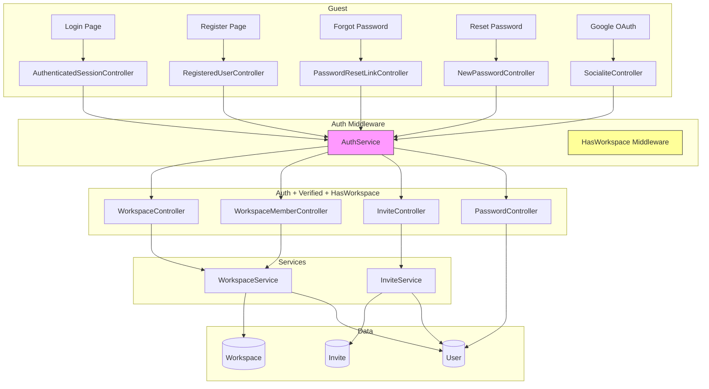

# Auth & Onboarding — Design

**Spec**: `.specs/features/auth-onboarding/spec.md`
**Status**: Draft

---

## Architecture Overview

Manual auth implementation using Laravel's built-in primitives (no Breeze/Jetstream) due to existing custom layout shell (`AuthenticatedLayout`, `AppSidebar`) already in place. Socialite for Google OAuth. UUID route model binding on all models.



### Middleware Pipeline

```
web middleware
  → HandleInertiaRequests (share auth.user, workspaces)
    → auth (redirect to /login)
      → verified (redirect to /verify-email)
        → [EXEMPT: /workspace/create, /workspace/select]
        → EnsureHasWorkspace (redirect to /workspace/create if 0 workspaces)
          → AppLayout (workspace context)
```

**Zero-workspace routes** are exempt from `EnsureHasWorkspace`:
- `GET /workspace/create`
- `POST /workspace`
- `GET /workspace/select`
- `POST /workspace/activate`

---

## Code Reuse Analysis

### Existing Components to Leverage

| Component | Location | How to Use |
|-----------|----------|------------|
| `AuthenticatedLayout` | `resources/js/Layouts/AuthenticatedLayout.tsx` | Wrap all authenticated pages; already renders AppSidebar + AppHeader |
| `AppSidebar` | `resources/js/Components/AppSidebar.tsx` | Update workspace name from hardcoded to `auth.workspace` prop |
| `AppHeader` | `resources/js/Components/AppHeader.tsx` | Already linked to sidebar; no changes needed |
| `UserMenu` | `resources/js/Components/UserMenu.tsx` | Replace hardcoded "Gustavo / gustavo@email.com" with `auth.user.name` / `auth.user.email` shared prop |
| `ui/button` | `resources/js/components/ui/button.tsx` | All form submissions |
| `ui/input` | `resources/js/components/ui/input.tsx` | All form fields |
| `ui/label` | `resources/js/components/ui/label.tsx` | Form labels |
| `ui/card` | `resources/js/components/ui/card.tsx` | Auth page cards, workspace cards |
| `ui/dropdown-menu` | `resources/js/components/ui/dropdown-menu.tsx` | Role selector, member actions |
| `cn()` | `resources/js/lib/utils.ts` | Utility for conditional classes |

### Integration Points

| System | Integration Method |
|--------|-------------------|
| Laravel Auth | `Auth` facade + guards, `Illuminate\Foundation\Auth\EmailVerificationRequest` |
| Google OAuth | `Laravel\Socialite` + `Socialite::driver('google')` |
| Inertia | `HandleInertiaRequests::share()` for `auth.user` + `workspaces` |
| Email (Mailpit) | Standard Laravel Mail via SMTP to `mailpit:1025` |
| Ziggy | `route()` helper for all named routes in frontend |

### What Needs to Change in Existing Code

| File | Change |
|------|--------|
| `app/Http/Middleware/HandleInertiaRequests.php` | Add `auth.user` and `workspaces` to shared props |
| `resources/js/Components/UserMenu.tsx` | Use `usePage().props.auth.user` instead of hardcoded values |
| `resources/js/Components/AppSidebar.tsx` | Workspace name from shared prop |
| `database/migrations/...create_users_table.php` | Add `uuid` column, `google_id`, `avatar` |

---

## Data Models

### User

```php
// Existing columns (keep)
id            bigint auto-increment PK
name          string
email         string unique
email_verified_at timestamp nullable
password      string nullable        # nullable for Google OAuth users
remember_token string nullable
timestamps

// New columns to add
uuid          uuid unique            # for route model binding
google_id     string nullable unique # Socialite linking
avatar        string nullable        # Google avatar URL
```

**Route key**: `uuid`

### Workspace

```
id            bigint auto-increment PK
uuid          uuid unique
name          string
description   text nullable
timestamps
```

**Route key**: `uuid`
**Relationships**: `belongsToMany(User::class)->withPivot('role')->withTimestamps()`

### workspace_user (pivot)

```
workspace_id  FK → workspaces.id
user_id       FK → users.id
role          enum: admin, editor, viewer  (default: admin for creator)
last_visited_at timestamp nullable
timestamps
```

### Invite

```
id            bigint auto-increment PK
uuid          uuid unique
workspace_id  FK → workspaces.id
email         string
role          enum: admin, editor, viewer
inviter_id    FK → users.id
status        enum: pending, accepted, declined  (default: pending)
timestamps
```

**Route key**: `uuid`
**Relationships**: `belongsTo(Workspace::class)`, `belongsTo(User::class, 'inviter_id')`

---

## Enums

### WorkspaceRole

```php
enum WorkspaceRole: string
{
    case Admin = 'admin';
    case Editor = 'editor';
    case Viewer = 'viewer';
}
```

### InviteStatus

```php
enum InviteStatus: string
{
    case Pending = 'pending';
    case Accepted = 'accepted';
    case Declined = 'declined';
}
```

---

## Routes

### Guest Routes (no auth)

```php
Route::middleware('guest')->group(function () {
    Route::get('register', [RegisteredUserController::class, 'create'])->name('register');
    Route::post('register', [RegisteredUserController::class, 'store']);
    Route::get('login', [AuthenticatedSessionController::class, 'create'])->name('login');
    Route::post('login', [AuthenticatedSessionController::class, 'store']);
    Route::get('forgot-password', [PasswordResetLinkController::class, 'create'])->name('password.request');
    Route::post('forgot-password', [PasswordResetLinkController::class, 'store'])->name('password.email');
    Route::get('reset-password/{token}', [NewPasswordController::class, 'create'])->name('password.reset');
    Route::post('reset-password', [NewPasswordController::class, 'store'])->name('password.store');
});

Route::get('auth/google', [SocialiteController::class, 'redirect'])->name('google.redirect');
Route::get('auth/google/callback', [SocialiteController::class, 'callback'])->name('google.callback');
```

### Auth Routes (must be authenticated)

```php
Route::middleware('auth')->group(function () {
    Route::post('logout', [AuthenticatedSessionController::class, 'destroy'])->name('logout');

    // Email verification
    Route::get('verify-email', [EmailVerificationPromptController::class, '__invoke'])->name('verification.notice');
    Route::get('verify-email/{id}/{hash}', [VerifyEmailController::class, '__invoke'])
        ->middleware('signed')->name('verification.verify');
    Route::post('email/verification-notification', [EmailVerificationNotificationController::class, 'store'])
        ->middleware('throttle:6,1')->name('verification.send');

    // Password change (logged-in user)
    Route::get('settings/password', [PasswordController::class, 'edit'])->name('password.edit');
    Route::put('settings/password', [PasswordController::class, 'update'])->name('password.update');
});
```

### Auth + Verified Routes

```php
Route::middleware(['auth', 'verified'])->group(function () {
    // Workspace management (no workspace context — exempt from EnsureHasWorkspace)
    Route::get('workspace/create', [WorkspaceController::class, 'create'])->name('workspace.create');
    Route::post('workspace', [WorkspaceController::class, 'store'])->name('workspace.store');
    Route::get('workspace/select', [WorkspaceController::class, 'select'])->name('workspace.select');
    Route::post('workspace/activate', [WorkspaceController::class, 'activate'])->name('workspace.activate');

    // All other routes require workspace
    Route::middleware('ensure.has.workspace')->group(function () {
        Route::get('/', fn () => redirect()->route('workspace.select'));
    });
});
```

### Workspace-Scoped Routes (auth + verified + workspace)

```php
Route::middleware(['auth', 'verified', 'ensure.has.workspace'])
    ->prefix('w/{workspace}')
    ->group(function () {
        Route::get('/', fn () => inertia('Home'))->name('dashboard');

        // Members
        Route::get('members', [WorkspaceMemberController::class, 'index'])->name('workspace.members.index');
        Route::delete('members/{user}', [WorkspaceMemberController::class, 'destroy'])->name('workspace.members.destroy');
        Route::put('members/{user}/role', [WorkspaceMemberController::class, 'updateRole'])->name('workspace.members.role');

        // Invites
        Route::post('invites', [InviteController::class, 'store'])->name('workspace.invites.store');
        Route::post('invites/{invite}/accept', [InviteController::class, 'accept'])->name('workspace.invites.accept');
        Route::post('invites/{invite}/decline', [InviteController::class, 'decline'])->name('workspace.invites.decline');
    });
```

**Route model binding**: `{workspace}` and `{invite}` resolve via UUID (`getRouteKeyName()` returns `'uuid'`).

---

## Controllers

### Auth Controllers

| Controller | Location | Methods | FormRequest |
|-----------|----------|---------|-------------|
| `RegisteredUserController` | `App\Http\Controllers\Auth\` | `create`, `store` | `StoreRegisteredUserRequest` |
| `AuthenticatedSessionController` | `App\Http\Controllers\Auth\` | `create`, `store`, `destroy` | `LoginRequest` |
| `PasswordResetLinkController` | `App\Http\Controllers\Auth\` | `create`, `store` | `StoreForgotPasswordRequest` |
| `NewPasswordController` | `App\Http\Controllers\Auth\` | `create`, `store` | `StoreNewPasswordRequest` |
| `EmailVerificationPromptController` | `App\Http\Controllers\Auth\` | `__invoke` | — |
| `VerifyEmailController` | `App\Http\Controllers\Auth\` | `__invoke` | — |
| `EmailVerificationNotificationController` | `App\Http\Controllers\Auth\` | `store` | — |
| `SocialiteController` | `App\Http\Controllers\Auth\` | `redirect`, `callback` | — |
| `PasswordController` | `App\Http\Controllers\Auth\` | `edit`, `update` | `UpdatePasswordRequest` |

### Workspace Controllers

| Controller | Location | Methods | FormRequest |
|-----------|----------|---------|-------------|
| `WorkspaceController` | `App\Http\Controllers\` | `create`, `store`, `select`, `activate` | `StoreWorkspaceRequest` |
| `WorkspaceMemberController` | `App\Http\Controllers\` | `index`, `destroy`, `updateRole` | `UpdateMemberRoleRequest` |
| `InviteController` | `App\Http\Controllers\` | `store`, `accept`, `decline` | `StoreInviteRequest` |

### Controller Pattern

Every controller follows this structure:
1. Inject dependencies via constructor (Service classes)
2. Validate via FormRequest (auto-injected)
3. Delegate to Service
4. Return Inertia response (GET) or redirect (POST/PUT/DELETE)
5. User-facing messages in pt-BR via `session()->flash()`

---

## FormRequests

| Request | Validates | Rules |
|---------|-----------|-------|
| `StoreRegisteredUserRequest` | `name`, `email`, `password`, `password_confirmation` | name: required\|string\|max:255, email: required\|email\|unique:users, password: required\|min:8\|confirmed |
| `LoginRequest` | `email`, `password`, `remember` | email: required\|email, password: required\|string, remember: boolean |
| `StoreForgotPasswordRequest` | `email` | email: required\|email |
| `StoreNewPasswordRequest` | `token`, `email`, `password`, `password_confirmation` | token: required, email: required\|email, password: required\|min:8\|confirmed |
| `UpdatePasswordRequest` | `current_password`, `password`, `password_confirmation` | current_password: required\|current_password, password: required\|min:8\|confirmed |
| `StoreWorkspaceRequest` | `name` | name: required\|string\|max:255 |
| `StoreInviteRequest` | `email`, `role` | email: required\|email, role: required\|in:admin,editor,viewer |
| `UpdateMemberRoleRequest` | `role` | role: required\|in:admin,editor,viewer |

---

## Services

### AuthService

```php
class AuthService
{
    public function register(array $data): User
    public function authenticate(array $credentials, bool $remember): void
    public function sendVerificationEmail(User $user): void
    public function verifyEmail(User $user): void
    public function sendPasswordResetLink(string $email): void
    public function resetPassword(array $data): void
    public function changePassword(User $user, string $newPassword): void
    public function handleGoogleCallback(SocialiteUser $googleUser): User
}
```

### WorkspaceService

```php
class WorkspaceService
{
    public function create(User $creator, array $data): Workspace
    public function getUserWorkspaces(User $user): Collection
    public function addMember(Workspace $workspace, User $user, WorkspaceRole $role): void
    public function removeMember(Workspace $workspace, User $user): void
    public function changeRole(Workspace $workspace, User $user, WorkspaceRole $role): void
    public function transferAdmin(Workspace $workspace, User $from, User $to): void
    public function setLastVisited(Workspace $workspace, User $user): void
}
```

### InviteService

```php
class InviteService
{
    public function invite(Workspace $workspace, User $inviter, string $email, WorkspaceRole $role): ?Invite
    public function accept(Invite $invite, User $user): void
    public function decline(Invite $invite): void
    public function getPendingInvites(User $user): Collection
}
```

---

## Policies

### WorkspacePolicy

```php
class WorkspacePolicy
{
    // All members can view
    public function view(User $user, Workspace $workspace): bool
    
    // Auth+verified users can create
    public function create(User $user): bool
    
    // Admin only
    public function manageMembers(User $user, Workspace $workspace): bool
    public function invite(User $user, Workspace $workspace): bool
    
    // Admin + Editor
    public function manageTransactions(User $user, Workspace $workspace): bool
    
    // All members
    public function viewMembers(User $user, Workspace $workspace): bool
}
```

Policy registration in `AppServiceProvider::boot()` using `Gate::policy()`.

---

## Middleware

### EnsureHasWorkspace

```php
class EnsureHasWorkspace
{
    public function handle(Request $request, Closure $next): Response
    {
        if ($request->user() && $request->user()->workspaces()->count() === 0) {
            return redirect()->route('workspace.create');
        }
        return $next($request);
    }
}
```

Registered as `ensure.has.workspace` in `bootstrap/app.php`.

---

## ApiResources

| Resource | Fields | Used In |
|----------|--------|---------|
| `UserResource` | `uuid`, `name`, `email`, `avatar` | Shared props, member lists, invite info |
| `WorkspaceResource` | `uuid`, `name`, `description`, `role` (pivot), `members_count` | Shared props, workspace selector |
| `MemberResource` | `user` (UserResource), `role`, `joined_at` | Member list page |
| `InviteResource` | `uuid`, `email`, `role`, `status`, `inviter` (UserResource), `workspace` (WorkspaceResource) | Invite list |

---

## Shared Inertia Props (HandleInertiaRequests)

```php
public function share(Request $request): array
{
    return [
        ...parent::share($request),
        'auth' => [
            'user' => $request->user() ? new UserResource($request->user()) : null,
        ],
        'workspaces' => $request->user()
            ? WorkspaceResource::collection($request->user()->workspaces)
            : [],
    ];
}
```

**Note**: `auth.user` and `workspaces` are shared globally. Workspace-scoped data (current workspace details, members, etc.) is passed as controller props.

---

## Frontend Pages

### Auth Pages (Guest Layout)

| Page | Route | Inertia Component | Key Elements |
|------|-------|-------------------|-------------|
| `Pages/Auth/Login.tsx` | `/login` | Card with email, password, remember me, submit, "Esqueci senha?" link, Google button, "Não tem conta? Registre-se" |
| `Pages/Auth/Register.tsx` | `/register` | Card with name, email, password, confirm, submit, "Já tem conta? Entre" |
| `Pages/Auth/ForgotPassword.tsx` | `/forgot-password` | Card with email, submit, "Voltar ao login" |
| `Pages/Auth/ResetPassword.tsx` | `/reset-password/{token}` | Card with email, password, confirm, submit |
| `Pages/Auth/VerifyEmail.tsx` | `/verify-email` | Message "Verifique seu email", resend button, logout |

### Authenticated Pages (AuthenticatedLayout)

| Page | Route | Inertia Component | Key Elements |
|------|-------|-------------------|-------------|
| `Pages/Workspace/Create.tsx` | `/workspace/create` | Card with name field, submit. No sidebar. |
| `Pages/Workspace/Select.tsx` | `/workspace/select` | Grid of workspace cards, "Criar novo workspace" button |
| `Pages/Home.tsx` | `/w/{workspace}` | Already exists; update to receive workspace prop |

### Layout Strategy

- **Guest pages**: Use a minimal `GuestLayout` with centered card (no sidebar/header)
- **Workspace creation/selection**: Use `AuthenticatedLayout` but hide workspace-scoped sidebar items (no workspace context yet)
- **Full app pages**: Use `AuthenticatedLayout` with full sidebar

---

## Frontend Components (New)

| Component | Location | Purpose |
|-----------|----------|---------|
| `GuestLayout` | `resources/js/Layouts/GuestLayout.tsx` | Centered card layout for auth pages |
| `WorkspaceCard` | `resources/js/Components/WorkspaceCard.tsx` | Card showing workspace name, description, member count |
| `InviteDialog` | `resources/js/Components/InviteDialog.tsx` | Dialog with email input + role select, submit |
| `PendingInvitesList` | `resources/js/Components/PendingInvitesList.tsx` | List of pending invites with accept/decline |
| `MemberRow` | `resources/js/Components/MemberRow.tsx` | Row with user avatar, name, role badge, actions |
| `RoleBadge` | `resources/js/Components/RoleBadge.tsx` | Colored badge: Admin (purple), Editor (blue), Viewer (gray) |
| `RoleSelect` | `resources/js/Components/RoleSelect.tsx` | Dropdown for selecting role |

---

## Error Handling Strategy

| Error Scenario | Handling | User Impact |
|---------------|----------|------------|
| Invalid credentials | `LoginRequest` fails validation → Inertia error bag | "Credenciais inválidas" |
| Duplicate email (register) | `StoreRegisteredUserRequest` → unique rule | "Este email já está em uso" |
| Email already in workspace (invite) | `InviteService` checks → 422 | "Este usuário já pertence ao workspace" |
| Non-existent email (invite) | Silently accept + flash message | "Convite enviado" (no actual invite created) |
| Unverified user accesses route | `verified` middleware → redirect | Redirect to verify-email screen |
| Zero workspaces, any route | `EnsureHasWorkspace` middleware | Redirect to workspace.create |
| Unauthorized role action | `Gate::authorize()` → 403 | "Acesso não autorizado" |
| Last admin leaving | `WorkspaceService` blocks → 422 | "Transfira a função de admin antes de sair" |
| Google OAuth failure | Try/catch in callback → redirect with error | "Falha na autenticação com Google" |
| SMTP error (email send) | Log error → flash warning | "Erro ao enviar email. Tente novamente." |
| Expired verification link | `signed` middleware → 403 | "Link inválido ou expirado" |
| Expired password reset link | Manual check → redirect with error | "Link inválido ou expirado" |

---

## Test Strategy (TDD)

**Rule**: Each acceptance criterion maps to at least one test. Tests are written BEFORE implementation.

### Feature Tests (PHPUnit)

All feature tests use `RefreshDatabase` trait. Google OAuth interactions are mocked.

| Test Class | Requirement IDs | Tests |
|-----------|----------------|-------|
| `tests/Feature/Auth/RegistrationTest.php` | AUTH-01, AUTH-05 | `test_user_can_register`, `test_registration_requires_valid_data`, `test_duplicate_email_is_rejected`, `test_verification_email_is_sent`, `test_user_cannot_access_authenticated_routes_unverified`, `test_user_can_resend_verification_email` |
| `tests/Feature/Auth/AuthenticationTest.php` | AUTH-02, AUTH-03, AUTH-04 | `test_user_can_login`, `test_user_cannot_login_with_invalid_credentials`, `test_unverified_user_is_redirected_to_verify`, `test_user_can_logout`, `test_remember_me_token_is_issued`, `test_remember_me_persists_session` |
| `tests/Feature/Auth/PasswordResetTest.php` | AUTH-06 | `test_user_can_request_password_reset`, `test_password_reset_link_is_sent`, `test_user_can_reset_password`, `test_expired_token_is_rejected`, `test_non_existent_email_gets_same_response` |
| `tests/Feature/Auth/PasswordChangeTest.php` | AUTH-07 | `test_user_can_change_password`, `test_wrong_current_password_is_rejected`, `test_google_user_cannot_change_password_without_setting_first` |
| `tests/Feature/Auth/GoogleOAuthTest.php` | AUTH-08 | `test_google_redirect`, `test_google_callback_creates_new_user`, `test_google_callback_links_existing_user`, `test_google_callback_failure` |
| `tests/Feature/Workspace/WorkspaceCreationTest.php` | AUTH-09, AUTH-10, AUTH-11 | `test_user_with_zero_workspaces_is_redirected_to_create`, `test_user_can_create_workspace`, `test_creator_becomes_admin`, `test_user_with_workspace_is_not_redirected` |
| `tests/Feature/Workspace/WorkspaceSelectionTest.php` | AUTH-12 | `test_user_sees_workspace_selector`, `test_user_is_redirected_to_last_active_workspace`, `test_unavailable_workspace_falls_back_to_selector` |
| `tests/Feature/Workspace/InviteTest.php` | AUTH-13, AUTH-14 | `test_admin_can_invite_existing_user`, `test_invite_email_is_sent`, `test_non_existent_email_does_not_create_invite`, `test_user_can_accept_invite`, `test_user_can_decline_invite`, `test_duplicate_invite_is_rejected` |
| `tests/Feature/Workspace/MemberRoleTest.php` | AUTH-15 | `test_admin_can_do_all_actions`, `test_editor_can_manage_transactions`, `test_editor_cannot_manage_members`, `test_viewer_cannot_mutate`, `test_unauthorized_action_returns_403`, `test_last_admin_cannot_leave` |

### Cypress E2E Tests

| Test | Journey |
|------|---------|
| `cypress/e2e/auth/register.cy.ts` | Visit register → fill form → submit → see verify screen |
| `cypress/e2e/auth/login.cy.ts` | Visit login → fill credentials → submit → see workspace creation (first time) → create workspace → see dashboard |
| `cypress/e2e/auth/google-oauth.cy.ts` | Click "Entrar com Google" → mock OAuth → see dashboard |
| `cypress/e2e/workspace/invite.cy.ts` | Admin creates workspace → invites user → invited user accepts → both see same workspace |

---

## Tech Decisions

| Decision | Choice | Rationale |
|----------|--------|-----------|
| Breeze vs Manual | **Manual** | Existing custom layout (AuthenticatedLayout) conflicts with Breeze scaffolding |
| UUID strategy | `uuid` column + auto-increment PK | Avoids InnoDB index fragmentation with UUID PKs; `getRouteKeyName()` for binding |
| Password nullable | **Yes** | Google OAuth users have no password; must set one before changing |
| Google OAuth email verification | **Mark as verified** | Google already verified the email |
| Shared props | `auth.user` + `workspaces` via Inertia | Follows D-08 (Inertia pure), D-15 (shared data minimum) |
| Remember me | Laravel native `remember_me` | Already built into `Auth::attempt()` and session guard |
| Email driver (dev) | Mailpit via SMTP | Container `fin-mailpit`, catch-all, UI at localhost:8026 |
| Route naming | `workspace.*` for WS management, `workspace.invites.*`, `workspace.members.*` | Consistent prefix-based naming |

---

## Implementation Dependencies

```
1. Migrations (uuid on users, workspaces, invites)
   ↓
2. Models (User updated, Workspace, Invite)
   ↓
3. Enums (WorkspaceRole, InviteStatus)
   ↓
4. Services (AuthService, WorkspaceService, InviteService)
   ↓
5. FormRequests (all 8)
   ↓
6. Policies (WorkspacePolicy)
   ↓
7. Middleware (EnsureHasWorkspace)
   ↓
8. ApiResources (UserResource, WorkspaceResource, InviteResource, MemberResource)
   ↓
9. Controllers (all 12)
   ↓
10. Routes (web.php)
   ↓
11. Shared Props (HandleInertiaRequests)
   ↓
12. Frontend Layouts (GuestLayout)
   ↓
13. Frontend Pages (all auth + workspace pages)
   ↓
14. Frontend Components (new + update existing)
   ↓
15. Update existing frontend (UserMenu, AppSidebar, Home)
```

**Tests are written at each step BEFORE the implementation code for that step.**

---

## Dependencies to Install

```bash
composer require laravel/socialite
```

No other new PHP dependencies needed. No additional npm packages needed (all UI primitives already installed).
