# Cartões de Crédito V2 — Design

**Spec:** `.specs/features/cartoes-v2/spec.md`
**Context:** `.specs/features/cartoes-v2/context.md`
**Status:** Approved

---

## Architecture Overview

O refactor unifica dois silos (despesas de conta vs. despesas de cartão) num único fluxo baseado em `Transaction`. O diagrama alto-nível mostra como os domínios se conectam após o refactor:

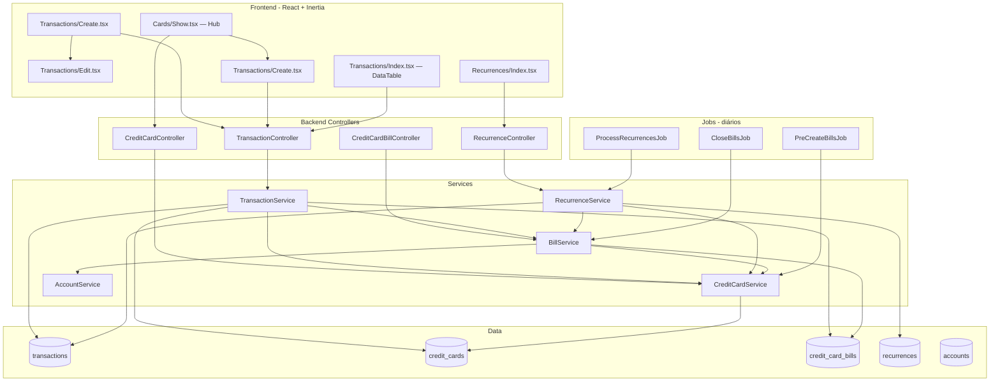

---

## Domain 1: Service Layer — TransactionService Unification

O `CardExpenseService` é fundido dentro do `TransactionService`. Métodos específicos prefixados (`createCard*`, `updateCard*`, `deleteCard*`) mantêm coesão. Helpers partilhados (`resolveBill`, `syncTags`, `ensureBillNotPaid`) eliminam duplicação.

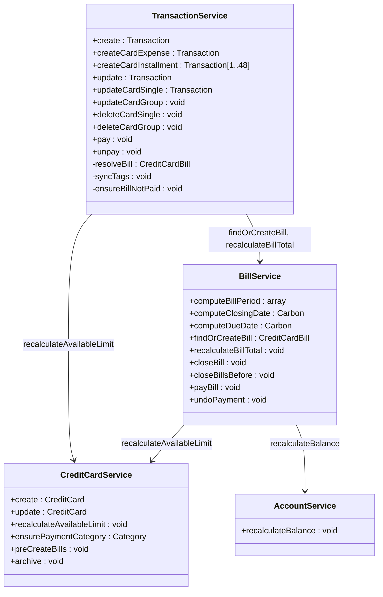

### Decisões

| Decisão | Escolha | Racionale |
|---------|---------|-----------|
| Organização dos métodos | Métodos específicos prefixados (`createCardExpense`, etc.) + helpers partilhados | Cada método permanece coeso e testável; controller faz roteamento inicial |
| Helpers extraídos de CardExpenseService | `resolveBill()`, `syncTags()`, `ensureBillNotPaid()` | Elimina duplicação entre caminhos de conta e cartão |
| Guard de pagamento | `pay()`/`unpay()` rejeitam `credit_card_id` com mensagem específica | Enforcement real do invariant D-28 |

---

## Domain 2: Recurrence — Suporte a Cartão

O `RecurrenceService` recebe `BillService` e `CreditCardService` como novas dependências de construtor. O método `createWithBuffer()` passa a aceitar `credit_card_id` como alternativa a `account_id` (mutualmente exclusivos). A validação de colisão com fatura paga é adicionada.

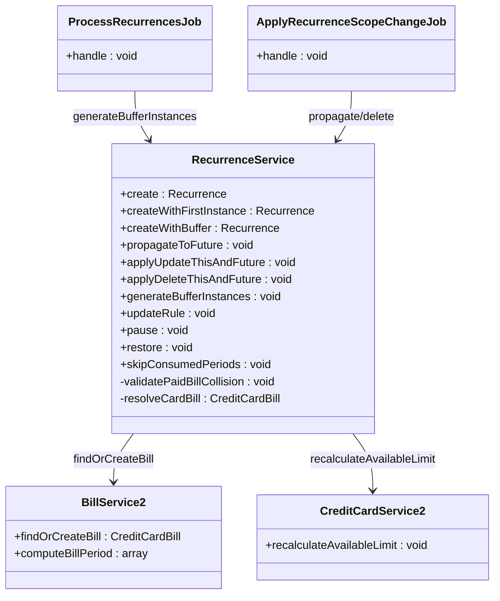

### Data Model Change

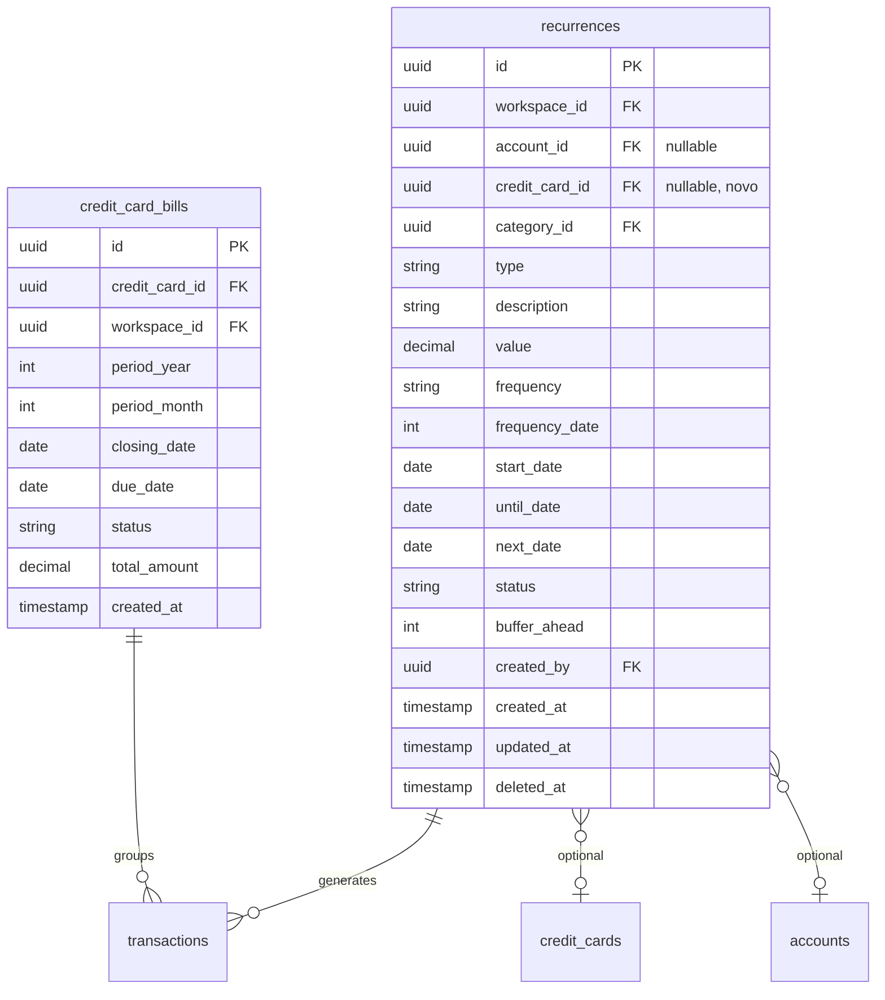

### Decisões

| Decisão | Escolha | Racionale |
|---------|---------|-----------|
| `account_id` em recurrences | Torna nullable; `credit_card_id` adicionado também nullable | Mutual exclusivity via validation; dados existentes permanecem válidos |
| Ocorrências retroativas | Materializadas mesmo em faturas fechadas (não pagas) | Conforme spec AC5; faturas fechadas ≠ faturas pagas |
| Validação de colisão | Rejeita criação se ocorrência start_date→hoje cair em fatura paga | Preserva imutabilidade da fatura paga (D-79) |

---

## Domain 3: Bill Lifecycle — Pré-criação e Fechamento Uniforme

Duas mudanças no ciclo de vida das faturas:

1. **`CreditCardService::create()`** cria 13 faturas sincronamente na criação do cartão
2. **`PreCreateBillsJob`** (novo) roda diariamente mantendo o horizonte de 13 meses
3. **`CloseBillsJob`** (modificado) fecha **todas** as faturas com `closing_date < today`, incluindo vazias
4. Fallback on-demand no render da UI do cartão (CCXP-06 AC2)

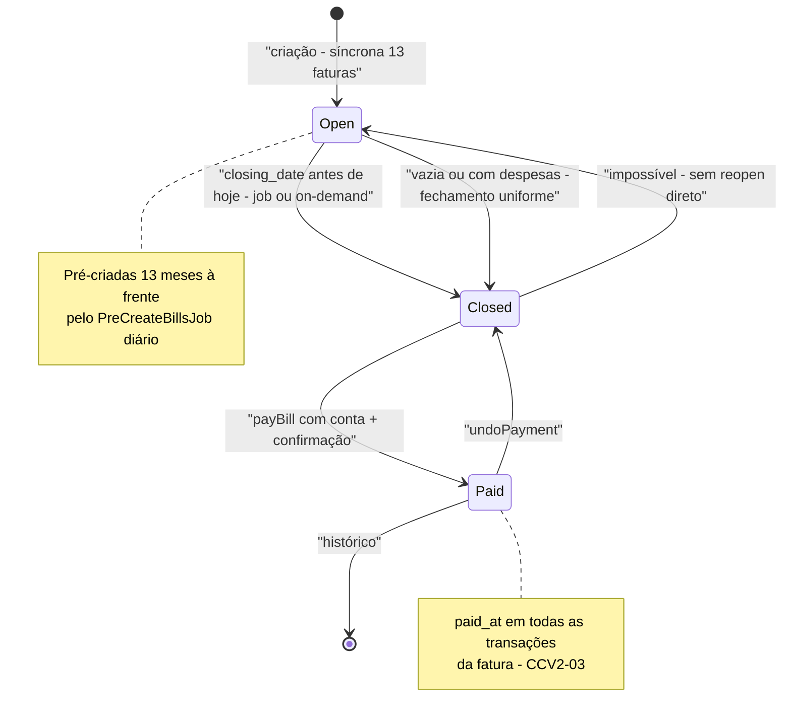

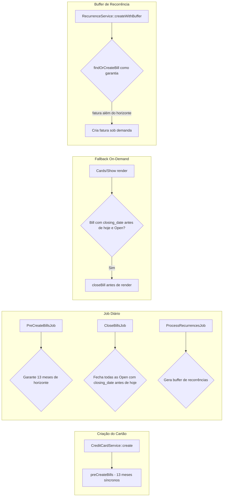

### Decisões

| Decisão | Escolha | Racionale |
|---------|---------|-----------|
| Criação síncrona de 13 faturas | Na request de `store` do cartão | 13 INSERTs vazias não causam latência considerável |
| Fechamento de faturas vazias | Fecham uniformemente (não são mais descartadas) | Supersede D-32 (lazy); ciclo uniforme com faturas pré-criadas |
| Fallback on-demand | No render de `Cards/Show` | Implementa CCXP-06 AC2 (nunca implementada); resilia contra job atrasado |

---

## Domain 4: Form Requests — Validação Unificada

O `StoreTransactionRequest` e `UpdateTransactionRequest` passam a aceitar `credit_card_id` como alternativa a `account_id`, com validação de mutual exclusivity e campos condicionais.

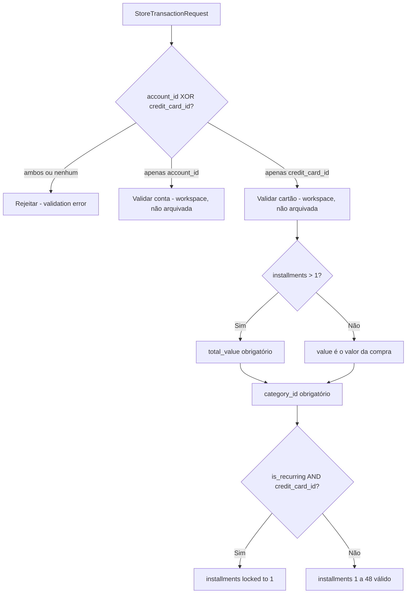

### Mapa de FormRequests

```
StoreTransactionRequest  → MODIFICADO: account_id XOR credit_card_id, installments, total_value
UpdateTransactionRequest → MODIFICADO: sometimes rules + scope (single/group)
StoreCardExpenseRequest  → REMOVIDO
UpdateCardExpenseRequest → REMOVIDO
```

### Decisões

| Decisão | Escolha | Racionale |
|---------|---------|-----------|
| Mutual exclusivity | Validação XOR no FormRequest | Regra de negócio (D-24) centralizada |
| Parcelas com recorrência | Rejeitadas: "Despesas recorrentes em cartão não podem ser parceladas" | D-78: recorrência em cartão sempre 1x |
| Remoção de CardExpenseRequests | Deletados com o silo | Toda a validação migra para TransactionRequest |

---

## Domain 5: Frontend — Formulário Unificado

O `Transactions/Create.tsx` e `Edit.tsx` são reestruturados com sub-components por tipo de despesa. O seletor "forma de pagamento" controla quais campos são exibidos.

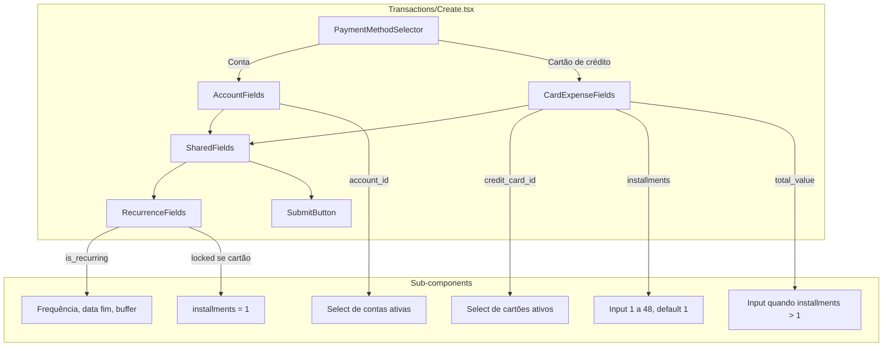

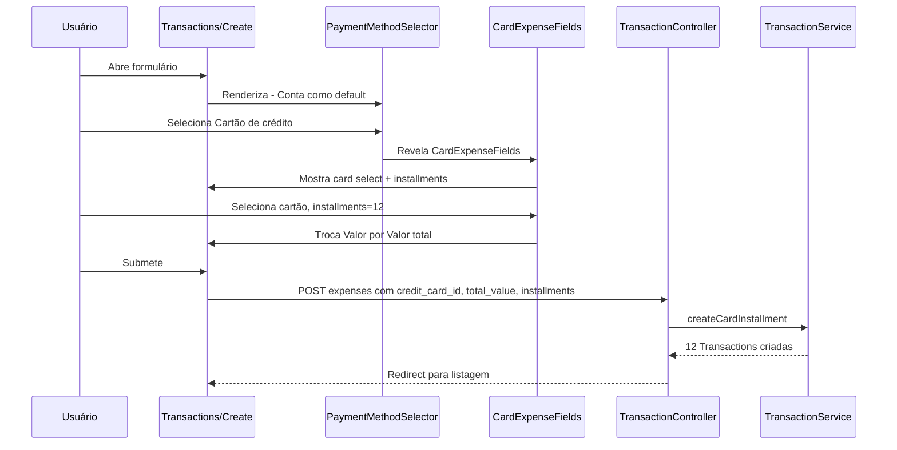

### Decisões

| Decisão | Escolha | Racionale |
|---------|---------|-----------|
| Sub-components por tipo | `AccountFields`, `CardExpenseFields`, `RecurrenceFields` | Separa responsabilidades; form principal orquesta |
| PaymentMethodSelector | Toggle Conta ↔ Cartão no topo do form | UX clara; campos aparecem/desaparecem conforme seleção |
| Redirect do cartão | Query string `?payment_method=card&card_id={uuid}` | Cartão pré-preenchido no form unificado |

---

## Domain 6: Frontend — Card Hub UI

O `Cards/Show.tsx` é redesenhado como hub único do crédito, com 4 cards de limite, seletor de faturas, despesas scopadas e pagamento inline.

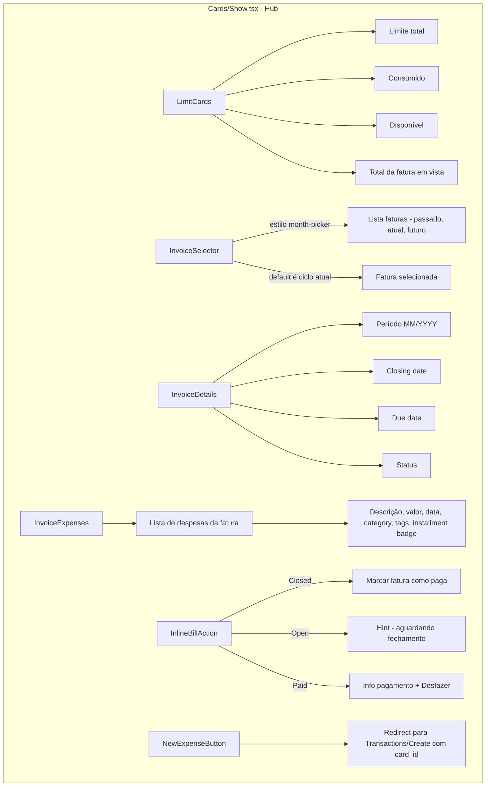

```mermaid
stateDiagram-v2
    direction LR
    [*] --> SelectingBill

    SelectingBill --> ViewingExpenses: seleciona fatura
    ViewingExpenses --> PayingBill: clica Marcar como paga -- se Closed
    SelectingBill --> CreatingExpense: clica Nova despesa neste cartão

    PayingBill --> ConfirmingAccount: pede conta + confirma valor
    ConfirmingAccount --> BillPaid: confirma
    BillPaid --> [*]: redirect para show atualizado

    CreatingExpense --> ExpenseForm: redirect com card_id
    ExpenseForm --> ViewingExpenses: redirect de volta após criar
```

### Decisões

| Decisão | Escolha | Racionale |
|---------|---------|-----------|
| Cards de limite | Globais (não por fatura) | Conforme decisão do usuário; `available_limit` é propriedade do cartão |
| Seletor de faturas | Estilo month-picker de `Transactions/Index` | Consistência visual; referência explícita do usuário |
| Pagamento inline | Botão refere-se à fatura sendo vista | Decisão do usuário: "marcar fatura como paga" = fatura selecionada |

---

## Domain 7: Frontend — DataTable com Filtros de Cartão

A `Transactions/Index.tsx` ganha coluna "Cartão" e filtros por cartão/fatura. O `Recurrences/Index.tsx` ganha coluna "Cartão" quando aplicável.

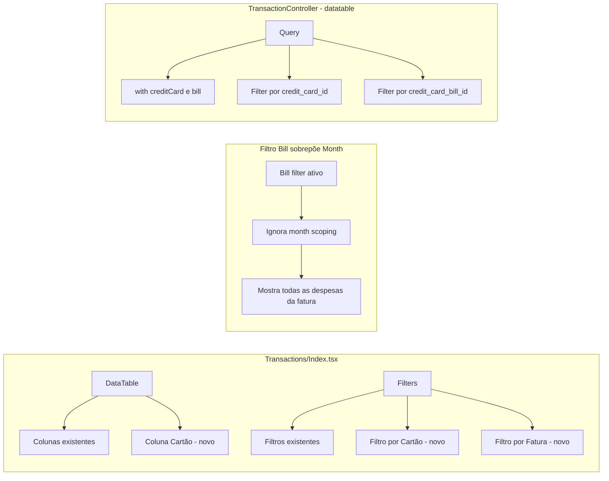

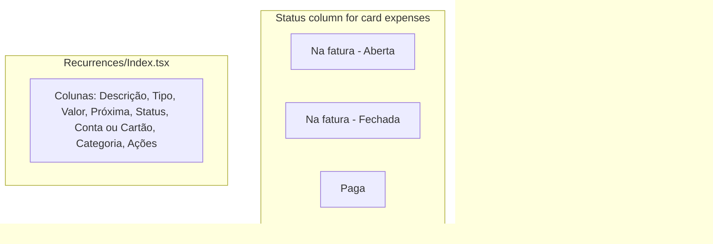

### Decisões

| Decisão | Escolha | Racionale |
|---------|---------|-----------|
| Coluna "Cartão" | Mostra nome do cartão; vazio para despesas em conta | Visibilidade do vínculo sem navegação extra |
| Filtro fatura sobrepõe mês | Quando ativo, mostra todas as despesas da fatura independente do mês selecionado | Um ciclo de fatura cruza meses (closing_date) |
| Status de despesa de cartão | Derivado da fatura: "Na fatura (Aberta/Fechada)" ou "Paga" | Botão Pagar oculto; status reflete realidade da fatura |

---

## Domain 8: Decommission — Remoção do Silo CardExpenses

Todo o fluxo dedicado de `CardExpenses` é removido atomicamente. Nenhum período de transição — o projeto ainda não está em produção.

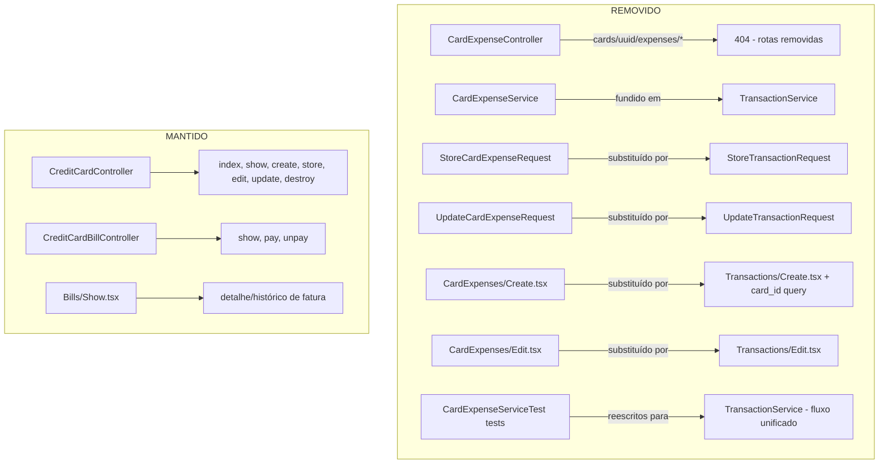

### Decisões

| Decisão | Escolha | Racionale |
|---------|---------|-----------|
| Atomicidade | Tudo removido num único conjunto de commits | Projeto não está em produção; coexistência traria complexidade desnecessária |
| Legado `Bills/Show` | Mantido | Serve como detalhe/histórico de faturas fechadas e pagas |
| Testes de CardExpenses | Reescritos para o fluxo unificado | Cobrem os mesmos cenários via `Transactions/Create` com cartão selecionado |

---

## Migration Summary

| Migration | Type | Impact |
|-----------|------|--------|
| Add `credit_card_id` to `recurrences` | ALTER (nullable FK) | Baixo — novas recorrências de cartão; existentes em conta inalteradas |
| Make `account_id` nullable in `recurrences` | ALTER | Baixo — existente NOT NULL rows permanecem válidos |
| Nenhum change em `credit_card_bills` | — | — |
| Nenhum change em `credit_cards` | — | — |
| Nenhum change em `transactions` | — | Colunas `credit_card_id` e `credit_card_bill_id` já existem |

---

## Error Handling Strategy

| Error Scenario | Handling | User Impact |
|---|---|---|
| Pay card expense via `TransactionService::pay()` | Reject with 422 + "Despesas de cartão são pagadas através da fatura do cartão" | Botão Pagar oculto na UI; API protegida |
| Both `account_id` + `credit_card_id` submitted | FormRequest validation error | Mensagem: "Uma transação deve ter conta OU cartão, nunca ambos" |
| Card recurrence with installments > 1 | FormRequest validation error | Mensagem: "Despesas recorrentes em cartão não podem ser parceladas" |
| Recurrence buffer hits paid bill | Reject creation | Mensagem: "A data de início colide com faturas já pagas do cartão" |
| Bill with total=0 paid | Reject | Mensagem: "Esta fatura não possui despesas" |
| Edit/delete expense on paid bill | Blocked (existing) | Mensagem de imutabilidade existente |
| Payment transaction deleted from list | Blocked (existing) | Mensagem: "Esta transação foi gerada pelo pagamento de uma fatura..." |

---

## Quality Gates (per task)

- `composer quality` — Pint format check + PHPMD complexity
- `npm run quality` — ESLint complexity + Prettier check
- PHPUnit: feature tests (one per acceptance criteria) + smoke tests (one per GET route)
- Cypress E2E: critical journeys (create card → create expense → pay bill → undo)
