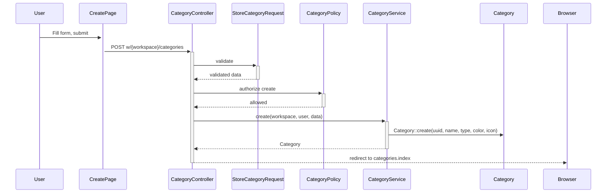

# Categorias e Tags — Design

**Spec**: `.specs/features/categorias-tags/spec.md`
**Status**: Draft

---

## Architecture Overview

```
┌──────────────────────────────────────────────────────────────┐
│                    INERTIA SSR LAYER                          │
│  Pages/Categories/{Index,Create,Edit}.tsx                     │
│  Pages/Tags/{Index,Create,Edit}.tsx                           │
│  Components/ui/{card,input,label,badge,select,button}         │
├──────────────────────────────────────────────────────────────┤
│                    CONTROLLER LAYER                           │
│  CategoryController (resource)                                │
│  TagController (resource)                                     │
│  StoreCategoryRequest / UpdateCategoryRequest                 │
│  StoreTagRequest / UpdateTagRequest                           │
│  CategoryPolicy / TagPolicy                                   │
├──────────────────────────────────────────────────────────────┤
│                    SERVICE LAYER                               │
│  CategoryService (create, update, archive,                    │
│                   ensureDefaultExists)                        │
│  TagService (create, update, archive)                         │
├──────────────────────────────────────────────────────────────┤
│                    DATA LAYER                                  │
│  Category model (UUID PK, workspace FK, soft deletes,         │
│                   type enum, color hex, icon Lucide name)     │
│  Tag model (UUID PK, workspace FK, soft deletes,              │
│              color hex, unique name per workspace)            │
└──────────────────────────────────────────────────────────────┘
```

### Request Flow (create category)



---

## Code Reuse Analysis

### Existing Components to Leverage

| Component | Location | How to Use |
|-----------|----------|------------|
| `AuthenticatedLayout` | `Layouts/AuthenticatedLayout.tsx` | Wrap all category and tag pages |
| `Card`, `CardContent`, `CardHeader`, `CardTitle` | `components/ui/card.tsx` | Category/tag list cards, form cards |
| `Button` | `components/ui/button.tsx` | Form submit, actions |
| `Input` | `components/ui/input.tsx` | Form text fields (name, hex color, icon name) |
| `Label` | `components/ui/label.tsx` | Form field labels |
| `Badge` | `components/ui/badge.tsx` | Color indicator pills, type badges |
| `Select` | `components/ui/select.tsx` (installed in T1 accounts) | Category type dropdown (Income/Expense/Both) |
| `useForm()` | Inertia built-in | Form state, submission, errors |
| `route()` | Ziggy global | All links and redirects |
| `AccountPolicy` pattern | `app/Policies/AccountPolicy.php` | Same role-based gate structure |
| `AccountService` pattern | `app/Services/AccountService.php` | Same service injection + `Str::orderedUuid()` |
| `AccountResource` pattern | `app/Http/Resources/AccountResource.php` | Same JsonResource structure |
| `StoreAccountRequest` pattern | `app/Http/Requests/StoreAccountRequest.php` | Same `authorize()`, `rules()`, `messages()` |

### New shadcn/ui components needed

| Component | Command |
|-----------|---------|
| `Button` | `npx shadcn@latest add button` |
| `Input` | `npx shadcn@latest add input` |
| `Label` | `npx shadcn@latest add label` |
| `Card` | `npx shadcn@latest add card` |
| `Badge` | `npx shadcn@latest add badge` |
| `Select` | `npx shadcn@latest add select` |
| `Popover` | `npx shadcn@latest add popover` |

### New npm dependencies

| Package | Purpose | Command |
|---------|---------|---------|
| `react-colorful` | Lightweight (2.5KB) headless color picker; no extra deps | `npm install react-colorful` |

### Integration Points

| System | Integration Method |
|--------|-------------------|
| Workspace context | Already available via `HandleInertiaRequests` shared data (T2 from accounts) |
| Sidebar navigation | Add navigation links for categories and tags |
| Future transaction services | Transaction services (DEBT-01, CCXP-01, INCM-01) will reference `category_id` FK and `taggables` pivot |
| Workspace creation | `WorkspaceService::create()` calls `CategoryService::ensureDefaultExists()` for default "Sem Categoria" |

---

## Components

### Backend

#### 1. TransactionType Enum
- **Purpose**: Define valid category type values (income, expense, both)
- **Location**: `app/Enums/TransactionType.php`
- **Cases**: `Income = 'income'`, `Expense = 'expense'`, `Both = 'both'`
- **Reuses**: `AccountType` enum pattern, `WorkspaceRole` label() pattern
- **Labels**: `Receita`, `Despesa`, `Ambos`

#### 2. Category Model
- **Purpose**: Eloquent model for categories table
- **Location**: `app/Models/Category.php`
- **Traits**: `HasFactory`, `SoftDeletes`
- **Fillable**: `uuid`, `workspace_id`, `created_by`, `name`, `type`, `color`, `icon`, `position`
- **Route key**: `uuid`
- **Casts**: `type` → `TransactionType` enum
- **Relationships**: `belongsTo(Workspace::class)`, `belongsTo(User::class, 'created_by')`

#### 3. Tag Model
- **Purpose**: Eloquent model for tags table
- **Location**: `app/Models/Tag.php`
- **Traits**: `HasFactory`, `SoftDeletes`
- **Fillable**: `uuid`, `workspace_id`, `created_by`, `name`, `color`
- **Route key**: `uuid`
- **Relationships**: `belongsTo(Workspace::class)`, `belongsTo(User::class, 'created_by')`

#### 4. Migrations

**categories table** (`database/migrations/XXXX_create_categories_table.php`):
```
categories
├── id                  bigint (auto-increment)
├── uuid                string (unique) — route model binding
├── workspace_id        FK → workspaces (CASCADE on delete)
├── created_by          FK → users (SET NULL on delete)
├── name                string
├── type                string — TransactionType enum value
├── color               string(7) — hex e.g. "#FF5733"
├── icon                string nullable — Lucide icon name e.g. "shopping-cart"
├── position            integer unsigned nullable — manual ordering
├── deleted_at          timestamp nullable — SoftDeletes
├── created_at          timestamp
└── updated_at          timestamp
```

**tags table** (`database/migrations/XXXX_create_tags_table.php`):
```
tags
├── id                  bigint (auto-increment)
├── uuid                string (unique) — route model binding
├── workspace_id        FK → workspaces (CASCADE on delete)
├── created_by          FK → users (SET NULL on delete)
├── name                string — unique per workspace (composite unique index)
├── color               string(7) — hex e.g. "#FF5733"
├── deleted_at          timestamp nullable — SoftDeletes
├── created_at          timestamp
└── updated_at          timestamp
```

**Composite unique index on tags**: `UNIQUE(workspace_id, name)` — tag names are unique within a workspace but can repeat across workspaces.

**taggables table** (`database/migrations/XXXX_create_taggables_table.php`):
```
taggables
├── id                  bigint (auto-increment)
├── tag_id              FK → tags (CASCADE on delete)
├── taggable_type       string — morph type (future: "App\Models\DebitExpense", etc.)
├── taggable_id         uuid — morph id (UUID, not bigint)
├── created_at          timestamp
└── updated_at          timestamp
```
This table is schema-only now. No models reference it yet. It exists so future transaction migrations don't need to create it — they just start inserting rows.

#### 5. CategoryController
- **Purpose**: Resource controller for categories CRUD
- **Location**: `app/Http/Controllers/CategoryController.php`
- **Methods**: `index`, `create`, `store`, `edit`, `update`, `destroy`
- **Dependencies**: Injects `CategoryService`
- **Auth**: `$this->authorize()` calls before actions using CategoryPolicy
- **Reuses**: `AccountController` pattern

#### 6. TagController
- **Purpose**: Resource controller for tags CRUD
- **Location**: `app/Http/Controllers/TagController.php`
- **Methods**: `index`, `create`, `store`, `edit`, `update`, `destroy`
- **Dependencies**: Injects `TagService`
- **Auth**: `$this->authorize()` calls before actions using TagPolicy
- **Reuses**: `AccountController` pattern

#### 7. CategoryService
- **Purpose**: Business logic for category operations
- **Location**: `app/Services/CategoryService.php`
- **Methods**:
  - `create(Workspace $workspace, User $creator, array $data): Category` — generates UUID, sets workspace_id and created_by
  - `update(Category $category, array $data): Category` — updates allowed fields
  - `archive(Category $category): void` — soft delete with guard: rejects if category is the default "Sem Categoria"
  - `ensureDefaultExists(Workspace $workspace): Category` — finds or creates the "Sem Categoria" default category (type: both, color: "#9CA3AF", icon: "folder")
- **Reuses**: `AccountService` pattern (`Str::orderedUuid()`, `Model::create()`)

#### 8. TagService
- **Purpose**: Business logic for tag operations
- **Location**: `app/Services/TagService.php`
- **Methods**:
  - `create(Workspace $workspace, User $creator, array $data): Tag` — generates UUID, validates uniqueness per workspace
  - `update(Tag $tag, array $data): Tag` — updates allowed fields, validates uniqueness
  - `archive(Tag $tag): void` — soft delete
- **Reuses**: `AccountService` pattern

#### 9. CategoryPolicy
- **Purpose**: Authorization for category actions
- **Location**: `app/Policies/CategoryPolicy.php`
- **Methods**:
  - `viewAny(User $user, Workspace $workspace): bool` — member check
  - `create(User $user, Workspace $workspace): bool` — admin or editor
  - `update(User $user, Workspace $workspace, Category $category): bool` — admin or editor + workspace match
  - `delete(User $user, Workspace $workspace, Category $category): bool` — admin or editor + not default category (reject if name === "Sem Categoria" or a flag `is_default`)
- **Reuses**: `AccountPolicy` role-check pattern

#### 10. TagPolicy
- **Purpose**: Authorization for tag actions
- **Location**: `app/Policies/TagPolicy.php`
- **Methods**:
  - `viewAny(User $user, Workspace $workspace): bool` — member check
  - `create(User $user, Workspace $workspace): bool` — admin or editor
  - `update(User $user, Workspace $workspace, Tag $tag): bool` — admin or editor + workspace match
  - `delete(User $user, Workspace $workspace, Tag $tag): bool` — admin or editor + workspace match
- **Reuses**: `AccountPolicy` role-check pattern

#### 11. FormRequests

**StoreCategoryRequest** (`app/Http/Requests/StoreCategoryRequest.php`):
| Field | Rules |
|-------|-------|
| `name` | required, string, max:255 |
| `type` | required, Rule::enum(TransactionType::class) |
| `color` | required, string, size:7, regex:/^#[0-9A-Fa-f]{6}$/ |
| `icon` | nullable, string, max:50 |
| `position` | nullable, integer, min:0 |

**UpdateCategoryRequest** (`app/Http/Requests/UpdateCategoryRequest.php`):
Same rules but all `sometimes`. Additionally: reject if category is default and type/name would break default semantics (enforced in service, not form request).

**StoreTagRequest** (`app/Http/Requests/StoreTagRequest.php`):
| Field | Rules |
|-------|-------|
| `name` | required, string, max:255 |
| `color` | required, string, size:7, regex:/^#[0-9A-Fa-f]{6}$/ |

**UpdateTagRequest** (`app/Http/Requests/UpdateTagRequest.php`):
Same rules but all `sometimes`.

#### 12. API Resources

**CategoryResource** (`app/Http/Resources/CategoryResource.php`):
```php
{
  uuid, name, type, color, icon, position,
  workspace (conditional: WorkspaceResource when loaded),
  created_at
}
```

**TagResource** (`app/Http/Resources/TagResource.php`):
```php
{
  uuid, name, color,
  workspace (conditional: WorkspaceResource when loaded),
  created_at
}
```

### Frontend

#### 13. Components/ui/color-picker.tsx
- **Purpose**: Reusable color picker component for categories and tags forms
- **Location**: `resources/js/Components/ui/color-picker.tsx`
- **Composition**: shadcn `Popover` + `Button` (trigger) + `Input` (hex text) + `react-colorful` `HexColorPicker`
- **API (simplified)**:
  ```tsx
  <ColorPicker value="#FF5733" onChange={(color: string) => setColor(color)} />
  ```
- **Trigger**: A 28px circle showing the current color, wrapped in a `Button` with `variant="outline"`
- **Popover content**: `HexColorPicker` from react-colorful (canvas + hue slider) + an `Input` below showing/setting the hex value
- **Behavior**: Clicking the trigger opens the popover; selecting a color updates both the hex input and the parent form state; manual typing in the hex input also updates the picker
- **Edge cases**: Empty/null value shows a dashed-border circle (no color selected); closes popover on click outside (Popover handles this)
- **Reuses**: Existing shadcn Popover, Button, Input primitives
- **Note**: Placed in `Components/ui/` because it's a general-purpose UI primitive following the shadcn extension pattern

#### 14. Pages/Categories/Index.tsx
- **Purpose**: List all active categories grouped by type
- **Props**: `{ categories: CategoryResource[], workspace: { uuid, name } }`
- **Layout**: `AuthenticatedLayout`
- **Groups**: 3 sections — "Receitas" (type=income), "Despesas" (type=expense), "Ambos" (type=both)
- **Each item**: Color dot (16px circle), Lucide icon (rendered via dynamic import or icon map), name, edit/delete buttons
- **Default category**: Visual distinction (no delete button, subtle badge "Padrão")
- **States**: Empty (per group), loaded
- **Header**: "Categorias" + "Nova Categoria" button

#### 15. Pages/Categories/Create.tsx
- **Purpose**: Form to create a new category
- **Props**: `{ workspace: { uuid } }`
- **Form fields**:
  - name: `Input` (text) — label "Nome"
  - type: `Select` with 3 options — label "Tipo" (Receita/Despesa/Ambos)
  - color: `<ColorPicker />` component — label "Cor"
  - icon: `Input` (text) with helper "Nome do ícone Lucide (ex: shopping-cart)" — label "Ícone"
- **Submit**: POST `route('categories.store', { workspace })`
- **Cancel**: Link to `categories.index`

#### 16. Pages/Categories/Edit.tsx
- **Purpose**: Form to edit existing category
- **Props**: `{ category: CategoryResource, workspace: { uuid } }`
- **Form fields**: Same as Create, pre-populated
- **Submit**: PUT `route('categories.update', { workspace, category })`

#### 17. Pages/Tags/Index.tsx
- **Purpose**: List all active tags
- **Props**: `{ tags: TagResource[], workspace: { uuid, name } }`
- **Layout**: `AuthenticatedLayout`
- **Each item**: Color indicator pill (Badge with background = tag.color), name, edit/delete buttons
- **States**: Empty, loaded
- **Header**: "Tags" + "Nova Tag" button

#### 18. Pages/Tags/Create.tsx
- **Purpose**: Form to create a new tag
- **Props**: `{ workspace: { uuid } }`
- **Form fields**:
  - name: `Input` (text) — label "Nome"
  - color: `<ColorPicker />` component — label "Cor"
- **Submit**: POST `route('tags.store', { workspace })`

#### 19. Pages/Tags/Edit.tsx
- **Purpose**: Form to edit existing tag
- **Props**: `{ tag: TagResource, workspace: { uuid } }`
- **Form fields**: Same as Create, pre-populated
- **Submit**: PUT `route('tags.update', { workspace, tag })`

#### 20. Sidebar Navigation (AppSidebar.tsx)
- **Change**: Add "Categorias" and "Tags" nav items
- **Links**: `route('categories.index', { workspace })` and `route('tags.index', { workspace })`
- **Position**: Below "Contas", in a "Configurações" group or plain items

#### 21. WorkspaceService Update
- **Change**: Add `CategoryService::ensureDefaultExists()` call in `WorkspaceService::create()`
- **Injection**: CategoryService injected via constructor or method parameter
- **Importance**: Every workspace must have the default "Sem Categoria" from creation

---

## Data Models

### Category

```
categories
├── id                  bigint (auto-increment, internal only)
├── uuid                string (unique) — route model binding
├── workspace_id        FK → workspaces (CASCADE on delete)
├── created_by          FK → users (SET NULL on delete)
├── name                string — not unique per workspace (type differentiates)
├── type                string — TransactionType {income, expense, both}
├── color               string(7) — hex #RRGGBB, normalized uppercase
├── icon                string nullable — Lucide icon name
├── position            integer unsigned nullable — manual ordering (future P2)
├── deleted_at          timestamp nullable — SoftDeletes
├── created_at          timestamp
└── updated_at          timestamp
```

### Tag

```
tags
├── id                  bigint (auto-increment, internal only)
├── uuid                string (unique) — route model binding
├── workspace_id        FK → workspaces (CASCADE on delete)
├── created_by          FK → users (SET NULL on delete)
├── name                string — unique per workspace (composite: workspace_id + name)
├── color               string(7) — hex #RRGGBB, normalized uppercase
├── deleted_at          timestamp nullable — SoftDeletes
├── created_at          timestamp
└── updated_at          timestamp
```

### Taggable (Pivot — Schema Only)

```
taggables
├── id                  bigint (auto-increment)
├── tag_id              FK → tags (CASCADE on delete)
├── taggable_type       string — morph class (future use)
├── taggable_id         uuid — morph ID (future use)
├── created_at          timestamp
└── updated_at          timestamp
```

No model for Taggable yet. Created in `XXXX_create_taggables_table.php` now; future transaction services will use `MorphToMany` on their models.

---

## Error Handling Strategy

| Error Scenario | Handling | User Impact |
|---------------|----------|-------------|
| Validation fails (empty name, invalid type, bad color hex) | FormRequest returns 422 with pt-BR messages | Inline errors below each field |
| Viewer role tries to create/edit/delete | Policy denies → 403 | Flash error: "Você não tem permissão." |
| Non-member accesses workspace resources | `viewAny` policy denies → 403 | Redirect with flash error |
| Resource not found (wrong UUID) | Route model binding → 404 | Laravel 404 page |
| Duplicate tag name (same workspace) | Service throws ValidationException → 422 | "Já existe uma tag com esse nome" |
| Delete default "Sem Categoria" | Service rejects → 422 | "A categoria padrão não pode ser excluída" |
| Delete default "Sem Categoria" via API bypass | Policy denies → 403 or Service rejects → 422 | — |
| Invalid hex color format | FormRequest regex validation → 422 | "Cor inválida. Use o formato #RRGGBB" |
| Color without `#` prefix | Service auto-prepends `#` on normalize | Transparent to user |
| Empty icon | Accepted (nullable field, icon is optional) | Category renders with color dot only, no icon |
| >50 categories | Pagination (15 per page) via `paginate()` | Page loads with pagination controls |

---

## Tech Decisions

| Decision | Choice | Rationale |
|----------|--------|-----------|
| UUID generation | `Str::orderedUuid()` in Service layer | Matches all existing services |
| Type enum | PHP 8.3 native enum `TransactionType` backed by string | Matches AccountType, WorkspaceRole pattern |
| Color format | Hex `#RRGGBB`, stored uppercase, accepted case-insensitive | Simple, universal; normalized in service |
| Color input (frontend) | Custom `ColorPicker` component using `react-colorful` + shadcn `Popover` + `Button` + `Input` | shadcn community pattern; visual picker + hex text in one component; no heavy deps |
| Icon input (frontend) | Plain text input with Lucide icon name | No icon picker component needed for MVP; can upgrade later |
| Default category | Created in `WorkspaceService::create()` via `CategoryService::ensureDefaultExists()` | Guaranteed to exist from workspace birth; no lazy loading edge cases |
| Default category protection | Guard in `CategoryService::archive()` + `CategoryPolicy::delete()` | Double protection (service + policy) |
| Duplicate category names | Allowed (type differentiates) | User may have "Alimentação" for both income and expense contexts |
| Duplicate tag names | Rejected (composite unique index + service validation) | Tags have no type; duplicates serve no purpose |
| Soft deletes | `SoftDeletes` trait on both models from day 1 | Spec decision; safety for future transaction references |
| Taggable table | Schema-only now; no model, no relationships | Forward-compatible; avoids migration churn when DEBT-01+ lands |
| Position column | Column in DB now; no UI for ordering yet (P2) | Schema final; sorting defaults to created_at until ordering UI is built |
| WorkspaceService coupling | WorkspaceService injects CategoryService (constructor DI) | Same pattern as InviteService does with WorkspaceService |
| View icon rendering | Dynamic Lucide import: `React.lazy()` or a small icon-name→component map | No icon library embedded; render only what's used |
| Default category color | Gray (`#9CA3AF`) | Neutral; visually distinct from user-created categories |
| Default category icon | `folder` (Lucide) | Generic folder icon; recognizable as a catch-all |

---

## Route Design

```php
// In web.php, inside w/{workspace} prefix group:
Route::resource('categories', CategoryController::class);
Route::resource('tags', TagController::class);

// Generates:
// Categories:
// GET    w/{workspace}/categories              → categories.index
// GET    w/{workspace}/categories/create       → categories.create
// POST   w/{workspace}/categories              → categories.store
// GET    w/{workspace}/categories/{category}   → categories.show (unused, redirect to index)
// GET    w/{workspace}/categories/{category}/edit → categories.edit
// PUT    w/{workspace}/categories/{category}   → categories.update
// DELETE w/{workspace}/categories/{category}   → categories.destroy

// Tags:
// GET    w/{workspace}/tags                    → tags.index
// GET    w/{workspace}/tags/create             → tags.create
// POST   w/{workspace}/tags                    → tags.store
// GET    w/{workspace}/tags/{tag}              → tags.show (unused, redirect to index)
// GET    w/{workspace}/tags/{tag}/edit         → tags.edit
// PUT    w/{workspace}/tags/{tag}              → tags.update
// DELETE w/{workspace}/tags/{tag}              → tags.destroy
```

`show` methods: redirect to index with a 301 — no detail view needed for categories/tags (they're simple entities, not compound records with history like accounts).

---

## Test Design (TDD-First)

**Gate commands:**
```bash
# Backend (per test file)
php artisan test --filter=CategoryCreationTest
php artisan test --filter=CategoryUpdateTest
php artisan test --filter=CategoryDeletionTest
php artisan test --filter=CategoryAuthorizationTest
php artisan test --filter=TagCreationTest
php artisan test --filter=TagDeletionTest
php artisan test --filter=TagAuthorizationTest
php artisan test --filter=DefaultCategoryTest

# E2E
npx cypress run --spec "cypress/e2e/categories/**/*"
npx cypress run --spec "cypress/e2e/tags/**/*"
```

### Spec → Test Traceability

| AC # | Acceptance Criteria | PHPUnit Test | E2E Test |
|------|--------------------|-------------|----------|
| CAT-01.1 | Create category (name, type, color, icon) | `CategoryCreationTest::test_user_can_create_category` | `categories/crud.cy.js` — create |
| CAT-01.2 | Category list grouped by type | `CategoryCreationTest::test_category_list_is_grouped_by_type` | `categories/crud.cy.js` — list |
| CAT-01.3 | Edit category | `CategoryUpdateTest::test_user_can_update_category` | `categories/crud.cy.js` — edit |
| CAT-01.4 | Delete category (soft delete) | `CategoryDeletionTest::test_soft_deletes_category` | `categories/crud.cy.js` — delete |
| CAT-01.5 | Default category not deletable | `DefaultCategoryTest::test_cannot_delete_default_category` | — |
| CAT-02.1 | Create tag (name, color) | `TagCreationTest::test_user_can_create_tag` | `tags/crud.cy.js` — create |
| CAT-02.2 | Tag list | `TagCreationTest::test_tag_list_shows_all_tags` | `tags/crud.cy.js` — list |
| CAT-02.3 | Edit tag | `TagCreationTest::test_user_can_update_tag` | `tags/crud.cy.js` — edit |
| CAT-02.4 | Delete tag (soft delete) | `TagDeletionTest::test_soft_deletes_tag` | `tags/crud.cy.js` — delete |
| CAT-02.5 | Duplicate tag name rejected | `TagCreationTest::test_rejects_duplicate_tag_name` | — |
| CAT-03.1 | Default category created with workspace | `DefaultCategoryTest::test_default_category_is_created_with_workspace` | — |
| CAT-03.2 | Default category visible but protected | `DefaultCategoryTest::test_default_category_is_protected_from_deletion` | — |
| Edge | Viewer cannot create category | `CategoryAuthorizationTest::test_viewer_cannot_create_category` | — |
| Edge | Viewer cannot create tag | `TagAuthorizationTest::test_viewer_cannot_create_tag` | — |
| Edge | Cross-workspace isolation (category) | `CategoryAuthorizationTest::test_cannot_access_category_from_other_workspace` | — |
| Edge | Cross-workspace isolation (tag) | `TagAuthorizationTest::test_cannot_access_tag_from_other_workspace` | — |
| Edge | Invalid color hex rejected | `CategoryCreationTest::test_rejects_invalid_color_hex` | — |
| Edge | Empty icon accepted | `CategoryCreationTest::test_accepts_empty_icon` | — |
| Edge | Empty states (no categories/tags) | — | `categories/crud.cy.js` — empty state |

**Coverage:** 19 tests (14 PHPUnit + 5 E2E), mapping all acceptance criteria + edge cases

---

### PHPUnit Feature Tests

#### `tests/Feature/Categories/CategoryCreationTest.php`
**TDD Gate:** `php artisan test --filter=CategoryCreationTest`

| Test Method | Arrangement | Action | Assertions |
|-------------|-------------|--------|------------|
| `test_user_can_create_category` | Admin user in workspace | POST `categories.store` with name, type, color, icon | 302, DB has category with workspace_id |
| `test_category_list_is_grouped_by_type` | Admin, 3 categories (2 expense, 1 income) | GET `categories.index` | 200 Inertia, categories present, default "Sem Categoria" present |
| `test_validation_errors_on_create` | Admin user | POST with empty data | 422 with errors for name, type, color |
| `test_rejects_invalid_color_hex` | Admin user | POST with color "invalid" | 422 validation error for color |
| `test_accepts_empty_icon` | Admin user | POST with icon = "" (empty string) | 302, DB has category with icon = null |
| `test_color_is_normalized_to_uppercase` | Admin user | POST with color "#ff5733" (lowercase) | 302, DB has color "#FF5733" |

#### `tests/Feature/Categories/CategoryUpdateTest.php`
**TDD Gate:** `php artisan test --filter=CategoryUpdateTest`

| Test Method | Arrangement | Action | Assertions |
|-------------|-------------|--------|------------|
| `test_user_can_update_category` | Admin, existing category | PUT `categories.update` with new name | 302, DB updated |
| `test_cannot_update_category_with_invalid_type` | Admin, existing category | PUT with invalid type | 422 validation error |

#### `tests/Feature/Categories/CategoryDeletionTest.php`
**TDD Gate:** `php artisan test --filter=CategoryDeletionTest`

| Test Method | Arrangement | Action | Assertions |
|-------------|-------------|--------|------------|
| `test_soft_deletes_category` | Admin, existing category | DELETE `categories.destroy` | 302, deleted_at set, still in DB |

#### `tests/Feature/Categories/CategoryAuthorizationTest.php`
**TDD Gate:** `php artisan test --filter=CategoryAuthorizationTest`

| Test Method | Arrangement | Action | Assertions |
|-------------|-------------|--------|------------|
| `test_viewer_cannot_create_category` | Viewer user | POST `categories.store` | 403 |
| `test_viewer_cannot_update_category` | Viewer, existing category | PUT `categories.update` | 403 |
| `test_viewer_cannot_delete_category` | Viewer, existing category | DELETE `categories.destroy` | 403 |
| `test_cannot_access_category_from_other_workspace` | User in workspace A | GET category from workspace B | 404 |

#### `tests/Feature/Categories/DefaultCategoryTest.php`
**TDD Gate:** `php artisan test --filter=DefaultCategoryTest`

| Test Method | Arrangement | Action | Assertions |
|-------------|-------------|--------|------------|
| `test_default_category_is_created_with_workspace` | Create workspace | GET `categories.index` | List contains "Sem Categoria" with type=both, color=#9CA3AF |
| `test_cannot_delete_default_category` | Admin user | DELETE default category | 422 or 403 error |

#### `tests/Feature/Tags/TagCreationTest.php`
**TDD Gate:** `php artisan test --filter=TagCreationTest`

| Test Method | Arrangement | Action | Assertions |
|-------------|-------------|--------|------------|
| `test_user_can_create_tag` | Admin user in workspace | POST `tags.store` with name, color | 302, DB has tag with workspace_id |
| `test_tag_list_shows_all_tags` | Admin, 2 tags | GET `tags.index` | 200 Inertia, 2 tags present |
| `test_user_can_update_tag` | Admin, existing tag | PUT `tags.update` with new name | 302, DB updated |
| `test_rejects_duplicate_tag_name` | Admin, existing tag "Urgente" | POST `tags.store` with same name | 422 error "Já existe uma tag com esse nome" |
| `test_rejects_invalid_color_hex` | Admin user | POST with invalid color | 422 validation error |

#### `tests/Feature/Tags/TagDeletionTest.php`
**TDD Gate:** `php artisan test --filter=TagDeletionTest`

| Test Method | Arrangement | Action | Assertions |
|-------------|-------------|--------|------------|
| `test_soft_deletes_tag` | Admin, existing tag | DELETE `tags.destroy` | 302, deleted_at set, still in DB |

#### `tests/Feature/Tags/TagAuthorizationTest.php`
**TDD Gate:** `php artisan test --filter=TagAuthorizationTest`

| Test Method | Arrangement | Action | Assertions |
|-------------|-------------|--------|------------|
| `test_viewer_cannot_create_tag` | Viewer user | POST `tags.store` | 403 |
| `test_viewer_cannot_update_tag` | Viewer, existing tag | PUT `tags.update` | 403 |
| `test_viewer_cannot_delete_tag` | Viewer, existing tag | DELETE `tags.destroy` | 403 |
| `test_cannot_access_tag_from_other_workspace` | User in workspace A | GET tag from workspace B | 404 |

---

### Cypress E2E Tests

#### `cypress/e2e/categories/crud.cy.js`
**TDD Gate:** `npx cypress run --spec "cypress/e2e/categories/crud.cy.js"`

| Test | User Journey | Verification |
|------|-------------|--------------|
| `creates a category and sees it in the list` | Nav → "Categorias" → "Nova Categoria" → fill name, select type, pick color, enter icon → submit | Redirected to list, new category visible with color + icon |
| `shows validation errors` | Nav → "Categorias" → "Nova Categoria" → submit empty | Inline errors for name, type, color |
| `edits an existing category` | On list → click "Editar" → change name → submit | Updated name on list |
| `deletes a category` | On list → click "Excluir" (non-default) → confirm | Category removed from list |
| `shows empty state when no user categories` | New workspace with only default → nav to categories | "Sem Categoria" visible, CTA "Criar primeira categoria" visible |

#### `cypress/e2e/tags/crud.cy.js`
**TDD Gate:** `npx cypress run --spec "cypress/e2e/tags/crud.cy.js"`

| Test | User Journey | Verification |
|------|-------------|--------------|
| `creates a tag and sees it in the list` | Nav → "Tags" → "Nova Tag" → fill name, pick color → submit | Redirected to list, new tag visible |
| `shows duplicate name error` | On list → "Nova Tag" → enter existing name → submit | Error "Já existe uma tag com esse nome" |
| `edits an existing tag` | On list → click "Editar" → change name → submit | Updated name on list |
| `deletes a tag` | On list → click "Excluir" → confirm | Tag removed from list |
| `shows empty state` | New workspace → nav to tags | "Nenhuma tag cadastrada" + CTA visible |

---

### Test Infrastructure: Factories

#### `database/factories/CategoryFactory.php`

```php
class CategoryFactory extends Factory
{
    protected $model = Category::class;

    public function definition(): array
    {
        return [
            'uuid' => Str::orderedUuid()->toString(),
            'name' => fake()->unique()->word(),
            'type' => fake()->randomElement(['income', 'expense', 'both']),
            'color' => '#' . str_pad(dechex(mt_rand(0, 0xFFFFFF)), 6, '0', STR_PAD_LEFT),
            'icon' => fake()->optional()->randomElement(['shopping-cart', 'home', 'car', 'utensils', 'heart', 'briefcase']),
        ];
    }

    public function income(): static
    {
        return $this->state(fn (array $attributes) => ['type' => 'income']);
    }

    public function expense(): static
    {
        return $this->state(fn (array $attributes) => ['type' => 'expense']);
    }

    public function both(): static
    {
        return $this->state(fn (array $attributes) => ['type' => 'both']);
    }
}
```

#### `database/factories/TagFactory.php`

```php
class TagFactory extends Factory
{
    protected $model = Tag::class;

    public function definition(): array
    {
        return [
            'uuid' => Str::orderedUuid()->toString(),
            'name' => fake()->unique()->word(),
            'color' => '#' . str_pad(dechex(mt_rand(0, 0xFFFFFF)), 6, '0', STR_PAD_LEFT),
        ];
    }
}
```

---

## Default Category Specification

The default "Sem Categoria" is the safety net for future transaction reassignment:

| Property | Value |
|----------|-------|
| `name` | "Sem Categoria" |
| `type` | `both` (TransactionType::Both) |
| `color` | `#9CA3AF` (Tailwind gray-400) |
| `icon` | `folder` |
| `position` | `0` (always first) |
| `is_default` | Detected by service via a marker. Simplest approach: check name === "Sem Categoria" in the `ensureDefaultExists` query. Use a query scope: `scopeDefault($query)` that filters by the known name. |

The protection mechanism:
1. UI: Delete button hidden for the default category (check via a `is_default` computed attribute on the Resource)
2. Policy: `delete()` returns false for the default category
3. Service: `archive()` throws `ValidationException` if the category is the default

This triple protection ensures the default category cannot be removed through any path.
