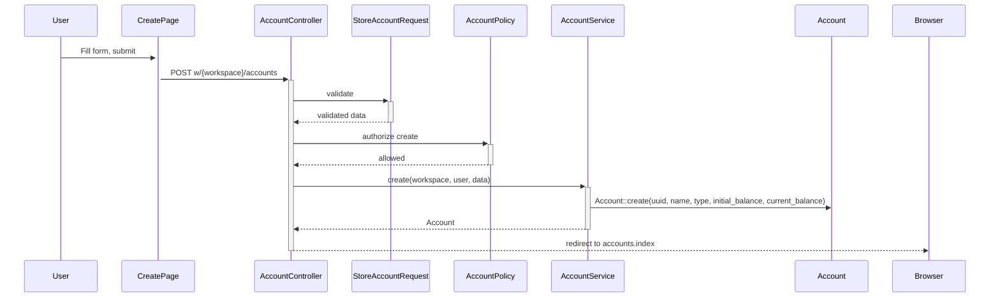

# Contas Bancárias — Design

**Spec**: `.specs/features/contas-bancarias/spec.md`
**Status**: Draft

---

## Architecture Overview

```
┌──────────────────────────────────────────────────────────┐
│                    INERTIA SSR LAYER                      │
│  Pages/Accounts/{Index,Create,Edit}.tsx                   │
│  Components/ui/{card,input,label,badge,select,button}     │
├──────────────────────────────────────────────────────────┤
│                    CONTROLLER LAYER                       │
│  AccountController (resource)                             │
│  StoreAccountRequest / UpdateAccountRequest               │
│  AccountPolicy                                            │
├──────────────────────────────────────────────────────────┤
│                    SERVICE LAYER                           │
│  AccountService (create, update, recalculateBalance,      │
│                  archive)                                 │
├──────────────────────────────────────────────────────────┤
│                    DATA LAYER                              │
│  Account model (UUID PK, workspace FK, soft deletes,      │
│                 denormalized current_balance)              │
└──────────────────────────────────────────────────────────┘
```

### Request Flow (create account)



---

## Code Reuse Analysis

### Existing Components to Leverage

| Component | Location | How to Use |
|-----------|----------|------------|
| `AuthenticatedLayout` | `Layouts/AuthenticatedLayout.tsx` | Wrap all account pages |
| `Card`, `CardContent`, `CardHeader`, `CardTitle` | `components/ui/card.tsx` | Account list cards, form cards |
| `Button` | `components/ui/button.tsx` | Form submit, actions |
| `Input` | `components/ui/input.tsx` | Form text fields |
| `Label` | `components/ui/label.tsx` | Form field labels |
| `Badge` | `components/ui/badge.tsx` | Account type badge (checking/savings/investment) |
| `useForm()` | Inertia built-in | Form state, submission, errors |
| `route()` | Ziggy global | All links and redirects |
| `AccountPolicy` pattern | `WorkspacePolicy` | Same role-based gate structure |
| `AccountService` pattern | `WorkspaceService` | Same service injection + `Str::orderedUuid()` |
| `AccountResource` pattern | `WorkspaceResource` | Same JsonResource structure |
| FormRequest pattern | `StoreWorkspaceRequest` | Same `authorize()`, `rules()`, `messages()` |

### New shadcn/ui components needed

| Component | Command |
|-----------|---------|
| `Select` | `npx shadcn-ui@latest add select` |

### Integration Points

| System | Integration Method |
|--------|-------------------|
| Workspace context | Add `workspace` to HandleInertiaRequests shared data (resolve from `w/{workspace}` route param) |
| Sidebar navigation | Update `Accounts` link to use `route('accounts.index', { workspace })` |
| Future transaction services | `AccountService::recalculateBalance()` will be called by IncomeService, ExpenseService, BillPaymentService |

---

## Components

### Backend

#### 1. AccountType Enum
- **Purpose**: Define valid account types
- **Location**: `app/Enums/AccountType.php`
- **Cases**: `Checking = 'checking'`, `Savings = 'savings'`, `Investment = 'investment'`
- **Reuses**: `WorkspaceRole` enum pattern

#### 2. Account Model
- **Purpose**: Eloquent model for accounts table
- **Location**: `app/Models/Account.php`
- **Traits**: `HasFactory`, `SoftDeletes`
- **Fillable**: `uuid`, `workspace_id`, `created_by`, `name`, `type`, `initial_balance`, `current_balance`
- **Route key**: `uuid`
- **Casts**: `initial_balance` → `decimal:2`, `current_balance` → `decimal:2`
- **Relationships**: `belongsTo(Workspace::class)`, `belongsTo(User::class, 'created_by')`

#### 3. Migration
- **Purpose**: Create `accounts` table
- **Location**: `database/migrations/XXXX_create_accounts_table.php`
- **Columns**: `id` (bigint), `uuid` (string unique), `workspace_id` (FK→workspaces CASCADE), `created_by` (FK→users), `name` (string), `type` (string), `initial_balance` (decimal 15,2), `current_balance` (decimal 15,2), `deleted_at` (timestamp nullable), timestamps

#### 4. AccountController
- **Purpose**: Resource controller for accounts CRUD
- **Location**: `app/Http/Controllers/AccountController.php`
- **Methods**: `index`, `create`, `store`, `show`, `edit`, `update`, `destroy`
- **Dependencies**: Injects `AccountService` into store/update/destroy
- **Auth**: `$this->authorize()` calls before actions using AccountPolicy
- **Reuses**: `WorkspaceController` pattern

#### 5. AccountService
- **Purpose**: Business logic for account operations
- **Location**: `app/Services/AccountService.php`
- **Methods**:
  - `create(Workspace $workspace, User $creator, array $data): Account`
  - `update(Account $account, array $data): Account`
  - `recalculateBalance(Account $account): void` — recomputes `current_balance` from all transactions (stub for now; transactions don't exist yet)
  - `archive(Account $account): void` — soft-delete with check for dependent transactions (future)
- **Reuses**: `WorkspaceService` pattern (`Str::orderedUuid()`, `Model::create()`)

#### 6. AccountPolicy
- **Purpose**: Authorization for account actions
- **Location**: `app/Policies/AccountPolicy.php`
- **Methods**:
  - `viewAny(User $user, Workspace $workspace): bool` — member check
  - `create(User $user, Workspace $workspace): bool` — admin or editor
  - `update(User $user, Workspace $workspace, Account $account): bool` — admin or editor + workspace match
  - `delete(User $user, Workspace $workspace, Account $account): bool` — admin only
- **Reuses**: `WorkspacePolicy` role-check pattern

#### 7. FormRequests
- **StoreAccountRequest** (`app/Http/Requests/StoreAccountRequest.php`):
  - `name`: required, string, max:255
  - `type`: required, Enum(AccountType::class)
  - `initial_balance`: required, numeric, min:0
- **UpdateAccountRequest** (`app/Http/Requests/UpdateAccountRequest.php`):
  - `name`: sometimes, string, max:255
  - `type`: sometimes, Enum(AccountType::class)
  - `initial_balance`: sometimes, numeric, min:0 (editable only when no transactions; enforced in service, not form request)

#### 8. AccountResource
- **Purpose**: Transform Account model for API/Inertia responses
- **Location**: `app/Http/Resources/AccountResource.php`
- **Fields**: `uuid`, `name`, `type`, `initial_balance` (float), `current_balance` (float), `created_at` (ISO string)
- **Conditional**: `workspace` (nested WorkspaceResource when loaded)

### Frontend

#### 9. Pages/Accounts/Index.tsx
- **Purpose**: List all non-archived accounts with balance cards
- **Props**: `{ accounts: AccountResource[], workspace: { uuid, name } }`
- **Layout**: Grid of `Card` components (responsive: 1col mobile, 2col tablet, 3col desktop)
- **States**: Empty state ("Nenhuma conta cadastrada" + CTA to create), loaded state, processing state (useForm processing)
- **Actions per card**: Edit link, Delete button (with confirmation)
- **Header**: Title "Contas" + "Nova Conta" button linking to `accounts.create`

#### 10. Pages/Accounts/Create.tsx
- **Purpose**: Form to create a new account
- **Props**: `{ workspace: { uuid } }`
- **Form fields**: name (Input), type (Select with 3 options: Corrente/Poupança/Investimento), initial_balance (Input type number)
- **Labels in pt-BR**: "Nome da Conta", "Tipo", "Saldo Inicial"
- **Submit**: POST to `route('accounts.store', { workspace })`
- **Cancel**: Link back to `accounts.index`
- **Validation**: Inline errors via `form.errors`

#### 11. Pages/Accounts/Edit.tsx
- **Purpose**: Form to edit existing account
- **Props**: `{ account: AccountResource, workspace: { uuid } }`
- **Form fields**: Same as Create, pre-populated from account
- **Submit**: PUT to `route('accounts.update', { workspace, account })`
- **Cancel**: Link back to `accounts.index`

#### 12. Sidebar Update (AppSidebar.tsx)
- **Change**: Replace hardcoded `href: '/accounts'` with `route('accounts.index', { workspace: workspaceUuid })`
- **Pre-requisite**: Workspace must be available in shared Inertia data

### Infrastructure Prerequisites

#### 13. Workspace in Shared Inertia Data
- **Change**: Add `workspace` to `HandleInertiaRequests::share()`
- **Approach**: Resolve `{workspace}` route parameter, load model, wrap in `WorkspaceResource`
- **Fields**: `uuid`, `name`, `role` (user's role in this workspace)

---

## Data Models

### Account

```
accounts
├── id                  bigint (auto-increment)
├── uuid                string (unique) — route model binding
├── workspace_id        FK → workspaces (CASCADE on delete)
├── created_by          FK → users (SET NULL on delete)
├── name                string
├── type                string — AccountType enum value
├── initial_balance     decimal(15,2)
├── current_balance     decimal(15,2) — denormalized, synced by services
├── deleted_at          timestamp nullable — SoftDeletes
├── created_at          timestamp
└── updated_at          timestamp
```

**Balance formula (documented for future services)**:
```
current_balance = initial_balance
                + SUM(income.value WHERE account_id = this.id)
                - SUM(debit_expenses.value WHERE account_id = this.id AND is_paid = true)
                - SUM(credit_card_bill_payments.amount WHERE account_id = this.id)
```

---

## Error Handling Strategy

| Error Scenario | Handling | User Impact |
|---------------|----------|-------------|
| Validation fails (name empty, invalid type, negative balance) | FormRequest returns 422 with pt-BR messages | Inline errors below each field |
| Viewer role tries to create/edit | AccountPolicy denies → 403 | Redirect with flash error: "Você não tem permissão." |
| Non-member accesses workspace accounts | `viewAny` policy denies → 403 | Redirect with flash error |
| Account not found (wrong UUID) | Route model binding → 404 | Laravel 404 page |
| Workspace not found | Route model binding → 404 | Laravel 404 page |
| Duplicate account name (same workspace) | No unique constraint — allowed (user may have multiple checking accounts) | — |

---

## Tech Decisions

| Decision | Choice | Rationale |
|----------|--------|-----------|
| Balance persistence | Denormalized `current_balance` column | Spec decision; updated by services |
| UUID generation | `Str::orderedUuid()` in Service layer | Matches WorkspaceService pattern |
| Account type enum | PHP 8.3 native enum backed by string | Matches WorkspaceRole pattern |
| Soft deletes | Laravel `SoftDeletes` trait from day 1 | Spec decision; avoids migration churn |
| Audit: created_by | FK to users on account creation | Spec decision; tracked in create() |
| workspace in Inertia | Share via HandleInertiaRequests | Needed by sidebar and all workspace-scoped pages |
| Balance editing locked | Service checks for transactions before allowing initial_balance change | Forward-compatible; always allowed until DEBT-01 ships |
| shadcn Select | Install via `npx shadcn-ui@latest add select` | Needed for account type dropdown; no existing Select component |
| Number input for balance | HTML `input type="number"` with step="0.01" | Simple; dedicated currency input can come later |

---

## Route Design

```php
// In web.php, inside w/{workspace} prefix group:
Route::resource('accounts', AccountController::class);
// Generates:
// GET    w/{workspace}/accounts              → accounts.index
// GET    w/{workspace}/accounts/create       → accounts.create
// POST   w/{workspace}/accounts              → accounts.store
// GET    w/{workspace}/accounts/{account}    → accounts.show
// GET    w/{workspace}/accounts/{account}/edit → accounts.edit
// PUT    w/{workspace}/accounts/{account}    → accounts.update
// DELETE w/{workspace}/accounts/{account}    → accounts.destroy
```

---

## Test Design (TDD-First)

**Gate commands:**
```bash
# Backend (per test file)
php artisan test --filter=AccountCreationTest
php artisan test --filter=AccountUpdateTest
php artisan test --filter=AccountDeletionTest
php artisan test --filter=AccountAuthorizationTest

# E2E
npx cypress run --spec "cypress/e2e/accounts/**/*"
```

### Spec → Test Traceability

| AC # | Acceptance Criteria | PHPUnit Test | E2E Test |
|------|--------------------|-------------|----------|
| ACCT-01.1 | Create account (name, type, initial_balance) | `AccountCreationTest::test_user_can_create_account` | `accounts/crud.cy.js` — create |
| ACCT-01.1 | Validation errors on create | `AccountCreationTest::test_validation_errors_on_create` | — |
| ACCT-01.2 | Account list with BRL balance | `AccountCreationTest::test_account_list_shows_balances` | `accounts/crud.cy.js` — list |
| ACCT-01.3 | Edit account name/type | `AccountUpdateTest::test_user_can_update_account` | `accounts/crud.cy.js` — edit |
| ACCT-01.4 | Delete account without transactions | `AccountDeletionTest::test_user_can_hard_delete_account` | `accounts/crud.cy.js` — delete |
| ACCT-01.4 | Archive account with transactions (soft delete) | `AccountDeletionTest::test_account_with_transactions_is_soft_deleted` | — |
| ACCT-01    | Viewer cannot create | `AccountAuthorizationTest::test_viewer_cannot_create_account` | — |
| ACCT-01    | Viewer cannot edit | `AccountAuthorizationTest::test_viewer_cannot_update_account` | — |
| ACCT-01    | Viewer cannot delete | `AccountAuthorizationTest::test_viewer_cannot_delete_account` | — |
| Edge       | Zero initial_balance accepted | `AccountCreationTest::test_account_with_zero_balance_is_accepted` | — |
| Edge       | Negative initial_balance accepted | `AccountCreationTest::test_account_with_negative_balance_is_accepted` | — |
| Edge       | Cross-workspace isolation (404) | `AccountAuthorizationTest::test_cannot_access_account_from_other_workspace` | — |
| Edge       | Empty state shown | — | `accounts/crud.cy.js` — empty state |

**Coverage:** 13 tests (9 PHPUnit + 4 E2E), mapping all acceptance criteria + edge cases

---

### PHPUnit Feature Tests

#### `tests/Feature/Accounts/AccountCreationTest.php`
**TDD Gate:** `php artisan test --filter=AccountCreationTest`

| Test Method | Arrangement | Action | Assertions |
|-------------|-------------|--------|------------|
| `test_user_can_create_account` | Admin user in workspace | POST `accounts.store` with name, type, initial_balance | 302 redirect, DB has account with workspace_id, initial_balance = current_balance |
| `test_validation_errors_on_create` | Admin user in workspace | POST `accounts.store` with empty/ invalid data | 302 with validation errors for name (required), type (enum), balance (numeric) |
| `test_account_list_shows_balances` | Admin, 2 accounts with different balances | GET `accounts.index` | Inertia response with 2 accounts, BRL values present |
| `test_account_with_zero_balance_is_accepted` | Admin user in workspace | POST `accounts.store` with initial_balance = 0 | 302, DB has current_balance = 0 |
| `test_account_with_negative_balance_is_accepted` | Admin user in workspace | POST `accounts.store` with initial_balance = -500 | 302, DB has current_balance = -500 |

#### `tests/Feature/Accounts/AccountUpdateTest.php`
**TDD Gate:** `php artisan test --filter=AccountUpdateTest`

| Test Method | Arrangement | Action | Assertions |
|-------------|-------------|--------|------------|
| `test_user_can_update_account` | Admin, existing account | PUT `accounts.update` with new name, type | 302, DB updated |
| `test_cannot_update_account_with_invalid_type` | Admin, existing account | PUT `accounts.update` with invalid type | 422 validation error |

#### `tests/Feature/Accounts/AccountDeletionTest.php`
**TDD Gate:** `php artisan test --filter=AccountDeletionTest`

| Test Method | Arrangement | Action | Assertions |
|-------------|-------------|--------|------------|
| `test_user_can_hard_delete_account` | Admin, account with no transactions | DELETE `accounts.destroy` | 302, account removed from DB (id + uuid gone) |
| `test_account_with_transactions_is_soft_deleted` | Admin, account (stub: mock hasTransactions = true in service) | DELETE `accounts.destroy` | 302, soft deleted (deleted_at set), still in DB |

#### `tests/Feature/Accounts/AccountAuthorizationTest.php`
**TDD Gate:** `php artisan test --filter=AccountAuthorizationTest`

| Test Method | Arrangement | Action | Assertions |
|-------------|-------------|--------|------------|
| `test_viewer_cannot_create_account` | Viewer user in workspace | POST `accounts.store` | 403 |
| `test_viewer_cannot_update_account` | Viewer, existing account | PUT `accounts.update` | 403 |
| `test_viewer_cannot_delete_account` | Viewer, existing account | DELETE `accounts.destroy` | 403 |
| `test_cannot_access_account_from_other_workspace` | User in workspace A | GET account from workspace B | 404 |

---

### Cypress E2E Tests

#### `cypress/e2e/accounts/crud.cy.js`
**TDD Gate:** `npx cypress run --spec "cypress/e2e/accounts/crud.cy.js"`

**Pre-requisite:** User is registered, verified, with an active workspace (reuse login helper or inline setup).

| Test | User Journey | Verification |
|------|-------------|--------------|
| `creates an account and sees it in the list` | Nav → "Contas" → click "Nova Conta" → fill name, select type "Corrente", enter balance 1000 → submit | Redirected to list, card shows name, type badge, "R$ 1.000,00" |
| `shows validation errors` | Nav → "Contas" → click "Nova Conta" → submit empty form | Inline errors: "O nome é obrigatório", "O tipo é obrigatório", "O saldo inicial é obrigatório" |
| `edits an existing account` | On list → click "Editar" on first account → change name → submit | Redirected to list, updated name shown |
| `deletes an account` | On list → click "Excluir" on account → confirm dialog | Account card removed from list |

---

### Test Infrastructure: AccountFactory

#### `database/factories/AccountFactory.php`

```php
class AccountFactory extends Factory
{
    protected $model = Account::class;

    public function definition(): array
    {
        return [
            'uuid' => Str::orderedUuid()->toString(),
            'name' => fake()->company(),
            'type' => fake()->randomElement(['checking', 'savings', 'investment']),
            'initial_balance' => fake()->randomFloat(2, 0, 100000),
            'current_balance' => fn (array $attrs) => $attrs['initial_balance'] ?? 0,
        ];
    }
}
```
