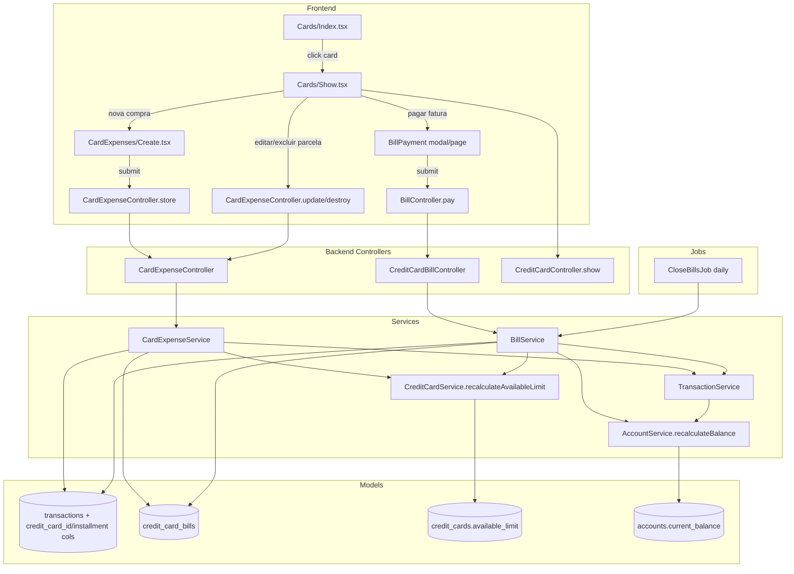

# Despesas de Cartão de Crédito — Design

**Spec:** `.specs/features/despesas-cartao/spec.md`
**Status:** Draft

---

## Architecture Overview

CCXP-01 extends two existing systems (CreditCards + Transactions) and introduces a new entity (CreditCardBill) that mediates the lifecycle between them. The design follows the same layered architecture established in prior features: Controller → Service → Model, all responses via ApiResources, all auth via Policies.

The key new architectural elements are:

1. **CreditCardBill** — a new model representing a billing cycle (card + year + month + status + total)
2. **BillService** — coordinates expense-to-bill bucketing, bill closing, and bill payment
3. **CardExpenseService** — coordinates single/installment expense creation, edit/delete with scope, and `available_limit` recalculation
4. **Transaction schema extension** — new nullable columns: `credit_card_id`, `installment_number`, `installments_total`, `installment_group_id`, `credit_card_bill_id`
5. **CreditCardService upgrade** — `recalculateAvailableLimit()` now queries real card expenses on non-paid bills
6. **TransactionService extension** — `create()` now has split paths: debit (existing) vs credit (new)
7. **Scheduled job** — daily closure of bills past their closing_day



### Key data flows

| Operation | Flow |
|-----------|------|
| Create single card expense | CardExpenseController → CardExpenseService → findOrCreate bill → create Transaction(credit_card_id, bill_id) → recalculateAvailableLimit |
| Create installment expense | CardExpenseController → CardExpenseService → for each installment: findOrCreate bill → create Transaction → recalculateAvailableLimit (once at end) |
| Pay bill | BillController → BillService → DB::transaction: create payment Transaction(account_id, paid_at=now) + mark bill Paid + link payment_transaction_id + recalculateBalance(account) + recalculateAvailableLimit(card) |
| Undo bill payment | BillController → BillService → DB::transaction: soft-delete payment Transaction + mark bill Closed + recalculateBalance(account) + recalculateAvailableLimit(card) |
| Close bills (scheduled) | CloseBillsJob → BillService::closeBillsBefore(today) → for each open bill with closing_date < today: mark Closed, create next open bill |
| Edit installment (this only) | CardExpenseController → CardExpenseService::updateSingle → update row + re-bucket if date changed + recalculateAvailableLimit |
| Edit installment (this + future) | CardExpenseController → CardExpenseService::updateGroup → update rows ≥ current installment_number + recalculateAvailableLimit for affected bills |
| Delete installment (this only/future) | CardExpenseController → CardExpenseService::deleteSingle/deleteGroup → soft-delete rows + recalculateAvailableLimit |
| View card bills | CreditCardController@show → load card + current open bill + bills list → Cards/Show.tsx |

---

## Code Reuse Analysis

### Existing Components to Leverage

| Component | Location | How to Use |
|-----------|----------|------------|
| TransactionController | `app/Http/Controllers/TransactionController.php` | Keep as-is for debit expenses; new CardExpenseController handles credit path separately |
| TransactionService | `app/Services/TransactionService.php` | Extended: `create()` gets a credit-card branch; `syncTags()` reused; tag/balance recalc patterns reused |
| CreditCardService | `app/Services/CreditCardService.php` | Upgrade `recalculateAvailableLimit()` from stub to real; add `ensurePaymentCategory()` |
| AccountService::recalculateBalance() | `app/Services/AccountService.php:45` | Reuse as-is for bill payment (creates a debit Transaction → recalc) |
| TransactionType enum | `app/Enums/TransactionType.php` | Reuse `Expense` for card expenses and bill payment transactions |
| Transaction model | `app/Models/Transaction.php` | Extend fillable + casts + relationships for card fields |
| CreditCard model | `app/Models/CreditCard.php` | Add `transactions()` and `bills()` relationships |
| Workspace model | `app/Models/Workspace.php` | Add `creditCardBills()` relationship |
| TransactionPolicy | `app/Policies/TransactionPolicy.php` | Reuse for CardExpense authorization (same role checks) |
| CreditCardPolicy | `app/Policies/CreditCardPolicy.php` | Reuse for bill viewing; add `pay` method for bill payment auth |
| taggables migration | `database/migrations/*_create_taggables_table.php` | Card expenses use same morphToMany tags as debit |
| formatCurrency() | `resources/js/lib/format-currency.ts` | BRL formatting for bill totals, expense values, available limit |
| AuthenticatedLayout | `resources/js/Layouts/AuthenticatedLayout.tsx` | Wrap all new pages |
| Card, CardContent, CardHeader, CardTitle | `resources/js/Components/ui/` | Form containers, bill display, expense cards |
| Button, Input, Label, Badge, Select | `resources/js/Components/ui/` | Form inputs and badges |
| DynamicIcon | `resources/js/Components/DynamicIcon.tsx` | Category icons on bill expenses |
| Cards/Index.tsx | `resources/js/Pages/Cards/Index.tsx` | Add "Ver fatura" link per card |
| Cards/Create.tsx, Cards/Edit.tsx | `resources/js/Pages/Cards/` | Unchanged (card CRUD stays as-is) |
| Transactions/Index.tsx | `resources/js/Pages/Transactions/Index.tsx` | Bill payment transactions appear here naturally (they are regular debit expenses) |
| TransactionFactory | `database/factories/TransactionFactory.php` | Extend with credit card fields (nullable by default) |
| CreditCardFactory | `database/factories/CreditCardFactory.php` | Reuse as-is |

### Integration Points

| System | Integration Method |
|--------|---------------------|
| Transactions table | New migration adds nullable columns: `credit_card_id`, `installment_number`, `installments_total`, `installment_group_id`, `credit_card_bill_id` |
| CreditCards table | No schema change; `available_limit` column already exists (CARD-01) |
| Accounts table | No schema change; bill payment creates debit Transaction with `account_id` |
| Categories table | No schema change; card expenses use existing Expense/Both categories; system auto-creates "Pagamento de Cartão" category |
| Routes (web.php) | New routes for `cards/{card}/bills`, `cards/{card}/expenses` resource, `bills/{bill}/pay`, `bills/{bill}/unpay` |
| AppSidebar | "Cartões" already links to cards.index; bills reachable from card show page |
| Scheduled jobs | New `CloseBillsJob` scheduled daily at midnight in `routes/console.php` or `bootstrap/app.php` |

---

## Data Models

### Transaction (Extended)

**Migration:** new migration adds nullable columns to existing `transactions` table

```php
Schema::table('transactions', function (Blueprint $table) {
    $table->foreignId('credit_card_id')->nullable()->after('account_id')->constrained('credit_cards');
    $table->foreignId('credit_card_bill_id')->nullable()->after('credit_card_id')->constrained('credit_card_bills');
    $table->integer('installment_number')->nullable()->after('date');
    $table->integer('installments_total')->nullable()->after('installment_number');
    $table->uuid('installment_group_id')->nullable()->after('installments_total');
});
```

**Model additions to `Transaction`:**

```php
// Add to $fillable
'credit_card_id', 'credit_card_bill_id', 'installment_number', 'installments_total', 'installment_group_id',

// Add to casts
'installment_number' => 'integer',
'installments_total' => 'integer',

// New relationships
public function creditCard(): BelongsTo
{
    return $this->belongsTo(CreditCard::class);
}

public function bill(): BelongsTo
{
    return $this->belongsTo(CreditCardBill::class, 'credit_card_bill_id');
}
```

**Discriminator logic:** `account_id !== null` → debit expense; `credit_card_id !== null` → credit card expense. Validation enforces mutual exclusivity (exactly one is non-null).

### CreditCardBill (New Model)

**Migration:**

```php
Schema::create('credit_card_bills', function (Blueprint $table) {
    $table->id();
    $table->uuid('uuid')->unique();
    $table->foreignId('credit_card_id')->constrained('credit_cards')->cascadeOnDelete();
    $table->foreignId('workspace_id')->constrained('workspaces')->cascadeOnDelete();
    $table->year('period_year');
    $table->tinyInteger('period_month');     // 1-12
    $table->date('closing_date');             // computed from closing_day + period
    $table->date('due_date');                 // computed from due_day + period
    $table->string('status')->default('open'); // open | closed | paid
    $table->decimal('total_amount', 15, 2)->default(0);
    $table->timestamp('closed_at')->nullable();
    $table->timestamp('paid_at')->nullable();
    $table->foreignId('paid_to_account_id')->nullable()->constrained('accounts');
    $table->foreignId('payment_transaction_id')->nullable()->constrained('transactions');
    $table->foreignId('created_by')->constrained('users');
    $table->timestamps();
    $table->softDeletes();

    $table->unique(['credit_card_id', 'period_year', 'period_month']);
    $table->index(['credit_card_id', 'status']);
});
```

**Model:** `App\Models\CreditCardBill`

```php
class CreditCardBill extends Model
{
    use HasFactory, SoftDeletes;

    protected $fillable = [
        'uuid', 'credit_card_id', 'workspace_id', 'period_year', 'period_month',
        'closing_date', 'due_date', 'status', 'total_amount', 'closed_at',
        'paid_at', 'paid_to_account_id', 'payment_transaction_id', 'created_by',
    ];

    protected function casts(): array
    {
        return [
            'period_year' => 'integer',
            'period_month' => 'integer',
            'closing_date' => 'date',
            'due_date' => 'date',
            'status' => BillStatus::class,
            'total_amount' => 'decimal:2',
            'closed_at' => 'datetime',
            'paid_at' => 'datetime',
        ];
    }

    public function getRouteKeyName(): string { return 'uuid'; }

    public function creditCard(): BelongsTo { return $this->belongsTo(CreditCard::class); }
    public function workspace(): BelongsTo { return $this->belongsTo(Workspace::class); }
    public function transactions(): HasMany { return $this->hasMany(Transaction::class, 'credit_card_bill_id'); }
    public function paymentAccount(): BelongsTo { return $this->belongsTo(Account::class, 'paid_to_account_id'); }
    public function paymentTransaction(): BelongsTo { return $this->belongsTo(Transaction::class, 'payment_transaction_id'); }
    public function creator(): BelongsTo { return $this->belongsTo(User::class, 'created_by'); }
}
```

**Relationships:**
- `CreditCard` hasMany `CreditCardBill` (via `bills()`)
- `CreditCardBill` hasMany `Transaction` (via `transactions()`, using `credit_card_bill_id`)
- `CreditCardBill` belongsTo `Account` (via `paid_to_account_id`, nullable)
- `CreditCardBill` belongsTo `Transaction` (via `payment_transaction_id`, nullable — the debit transaction created when paying)
- `Workspace` hasMany `CreditCardBill` (via `creditCardBills()`)

### BillStatus Enum (New)

```php
enum BillStatus: string
{
    case Open = 'open';
    case Closed = 'closed';
    case Paid = 'paid';

    public function label(): string
    {
        return match ($this) {
            self::Open => 'Aberta',
            self::Closed => 'Fechada',
            self::Paid => 'Paga',
        };
    }
}
```

**Location:** `app/Enums/BillStatus.php`

### CreditCard (Extended)

```php
// New relationships
public function transactions(): HasMany
{
    return $this->hasMany(Transaction::class, 'credit_card_id');
}

public function bills(): HasMany
{
    return $this->hasMany(CreditCardBill::class);
}

// Helper: current open bill (creates if not exists, optionally)
public function openBill(): ?CreditCardBill
{
    return $this->bills()->where('status', BillStatus::Open)->first();
}
```

### CreditCardBillFactory

```php
class CreditCardBillFactory extends Factory
{
    protected $model = CreditCardBill::class;

    public function definition(): array
    {
        return [
            'uuid' => Str::orderedUuid()->toString(),
            'period_year' => now()->year,
            'period_month' => now()->month,
            'closing_date' => now()->toDateString(),
            'due_date' => now()->addDays(10)->toDateString(),
            'status' => BillStatus::Open->value,
            'total_amount' => 0,
            'created_by' => User::factory(),
        ];
    }
}
```

### TransactionFactory (Extended)

Add nullable credit card fields to definition:

```php
'credit_card_id' => null,
'credit_card_bill_id' => null,
'installment_number' => null,
'installments_total' => null,
'installment_group_id' => null,
```

---

## Components

### CardExpenseController

- **Purpose:** Resource controller for credit card expenses (single + installment)
- **Location:** `app/Http/Controllers/CardExpenseController.php`
- **Scope:** Nested under `cards/{card}` prefix
- **Dependencies:** CardExpenseService, CreditCardService
- **Reuses:** TransactionController pattern (authorize → abort_if cross-workspace → service → redirect)

**Actions:**

| Method | Route | Auth | Service Call | Response |
|--------|-------|------|-------------|----------|
| `index` | GET `cards/{card}/expenses` | viewAny | — | Inertia: card expenses list on bill page |
| `create` | GET `cards/{card}/expenses/create` | create | — | Inertia: card + categories + tags |
| `store` | POST `cards/{card}/expenses` | create | `createSingle()` or `createInstallment()` | Redirect → cards.show |
| `edit` | GET `cards/{card}/expenses/{transaction}/edit` | update | — | Inertia: transaction + categories + tags + card |
| `update` | PUT `cards/{card}/expenses/{transaction}` | update | `updateSingle()` or `updateGroup()` | Redirect → cards.show |
| `destroy` | DELETE `cards/{card}/expenses/{transaction}` | delete | `deleteSingle()` or `deleteGroup()` | Redirect → cards.show |

**Cross-workspace guards:**
- `abort_if($card->workspace_id !== $workspace->id, 404)`
- `abort_if($transaction->workspace_id !== $workspace->id, 404)`
- `abort_if($transaction->credit_card_id !== $card->id, 404)`

### CardExpenseService

- **Purpose:** Business logic for creating, editing, deleting card expenses (single + installments)
- **Location:** `app/Services/CardExpenseService.php`
- **Dependencies:** CreditCardService, BillService
- **Reuses:** TransactionService pattern (DB::transaction, tag sync, recalc triggers)

**Methods:**

| Method | Signature | Behavior |
|--------|-----------|----------|
| `createSingle` | `(Workspace, User, CreditCard, array $data): Transaction` | Validate card not archived; findOrCreate bill for date; create Transaction(credit_card_id, bill_id, paid_at=null); sync tags; recalculateAvailableLimit |
| `createInstallment` | `(Workspace, User, CreditCard, array $data): string` | Validate card not archived; validate count 1-48; generate installment_group_id; round values (last absorbs remainder); for each installment: findOrCreate bill, create Transaction; recalculateAvailableLimit (once); return group_id |
| `updateSingle` | `(Transaction, array $data, string $scope): void` | If scope=group → delegate to updateGroup; else: update row; if date changed → re-bucket to correct bill; sync tags; recalc affected bill totals; recalculateAvailableLimit |
| `updateGroup` | `(Transaction $installment, array $data): void` | Update all rows with same installment_group_id AND installment_number >= current; sync tags on each; recalc affected bill totals; recalculateAvailableLimit |
| `deleteSingle` | `(Transaction): void` | Soft-delete one row; recalc bill total; recalculateAvailableLimit |
| `deleteGroup` | `(Transaction $installment): void` | Soft-delete all rows with same group_id AND installment_number >= current; recalc affected bill totals; recalculateAvailableLimit |
| `resolveCategoryId` | `(Workspace, string $uuid): int` | Resolve category UUID to ID (same as TransactionService) |
| `syncTags` | `(Transaction, array): void` | Same polymorphic tag sync as TransactionService |

**All mutation methods** are wrapped in `DB::transaction()`.

### BillService

- **Purpose:** Bill lifecycle management — creation, closing, payment, undo payment
- **Location:** `app/Services/BillService.php`
- **Dependencies:** CreditCardService, AccountService, TransactionService (for payment transaction creation)
- **Reuses:** AccountService::recalculateBalance for bill payment; TransactionService::create pattern for payment transaction

**Methods:**

| Method | Signature | Behavior |
|--------|-----------|----------|
| `findOrCreateBill` | `(CreditCard, Carbon $date): CreditCardBill` | Compute period_year/period_month from date + card.closing_day; find existing bill for (card, year, month) or create new (closing_date, due_date computed); return bill |
| `closeBill` | `(CreditCardBill): void` | Set status=Closed, closed_at=now(); do NOT create next bill (lazy creation) |
| `closeBillsBefore` | `(Carbon $date): int` | Find all Open bills with closing_date < $date → close them; return count; called by scheduled job |
| `payBill` | `(CreditCardBill, Account, User): Transaction` | DB::transaction: ensure "Pagamento de Cartão" category exists; create payment Transaction(type=Expense, account_id, paid_at=now, value=bill.total, description="Pagamento Fatura {card.name} {mm}/{yy}"); mark bill status=Paid, paid_at=now, paid_to_account_id, payment_transaction_id; recalculateBalance(account); recalculateAvailableLimit(card) |
| `undoPayment` | `(CreditCardBill): void` | DB::transaction: soft-delete payment Transaction; mark bill status=Closed, paid_at=null, paid_to_account_id=null, payment_transaction_id=null; recalculateBalance(account); recalculateAvailableLimit(card) |
| `recalculateBillTotal` | `(CreditCardBill): void` | `bill.total_amount = sum(value where bill_id = bill.id and deleted_at is null)`; persist |
| `computeClosingDate` | `(CreditCard, int $year, int $month): Carbon` | Build date from closing_day + year + month; if day > days_in_month → last day of month |
| `computeDueDate` | `(CreditCard, int $year, int $month): Carbon` | Build date from due_day + year + month; if day > days_in_month → last day of month |
| `computeBillPeriod` | `(CreditCard, Carbon $purchaseDate): array` | Returns ['year' => int, 'month' => int] — find the bill cycle where purchaseDate ≤ closing_date of that cycle |

**computeBillPeriod logic:**

```
Given purchase_date D and card.closing_day C:
  candidate_closing = Date(year(D), month(D), min(C, days_in_month))
  IF D <= candidate_closing:
    // purchase falls in the cycle that closes this month
    period_year = year(D)
    period_month = month(D)
  ELSE:
    // purchase falls in next cycle (closes next month)
    nextMonth = D->addMonth NoModify
    period_year = year(nextMonth)
    period_month = month(nextMonth)
```

### CreditCardService (Extended)

- **Purpose:** Upgrade existing service to support real available_limit calculation + "Pagamento de Cartão" category
- **Location:** `app/Services/CreditCardService.php` (existing, modified)

**Upgraded methods:**

```php
public function recalculateAvailableLimit(CreditCard $card): void
{
    $openExpensesTotal = Transaction::where('credit_card_id', $card->id)
        ->whereHas('bill', function ($q) {
            $q->whereIn('status', ['open', 'closed'])
              ->whereNull('paid_at');
        })
        ->orWhere('credit_card_id', $card->id)
        ->whereNull('credit_card_bill_id')
        ->whereNotNull('credit_card_id')
        ->sum('value');

    $card->available_limit = (float) $card->credit_limit - (float) $openExpensesTotal;
    $card->save();
}
```

**Simpler alternative** (preferred — avoids whereHas complexity):

```php
public function recalculateAvailableLimit(CreditCard $card): void
{
    // Sum all card expenses on non-paid bills
    $usedLimit = Transaction::where('credit_card_id', $card->id)
        ->whereNull('transactions.deleted_at')
        ->leftJoin('credit_card_bills', 'transactions.credit_card_bill_id', '=', 'credit_card_bills.id')
        ->where(function ($q) {
            $q->where('credit_card_bills.status', '!=', 'paid')
              ->orWhereNull('transactions.credit_card_bill_id');
        })
        ->sum('transactions.value');

    $card->available_limit = (float) $card->credit_limit - (float) $usedLimit;
    $card->save();
}
```

**New method:**

```php
public function ensurePaymentCategory(Workspace $workspace): Category
{
    $category = Category::where('workspace_id', $workspace->id)
        ->where('name', 'Pagamento de Cartão')
        ->first();

    if ($category) {
        return $category;
    }

    return Category::create([
        'uuid' => Str::orderedUuid()->toString(),
        'workspace_id' => $workspace->id,
        'name' => 'Pagamento de Cartão',
        'type' => TransactionType::Expense,
        'color' => '#6B7280',
        'is_system' => true,
    ]);
}
```

**Note:** The `ensurePaymentCategory` method creates a system-managed category. This requires adding an `is_system` boolean column to the `categories` table (nullable, default false) and updating the Category model. System categories cannot be deleted by users (checked in CategoryController@destroy or CategoryService@archive).

### CreditCardController (Extended)

- **Changes:** Add `show` method (currently missing — CARD-01 design skipped it intentionally)
- **Purpose:** Display card details + current bill + historical bills

```php
public function show(Workspace $workspace, CreditCard $card): Response
{
    abort_if($card->workspace_id !== $workspace->id, 404);
    $this->authorize('viewAny', [CreditCard::class, $workspace]);

    $card->load(['bills' => fn ($q) => $q->orderByDesc('period_year')
        ->orderByDesc('period_month')->limit(12)]);

    $openBill = $card->bills()->where('status', BillStatus::Open)->first();
    if ($openBill) {
        $openBill->load(['transactions' => fn ($q) => $q
            ->with(['category', 'tags'])
            ->orderBy('date')
            ->orderBy('installment_number')]);
    }

    return inertia('Cards/Show', [
        'card' => new CreditCardResource($card),
        'openBill' => $openBill ? new CreditCardBillResource($openBill) : null,
        'bills' => CreditCardBillResource::collection($card->bills),
    ]);
}
```

### CreditCardBillController

- **Purpose:** Pay and undo payment of bills
- **Location:** `app/Http/Controllers/CreditCardBillController.php`
- **Dependencies:** BillService, AccountService
- **Reuses:** TransactionController pay/unpay route pattern

**Actions:**

| Method | Route | Auth | Service Call | Response |
|--------|-------|------|-------------|----------|
| `show` | GET `bills/{bill}` | viewAny | — | Inertia: bill detail with expenses |
| `pay` | POST `bills/{bill}/pay` | update | `BillService::payBill()` | Redirect back |
| `unpay` | POST `bills/{bill}/unpay` | update | `BillService::undoPayment()` | Redirect back |

### CreditCardBillPolicy

- **Purpose:** Authorization for bill operations
- **Location:** `app/Policies/CreditCardBillPolicy.php`

```php
public function viewAny(User $user, Workspace $workspace): bool;
public function view(User $user, CreditCardBill $bill, Workspace $workspace): bool;
public function pay(User $user, CreditCardBill $bill, Workspace $workspace): bool; // admin, editor
public function unpay(User $user, CreditCardBill $bill, Workspace $workspace): bool; // admin, editor
```

### FormRequests

#### StoreCardExpenseRequest

**Location:** `app/Http/Requests/StoreCardExpenseRequest.php`

```php
public function rules(): array
{
    return [
        'description' => ['required', 'string', 'max:255'],
        'value' => ['required', 'numeric', 'gt:0', 'max:999999999.99'],       // single purchase value
        'total_value' => ['sometimes', 'numeric', 'gt:0', 'max:999999999.99'], // installment total
        'date' => ['required', 'date'],
        'credit_card_id' => ['required', 'exists:credit_cards,uuid'],
        'category_id' => ['required', 'exists:categories,uuid'],
        'installments' => ['sometimes', 'integer', 'between:1,48'],
        'tags' => ['sometimes', 'array'],
        'tags.*' => ['string', 'exists:tags,uuid'],
    ];
}
```

**withValidator after hooks:**
- `credit_card_id` must belong to `$workspace->id`
- `credit_card_id` must not be archived (soft-deleted)
- `category_id` must belong to `$workspace->id`
- `category_id.type` must be Expense or Both (reject Income)
- Tags must belong to `$workspace->id`
- If `installments > 1` then `total_value` is required and `value` is ignored (per-installment computed)
- If `installments = 1 or absent`, `value` is the single purchase value

**Messages (pt-BR):**
```php
'credit_card_id.required' => 'O cartão é obrigatório.',
'credit_card_id.exists' => 'O cartão selecionado é inválido.',
'installments.between' => 'O número de parcelas deve estar entre 1 e 48.',
'total_value.gt' => 'O valor total deve ser maior que zero.',
'total_value.max' => 'O valor total excede o limite permitido.',
```

#### UpdateCardExpenseRequest

**Location:** `app/Http/Requests/UpdateCardExpenseRequest.php`

Same as Store but all fields `sometimes` +:
- `scope` => `['required', 'in:single,group']` (edit/delete scope selector)

#### PayBillRequest

**Location:** `app/Http/Requests/PayBillRequest.php`

```php
public function rules(): array
{
    return [
        'account_id' => ['required', 'exists:accounts,uuid'],
    ];
}
```

**withValidator:**
- Account must belong to `$workspace->id`
- Account must not be archived
- Bill status must be `Closed` (reject if Open or Paid)

### Resources

#### CreditCardBillResource

**Location:** `app/Http/Resources/CreditCardBillResource.php`

```php
public function toArray(Request $request): array
{
    return [
        'uuid' => $this->uuid,
        'period_year' => $this->period_year,
        'period_month' => $this->period_month,
        'period_label' => $this->period_year . '/' . str_pad($this->period_month, 2, '0', STR_PAD_LEFT),
        'closing_date' => $this->closing_date->format('Y-m-d'),
        'due_date' => $this->due_date->format('Y-m-d'),
        'status' => $this->status,
        'status_label' => $this->status->label(),
        'total_amount' => (float) $this->total_amount,
        'closed_at' => $this->closed_at?->toISOString(),
        'paid_at' => $this->paid_at?->toISOString(),
        'payment_account' => new AccountResource($this->whenLoaded('paymentAccount')),
        'expenses' => TransactionResource::collection($this->whenLoaded('transactions')),
        'created_at' => $this->created_at?->toISOString(),
    ];
}
```

#### TransactionResource (Extended)

Add credit card + installment fields:

```php
'credit_card' => new CreditCardResource($this->whenLoaded('creditCard')),
'installment_number' => $this->installment_number,
'installments_total' => $this->installments_total,
'is_installment' => $this->installments_total !== null && $this->installments_total > 1,
'installment_label' => $this->installments_total !== null && $this->installments_total > 1
    ? "{$this->installment_number}/{$this->installments_total}"
    : null,
```

#### CreditCardResource (Extended)

Add `bills` relation when loaded:

```php
'bills' => CreditCardBillResource::collection($this->whenLoaded('bills')),
```

### CloseBillsJob

- **Purpose:** Scheduled job that closes bills past their closing_date
- **Location:** `app/Jobs/CloseBillsJob.php`
- **Schedule:** Daily at midnight (`->daily()` in console kernel or `bootstrap/app.php`)
- **Behavior:** Calls `BillService::closeBillsBefore(now())`; logs individual failures but continues processing other cards
- **Reuses:** Standard Laravel Job pattern

```php
class CloseBillsJob implements ShouldQueue
{
    public function handle(BillService $billService): void
    {
        try {
            $billService->closeBillsBefore(now());
        } catch (\Exception $e) {
            Log::error('CloseBillsJob failed: ' . $e->getMessage());
        }
    }
}
```

**Registration (in `routes/console.php` or `bootstrap/app.php`):**

```php
use App\Jobs\CloseBillsJob;
use Illuminate\Support\Facades\Schedule;

Schedule::call(fn () => CloseBillsJob::dispatch())->dailyAt('00:00');
```

### Category Schema Extension

**Migration:** add `is_system` column to categories

```php
Schema::table('categories', function (Blueprint $table) {
    $table->boolean('is_system')->default(false)->after('icon');
});
```

**Category model:** add `is_system` to fillable + casts (`'is_system' => 'boolean'`).

**CategoryController/CategoryService:** reject deletion when `is_system = true`:

```php
if ($category->is_system) {
    abort(403, 'Esta categoria é gerenciada pelo sistema e não pode ser excluída.');
}
return back()->with('error', '...');
```

### Routes

```php
// Inside Route::prefix("w/{workspace}")->group()

// Card show (bill view) — new
Route::get('cards/{card}', [CreditCardController::class, 'show'])
    ->name('cards.show')
    ->middleware('can:viewAny,' . CreditCard::class);

// Card expenses (nested resource)
Route::get('cards/{card}/expenses/create', [CardExpenseController::class, 'create'])
    ->name('card-expenses.create');
Route::post('cards/{card}/expenses', [CardExpenseController::class, 'store'])
    ->name('card-expenses.store');
Route::get('cards/{card}/expenses/{transaction}/edit', [CardExpenseController::class, 'edit'])
    ->name('card-expenses.edit');
Route::put('cards/{card}/expenses/{transaction}', [CardExpenseController::class, 'update'])
    ->name('card-expenses.update');
Route::delete('cards/{card}/expenses/{transaction}', [CardExpenseController::class, 'destroy'])
    ->name('card-expenses.destroy');

// Bills
Route::get('bills/{bill}', [CreditCardBillController::class, 'show'])
    ->name('bills.show');
Route::post('bills/{bill}/pay', [CreditCardBillController::class, 'pay'])
    ->name('bills.pay');
Route::post('bills/{bill}/unpay', [CreditCardBillController::class, 'unpay'])
    ->name('bills.unpay');
```

---

## Frontend Components

### Pages/Cards/Show.tsx (New)

- **Purpose:** Card detail page showing current open bill + historical bills
- **Location:** `resources/js/Pages/Cards/Show.tsx`
- **Props:** `card`, `openBill`, `bills`
- **Reuses:** AuthenticatedLayout, Card/Badge/Button components, formatCurrency

**Layout structure:**

```
AuthenticatedLayout
  Header:
    "Fatura {card.name}" — aria-label
    Card info: name, credit_limit, available_limit, closing_day, due_day

  Body (two-column on desktop):
    Left column (2/3):
      IF openBill:
        Open Bill Card:
          Title: "Fatura Atual — {month_label}"
          Total: R$ total (bold, right-aligned)
          Status: "Aberta" badge
          Closing date, due date
          Expense list (sorted by date):
            For each expense:
              Description (+ installment indicator "N/M" if applicable)
              Value (BRL)
              Date
              Category color dot + name
              Tag chips
              Actions: Editar (Link), Excluir (Button)
          Empty state if no expenses: "Nenhuma compra neste ciclo"
      ELSE:
        Empty state: "Nenhuma fatura aberta"

    Right column (1/3):
      "Faturas Anteriores" section:
        Collapsible list of past bills (closed/paid):
          Each: month_label, total_amount, status badge
          Click to view detail (navigate to bills.show)

      "Nova Compra" button (link to card-expenses.create)
      IF openBill.status == closed:
        "Pagar Fatura" button (opens account selection modal)

  Bill Payment Modal (when triggered):
    Shows bill total
    Account Select (active accounts only)
    Warning if insufficient balance
    Confirm button → POST bills.pay
```

**TypeScript interfaces:**

```typescript
interface BillExpense {
    uuid: string;
    description: string;
    value: number;
    date: string;
    installment_number: number | null;
    installments_total: number | null;
    installment_label: string | null;
    category: { uuid: string; name: string; color: string; icon: string | null } | null;
    tags: { uuid: string; name: string; color: string }[];
}

interface Bill {
    uuid: string;
    period_year: number;
    period_month: number;
    period_label: string;
    closing_date: string;
    due_date: string;
    status: 'open' | 'closed' | 'paid';
    status_label: string;
    total_amount: number;
    closed_at: string | null;
    paid_at: string | null;
    payment_account: { uuid: string; name: string } | null;
    expenses: BillExpense[];
}

interface CardDetail {
    uuid: string;
    name: string;
    credit_limit: number;
    available_limit: number;
    closing_day: number;
    due_day: number;
}
```

### Pages/Cards/Index.tsx (Modified)

- **Change:** Add "Ver fatura" link per card → navigates to `route('cards.show', { workspace, card })`
- **Keep:** All existing card display (name, credit_limit, available_limit, closing/due day badges, Editar/Excluir buttons)

### Pages/CardExpenses/Create.tsx (New)

- **Purpose:** Create a credit card purchase (single or installment)
- **Location:** `resources/js/Pages/CardExpenses/Create.tsx`
- **Props:** `card`, `categories` (Expense/Both), `tags`
- **Reuses:** Transactions/Create.tsx form pattern

**Form fields:**

1. Description (Input text, required)
2. Value (Input number, step=0.01, required, min=0.01) — labeled "Valor" for single, "Valor Total" when installments > 1
3. Date (Input date, default today, required) — labeled "Data da primeira parcela" when installments > 1
4. Installments (Input number, default 1, min 1, max 48) — when > 1, value field label changes to "Valor Total" and per-installment value is shown as read-only: "R$ {value / installments}"
5. Category (Select, required — filtered to Expense/Both)
6. Tags (multi-select, optional)

**Conditional rendering:**
- When `installments = 1` → single purchase form (label: "Compra Única")
- When `installments > 1` → adds "Valor total" label change + per-installment preview

**Submit:** `useForm().post(route('card-expenses.store', { workspace, card: card.uuid }))` → redirect to `cards.show`.

### Pages/CardExpenses/Edit.tsx (New)

- **Purpose:** Edit a card expense; for installments, prompt scope selection
- **Location:** `resources/js/Pages/CardExpenses/Edit.tsx`
- **Props:** `transaction`, `card`, `categories`, `tags`
- **Reuses:** Transactions/Edit.tsx pattern

**Form fields:** Same as Create, pre-populated from transaction.

**Installment scope prompt:** When `installments_total > 1`, show a RadioGroup at top:
- "Apenas esta parcela" (value=`single`)
- "Esta e futuras" (value=`group`)
The `scope` field is sent with the form data.

**Warning for paid bill:** If transaction belongs to a Paid bill, show error banner: "Esta despesa pertence a uma fatura já paga e não pode ser editada."

### Pages/Bills/Show.tsx (New)

- **Purpose:** Detail view of a single bill (open, closed, or paid) — linked from card show page
- **Location:** `resources/js/Pages/Bills/Show.tsx`
- **Props:** `bill`, `card`
- **Reuses:** Show similar structure to Cards/Show open bill panel

**Content:**
- Bill header: card name, period_label, status badge, total_amount
- If Paid: show paid_at + payment_account
- Expense list (same format as open bill on Cards/Show)
- If Closed: "Pagar Fatura" button
- If Paid: "Desfazer Pagamento" button

### Components/CardExpenses/ExpenseRow.tsx (New)

- **Purpose:** Reusable single expense row display for bills (used in Cards/Show and Bills/Show)
- **Location:** `resources/js/Components/CardExpenses/ExpenseRow.tsx`
- **Props:** `expense: BillExpense`, `canEdit: boolean`
- **Reuses:** Badge for tags, color dots for categories, formatCurrency

### Components/CardExpenses/BillPaymentModal.tsx (New)

- **Purpose:** Modal dialog for bill payment account selection
- **Location:** `resources/js/Components/CardExpenses/BillPaymentModal.tsx`
- **Props:** `bill: Bill`, `accounts: Account[]`, `onClose: () => void`
- **Reuses:** Dialog/Modal shadcn component, Select for account

### Components/CardExpenses/InstallmentBadge.tsx (New)

- **Purpose:** Compact badge showing "N/M" for installment expenses
- **Location:** `resources/js/Components/CardExpenses/InstallmentBadge.tsx`
- **Props:** `current: number, total: number`

---

## Error Handling Strategy

| Error Scenario | Handling | User Impact |
|----------------|----------|-------------|
| Invalid form data | FormRequest validation → Inertia `form.errors` | Red error text per field |
| Card doesn't belong to workspace | `abort_if` 404 in controller | Not Found page |
| Transaction doesn't belong to card | `abort_if` 404 in controller | Not Found page |
| Archived card used for new expense | FormRequest `after` hook validation | "Não é possível registrar despesas em um cartão arquivado" |
| installments < 1 or > 48 | FormRequest `between:1,48` | "O número de parcelas deve estar entre 1 e 48" |
| total_value ≤ 0 | FormRequest `gt:0` | "O valor total deve ser maior que zero" |
| Category type is Income-only | FormRequest `after` hook | "Esta categoria não aceita despesas" |
| Tags invalid | FormRequest `after` hook | "Tag inválida" |
| Paying an Open bill | FormRequest `after` hook | "A fatura ainda está aberta. Encerre o ciclo antes de pagar." |
| Paying an already-paid bill | FormRequest `after` hook | "Esta fatura já foi paga" |
| Undoing payment on non-paid bill | Service check → Validation exception | "Esta fatura não foi paga" |
| Selected account archived | FormRequest `after` hook | "A conta selecionada foi arquivada" |
| Editing expense on paid bill | Service check → Validation exception | "Não é possível editar parcelas de faturas já pagas" |
| Deleting bill payment transaction directly | TransactionController@destroy check | "Esta transação foi gerada pelo pagamento de uma fatura." |
| DB error during bill payment | DB::transaction rollback → 500 | "Erro ao processar pagamento. Tente novamente." |
| DB error during expense creation | DB::transaction rollback → 500 | "Erro ao registrar despesa." |
| Scheduled job failure for one card | Try/catch per bill → log error, continue | Next run catches it; no user-visible error |
| Duplicate bill creation (race) | Unique constraint on (card_id, year, month) → DuplicateException | Retry logic or 500 (edge case) |

---

## Tech Decisions (non-obvious)

| Decision | Choice | Rationale |
|----------|--------|-----------|
| Separate `CardExpenseController` vs extending `TransactionController` | New controller | Different validation rules (credit_card_id required, account_id null), different routes (nested under cards/{card}), cleaner code |
| Separate `CardExpenseService` vs extending `TransactionService` | New service | Card expense has bill bucketing, installment generation, scope-based edit/delete — different complexity from debit; keeps TransactionService focused |
| `BillService` separate from `CreditCardService` | Separate service | Bill lifecycle (create, close, pay, undo) is a distinct responsibility; SRP |
| Bill existence: lazy | Bills created on first expense or on-demand | Avoids empty bills for unused cards |
| Bill closing: scheduled + on-demand fallback | Job in console kernel, fallback in `CreditCardController@show` | Resilient — if job misses, user still sees correct state on visit |
| `is_system` column on categories | New boolean column | Prevents deletion of "Pagamento de Cartão" category; model-level enforcement |
| Installment grouping via UUID | `installment_group_id` (UUID per purchase) | Simple grouping without a separate installments model; query by group_id for scope operations |
| Per-installment value rounding | `round(total / count, 2)`, last absorbs remainder | Guarantees `sum(installments) == total` exactly |
| Bill payment creates a regular debit Transaction | Follows same pattern as DEBT-01 | Reuses `AccountService::recalculateBalance()`; payment appears in transactions list naturally; no special balance logic |
| No partial bill payment | Binary: full or none | v1 simplicity; payment splits deferred |
| `account_id` AND `credit_card_id` mutual exclusivity | FormRequest validation: if both non-null → reject | Prevents hybrid transactions; clear semantics; matches spec edge case |
| `cards.show` route added now (was skipped in CARD-01) | Add in CCXP-01 | Required for bill/expense viewing; CARD-01 only had index/create/edit |
| `CreditCardBillResource` includes `expenses` relation when loaded | `whenLoaded` pattern | Lists show expenses; index of bills (sidebar) can skip expenses for performance |
| `CloseBillsJob` as queueable Job | `ShouldQueue` + `Schedule::call` | Decouples from request lifecycle; resilient; can be manually dispatched |

---

## TDD Strategy

This feature follows **strict TDD-first**: tests are written BEFORE implementation code, per AGENTS.md convention. Every backend component and E2E user journey has its test defined in this design document. The task breakdown (tasks.md) MUST enforce the red-green-refactor cycle: write failing test → implement minimum code to pass → refactor.

### TDD Execution Rules

| Rule | Enforcement |
|------|-------------|
| **Test before implementation** | Each task in tasks.md starts with "Write test X" as the first sub-step, then "Implement Y to make X pass" |
| **Red first** | Run the test and confirm it FAILS for the right reason (not a setup error) before writing implementation |
| **Green** | Write the minimum code to make the test pass — no premature abstraction |
| **Refactor** | Once green, refactor for clarity without changing behavior; re-run test to confirm still green |
| **Backend gate** | `php artisan test --filter={TestFile}` MUST pass before a task is marked complete |
| **E2E gate** | `npx cypress run --spec={spec}` MUST pass before a user-facing task is marked complete |
| **No code without test** | If a service method, controller action, or model behavior has no corresponding test, it MUST be added before the code is written |

### TDD Layering: Backend → Frontend

```
Phase 1 (Backend — red/green/refactor per test file):
  1. Write BillStatus enum + CreditCardBill migration tests ← schema tests
  2. Write CreditCardBill model tests ← relationships, casts, scopes
  3. Write CardExpenseCreationTest (RED) → implement CardExpenseService::createSingle (GREEN)
  4. Write CardExpenseInstallmentTest (RED) → implement CardExpenseService::createInstallment (GREEN)
  5. Write BillPaymentTest (RED) → implement BillService::payBill (GREEN)
  6. Write BillViewTest (RED) → implement CreditCardController@show (GREEN)
  7. Write BillClosureTest (RED) → implement CloseBillsJob + BillService::closeBillsBefore (GREEN)
  8. Write AvailableLimitTest (RED) → upgrade CreditCardService::recalculateAvailableLimit (GREEN)
  9. Write CardExpenseUpdateTest (RED) → implement CardExpenseService::updateSingle/updateGroup (GREEN)
  10. Write CardExpenseDeletionTest (RED) → implement CardExpenseService::deleteSingle/deleteGroup (GREEN)
  11. Write CardExpenseAuthorizationTest (RED) → wire policies + controller guards (GREEN)

Phase 2 (Frontend — Cypress E2E drives):
  12. Write Cypress spec skeleton (RED — pages don't exist yet)
  13. Implement Cards/Show.tsx → Cypress "shows card detail page" (GREEN)
  14. Implement CardExpenses/Create.tsx → Cypress "creates a single card expense" (GREEN)
  15. Implement installment fields → Cypress "creates an installment purchase" (GREEN)
  16. Implement CardExpenses/Edit.tsx + scope selector → Cypress "edits with single/group scope" (GREEN)
  17. Implement BillPaymentModal → Cypress "pays a closed bill" (GREEN)
  18. Implement undo payment → Cypress "undoes bill payment" (GREEN)
```

### Test Environment Setup

**Backend (PHPUnit):**
- All tests use `RefreshDatabase` trait
- Factory dependencies: `UserFactory`, `WorkspaceFactory`, `AccountFactory`, `CreditCardFactory`, `CategoryFactory`, `TagFactory`, `TransactionFactory` (extended), `CreditCardBillFactory` (new)
- Setup helper: create `tests/Feature/CardExpenses/CardExpenseTestCase.php` — base class with `createWorkspaceWithMember()` helper (mirrors existing test patterns)
- Test double: `BillService::closeBillsBefore` is called directly in tests (no job dispatch needed); `CloseBillsJob` tested separately via `dispatch()` + `Bus::fake()`

**E2E (Cypress):**
- `cypress/e2e/card-expenses/crud.cy.js` follows existing `cypress/e2e/accounts/crud.cy.js` pattern
- Uses `cy.loginViaSession()` for auth
- Creates workspace in `before()` hook
- Creates credit card via UI before `beforeEach()` (or via API command)
- Selectors follow existing conventions: `#description`, `#value`, `#date`, `#installments`, `#category_id`, `#credit_card_id`, `button[type="submit"]`

### TDD Anti-Patterns to Avoid

| Anti-Pattern | Why Bad | Instead |
|-------------|---------|---------|
| Writing implementation first, test after | Test is shaped by implementation, not by requirements | Write test from AC in spec, then build to pass |
| Testing implementation details (private methods) | Fragile tests; break on refactor | Test public API (HTTP responses, DB state, model relations) |
| Skipping the "red" step | May be testing the wrong thing (false green) | Run test first, confirm it fails for the RIGHT reason |
| Writing all tests then all implementation | Long red phases; hard to isolate failures | One test file → implement → next test file (tight red-green loops) |
| Cypress tests that duplicate PHPUnit assertions | Wasteful; two layers testing same logic | PHPUnit tests business logic; Cypress tests user-visible behavior only |

---

## PHPUnit Feature Tests

**Base:** `tests/Feature/CardExpenses/` and `tests/Feature/Bills/` namespaces, extend `TestCase` with `RefreshDatabase`.

**Base class:** `tests/Feature/CardExpenses/CardExpenseTestCase.php` — shared setup (workspace + user + card + accounts + categories).

```php
abstract class CardExpenseTestCase extends TestCase
{
    use RefreshDatabase;

    protected function setUp(): void
    {
        parent::setUp();
    }

    protected function createWorkspaceWithMember(string $role = 'admin'): array
    {
        $user = User::factory()->create();
        $workspace = Workspace::factory()->create();
        $workspace->members()->attach($user, ['role' => $role]);
        return [$user, $workspace];
    }

    protected function createCard(Workspace $workspace): CreditCard
    {
        return CreditCard::factory()->create([
            'workspace_id' => $workspace->id,
            'closing_day' => 1,
            'due_day' => 10,
            'credit_limit' => 5000,
        ]);
    }

    protected function createExpenseCategory(Workspace $workspace): Category
    {
        return Category::factory()->create([
            'workspace_id' => $workspace->id,
            'type' => TransactionType::Expense,
        ]);
    }

    protected function createAccount(Workspace $workspace, float $balance = 5000): Account
    {
        return Account::factory()->create([
            'workspace_id' => $workspace->id,
            'initial_balance' => $balance,
            'current_balance' => $balance,
        ]);
    }
}
```

### File: CardExpenseCreationTest.php

Maps to: CCXP-01 AC1, AC2, AC8, Edge Cases

| Test Method | Covers | Assertions |
|-------------|--------|------------|
| `test_user_can_create_single_card_expense` | AC1 | Redirect, DB has Transaction with credit_card_id, account_id=null, paid_at=null |
| `test_single_expense_associated_to_correct_bill` | AC1 | Transaction.credit_card_bill_id matches computed bill for date + closing_day |
| `test_validation_errors_on_create` | Edge | Session errors for description, value, date, credit_card_id, category_id |
| `test_card_expense_with_zero_value_rejected` | Edge | Session error for value |
| `test_card_expense_on_archived_card_rejected` | Edge | Session error for credit_card_id |
| `test_card_expense_with_income_category_rejected` | Edge | Session error for category_id |
| `test_both_account_and_card_set_rejected` | AC8 | Session error "Uma transação deve ter conta OU cartão" |
| `test_viewer_cannot_create_card_expense` | AC6 | 403 Forbidden |
| `test_card_expense_tags_synced` | AC1 | taggables records exist |
| `test_card_from_other_workspace_404` | AC7 | 404 Not Found |

### File: CardExpenseInstallmentTest.php

Maps to: CCXP-02 ALL ACs

| Test Method | Covers | Assertions |
|-------------|--------|------------|
| `test_can_create_installment_purchase` | AC1 | N=N Transaction rows, all same group_id, installment_number 1..N |
| `test_installment_values_sum_to_total` | AC6 | Sum of values == total_value exactly |
| `test_installment_last_absorbs_remainder` | AC6 | R$1000 in 3x → 333.33, 333.33, 333.34 |
| `test_installments_count_one_treated_as_single` | AC2 | installment_number=null, installments_total=null |
| `test_installments_span_year_boundary` | AC5 | First 15/12/2026, last 15/11/2027 → correct dates |
| `test_installments_spread_across_bills` | AC1 | Closing_day=1: installment 1 → March bill, installment 2 → April bill |
| `test_installment_count_below_1_rejected` | AC7 | Session error for installments |
| `test_installment_count_above_48_rejected` | AC7 | Session error for installments |
| `test_installment_total_zero_rejected` | AC8 | Session error for total_value |
| `test_installment_indicator_visible_on_bill` | AC3 | Bill expense list has installment_label "3/12" |

### File: CardExpenseUpdateTest.php

Maps to: CCXP-05 AC1-AC3, AC8

| Test Method | Covers | Assertions |
|-------------|--------|------------|
| `test_edit_single_scope_updates_one_row` | AC1, AC2 | Only current installment changed |
| `test_edit_group_scope_updates_future_installments` | AC3 | Installments >= current changed, previous unchanged |
| `test_edit_installment_re_buckets_on_date_change` | Edge | Bill_id changes when date moves to different cycle |
| `test_cannot_edit_installment_on_paid_bill` | AC8 | Validation error returned |
| `test_edit_updates_tags` | AC2 | Tags synced on updated row(s) |

### File: CardExpenseDeletionTest.php

Maps to: CCXP-05 AC4-AC8

| Test Method | Covers | Assertions |
|-------------|--------|------------|
| `test_delete_single_scope_soft_deletes_one` | AC4, AC5 | One row soft-deleted, available_limit recalculated |
| `test_delete_group_scope_soft_deletes_future` | AC6 | Rows with installment_number >= current deleted |
| `test_delete_all_installments_no_orphan_group` | AC7 | All rows deleted, no orphaned group_id |
| `test_cannot_delete_installment_on_paid_bill` | AC8 | Validation error returned |
| `test_delete_restores_available_limit` | AC5, AC6 | available_limit increases by deleted value(s) |

### File: BillViewTest.php

Maps to: CCXP-03 AC1-AC6

| Test Method | Covers | Assertions |
|-------------|--------|------------|
| `test_card_show_displays_open_bill` | AC1 | Inertia has openBill with expenses |
| `test_card_show_displays_card_info` | AC1 | Inertia has card with name, credit_limit, available_limit |
| `test_empty_open_bill_shows_empty_state` | AC2 | Inertia openBill.expenses = [] |
| `test_card_show_lists_previous_bills` | AC5 | Inertia has bills collection with historical bills |
| `test_card_show_available_limit_from_persisted_column` | AC6 | available_limit matches DB column value |
| `test_bill_show_displays_paid_bill_info` | AC4 | Bill has paid_at, payment_account loaded |
| `test_bill_show_displays_closed_bill_info` | AC3 | Bill has status=closed, closing_date, due_date |

### File: BillPaymentTest.php

Maps to: CCXP-04 ALL ACs

| Test Method | Covers | Assertions |
|-------------|--------|------------|
| `test_can_pay_closed_bill` | AC2 | Bill.status=paid, paid_at set, payment_transaction_id set |
| `test_bill_payment_creates_debit_transaction` | AC2 | Transaction exists: type=expense, account_id=set, paid_at=now, value=bill.total |
| `test_bill_payment_deducts_account_balance` | AC2 | Account.current_balance = initial - bill.total |
| `test_bill_payment_restores_available_limit` | AC2 | Card.available_limit = credit_limit (paid expenses no longer counted) |
| `test_cannot_pay_open_bill` | AC4 | Validation error "A fatura ainda está aberta" |
| `test_cannot_pay_already_paid_bill` | AC5 | Validation error "Esta fatura já foi paga" |
| `test_viewer_cannot_pay_bill` | AC6 | 403 Forbidden |
| `test_payment_category_auto_created_if_missing` | AC7 | Category "Pagamento de Cartão" exists in workspace after payment |
| `test_insufficient_balance_warning_but_allows_payment` | AC3 | Account goes negative; bill still Paid |
| `test_can_undo_bill_payment` | CCXP spec (undo edge) | Bill.status=closed, payment Transaction soft-deleted, account balance restored |

### File: BillClosureTest.php

Maps to: CCXP-06 AC1-AC5

| Test Method | Covers | Assertions |
|-------------|--------|------------|
| `test_close_bills_before_closes_eligible_bills` | AC1 | Open bills with closing_date < today → Closed |
| `test_close_bills_does_not_close_future_bills` | AC1 | Open bills with closing_date >= today stay Open |
| `test_close_bills_does_not_close_paid_bills` | AC1 | Paid bills unchanged |
| `test_open_bill_cannot_receive_expenses_after_closing` | AC3 | Date > closing_date → expense goes to NEXT open bill |
| `test_job_continues_on_individual_failure` | AC5 | Mock one bill error → other bills still closed |
| `test_close_bills_does_not_create_empty_bills` | AC4 (edge) | Cards with no expenses → no bills created |

### File: CardExpenseAuthorizationTest.php

Maps to: CCXP-01 AC6, AC7

| Test Method | Covers | Assertions |
|-------------|--------|------------|
| `test_viewer_cannot_create_card_expense` | AC6 | 403 |
| `test_viewer_cannot_edit_card_expense` | AC6 | 403 |
| `test_editor_cannot_delete_card_expense` | AC6 (delete = admin only) | 403 |
| `test_cannot_access_card_expense_from_different_card` | Edge | 404 |
| `test_cannot_access_bill_from_other_workspace` | Edge | 404 |

### File: AvailableLimitTest.php

Maps to: D-29 (available_limit formula)

| Test Method | Covers | Assertions |
|-------------|--------|------------|
| `test_available_limit_decreases_on_expense_create` | AC1 | available_limit = credit_limit - expense_value |
| `test_available_limit_increases_on_expense_delete` | AC1 | available_limit restored |
| `test_available_limit_ignores_paid_bill_expenses` | Payment | After bill payment, available_limit = credit_limit |
| `test_available_limit_sums_multiple_expenses` | Multi | 3 expenses → available_limit = credit_limit - sum |
| `test_available_limit_correct_for_installment_partial` | Installment | 12x purchase: available_limit reduced by sum of all installments |
| `test_recalculate_available_limit_after_credit_limit_change` | CARD-01 integration | Update credit_limit → available_limit = new_limit - open expenses |

### Backend Test Summary

| File | Tests | Requirements |
|------|-------|--------------|
| `CardExpenseCreationTest.php` | 10 | CCXP-01 |
| `CardExpenseInstallmentTest.php` | 10 | CCXP-02 |
| `CardExpenseUpdateTest.php` | 5 | CCXP-05 |
| `CardExpenseDeletionTest.php` | 5 | CCXP-05 |
| `BillViewTest.php` | 7 | CCXP-03 |
| `BillPaymentTest.php` | 10 | CCXP-04 |
| `BillClosureTest.php` | 6 | CCXP-06 |
| `CardExpenseAuthorizationTest.php` | 5 | CCXP-01 |
| `AvailableLimitTest.php` | 6 | D-29 |
| **Total** | **64** | **All 7 requirements** |

**Gate command:** `php artisan test --filter=CardExpenses,Bills,AvailableLimit` (run inside container)

---

## Cypress E2E Tests

**File:** `cypress/e2e/card-expenses/crud.cy.js`

**TDD approach:** The Cypress spec is written AFTER backend PHPUnit tests are green, but BEFORE frontend pages are implemented. Each E2E test starts red (page/component doesn't exist yet), and the frontend implementation is built to make it pass. This ensures the tests validate user-visible behavior, not implementation details.

**TDD ordering for E2E:**

```
Step 1: Write the full Cypress spec (all `it` blocks) — RED (pages don't exist)
Step 2: Implement Cards/Show.tsx → `shows card detail page` turns GREEN
Step 3: Implement CardExpenses/Create.tsx → `creates a single card expense` turns GREEN
Step 4: Add installment fields to Create.tsx → `creates an installment purchase` turns GREEN
Step 5: Implement CardExpenses/Edit.tsx + scope selector → edit tests turn GREEN
Step 6: Implement BillPaymentModal → `pays a closed bill` turns GREEN
Step 7: Implement undo payment button → `undoes bill payment` turns GREEN
Step 8: Run full Cypress suite → confirm all GREEN
```

### Test Setup

```javascript
describe('Card Expenses CRUD + Bill Payment', () => {
    let workspaceUuid;
    let cardUuid;

    before(() => {
        cy.loginViaSession('card-expenses-session');
        cy.visit('/workspace/create');
        cy.get('#name').type('E2E Card Expenses');
        cy.get('button[type="submit"]').click();
        cy.url().should('match', /\/w\/([a-f0-9-]+)/);
        cy.url().then((url) => {
            workspaceUuid = url.match(/\/w\/([a-f0-9-]+)/)[1];
        });

        // Create a credit card via UI (or API)
        cy.visit(`/w/${workspaceUuid}/cards/create`);
        cy.get('#name').type('Nubank Teste');
        cy.get('#credit_limit').type('5000');
        cy.get('#closing_day').type('1');
        cy.get('#due_day').type('10');
        cy.get('button[type="submit"]').click();
        cy.url().should('include', '/cards');
        // Capture card UUID from URL or DOM
        cy.contains('Nubank Teste').closest('[data-slot="card"]')
            .find('a').invoke('attr', 'href').then((href) => {
                cardUuid = href.match(/\/cards\/([a-f0-9-]+)/)[1];
            });

        // Ensure an account exists for bill payment tests
        cy.visit(`/w/${workspaceUuid}/accounts/create`);
        cy.get('#name').type('Conta Principal');
        cy.get('#initial_balance').type('5000');
        cy.get('button[type="submit"]').click();
    });

    beforeEach(() => {
        cy.loginViaSession('card-expenses-session');
    });

    // ... it() blocks below
});
```

### Spec: Card Expense CRUD + Bill Payment

| Test (it) | User Journey | TDD Step | Assertions |
|-----------|-------------|----------|------------|
| `shows card detail page` | Navigate to `/w/{uuid}/cards/{cardUuid}` | 2 | "Fatura" heading visible, card name, available limit |
| `creates a single card expense` | Click "Nova Compra" → fill form (installments=1) → submit | 3 | Redirected to card show, expense appears in open bill |
| `creates an installment purchase` | Click "Nova Compra" → fill with installments=3 → submit | 4 | 3 entries visible with "1/3", "2/3", "3/3" indicators |
| `installments span multiple bills` | Purchase 3x with closing_day=1 → submit | 4 | Installment 1 in current bill, 2/3 in next bill |
| `edits a card expense with single scope` | Click "Editar" on installment 2 → select "Apenas esta parcela" → change description → submit | 5 | Only installment 2 updated |
| `edits card expense with group scope` | Click "Editar" on installment 2 → select "Esta e futuras" → change description → submit | 5 | Installments 2 and 3 updated, 1 unchanged |
| `deletes a card expense` | Click "Excluir" on single expense → confirm | 5 | Expense removed from bill list |
| `pays a closed bill` | Close bill (simulate via API or UI) → click "Pagar Fatura" → select account → confirm | 6 | Bill shows "Paga" status, account balance decreased |
| `undoes bill payment` | On paid bill → click "Desfazer Pagamento" → confirm | 7 | Bill reverts to "Fechada", account balance restored |
| `available_limit_updates_on_expense` | Create expense → check available limit | 3 | Displayed available_limit decreased by expense value |

### Key Cypress Selectors (consistent with existing patterns)

| Element | Selector |
|---------|----------|
| Form fields | `#description`, `#value`, `#date`, `#installments`, `#category_id`, `#credit_card_id` |
| Scope radio | `input[name="scope"][value="single"]`, `input[name="scope"][value="group"]` |
| Buttons | "Nova Compra", "Pagar Fatura", "Desfazer Pagamento", "Editar", "Excluir" |
| Card containers | `[data-slot="card"]` (shadcn Card data-slot attribute) |
| Bill status | `.contains('Aberta')`, `.contains('Fechada')`, `.contains('Paga')` |
| Installment indicator | `.contains('1/3')` etc. |
| Expense rows | `[data-testid="expense-row"]` (added to ExpenseRow component) |

### Cypress Custom Commands (if needed)

```javascript
// cypress/e2e/support/commands.js (add if not present)
Cypress.Commands.add('createCardExpense', (workspaceUuid, cardUuid, data) => {
    cy.request({
        method: 'POST',
        url: `/w/${workspaceUuid}/cards/${cardUuid}/expenses`,
        body: data,
    });
});

Cypress.Commands.add('closeBill', (workspaceUuid, billUuid) => {
    cy.request({
        method: 'POST',
        url: `/w/${workspaceUuid}/bills/${billUuid}/close`,
    });
});
```

**Gate command:** `npx cypress run --spec "cypress/e2e/card-expenses/**"` (run inside container, app must be running at `localhost:8090`)

**Full E2E gate (entire suite):** `npx cypress run` (run inside container)

---

## Test Coverage Matrix

| Requirement ID | Backend Test File(s) | E2E Test(s) | TDD Phase |
|----------------|----------------------|-------------|-----------|
| CCXP-01 (Single CRUD) | CardExpenseCreationTest, CardExpenseAuthorizationTest | `creates a single card expense`, `shows card detail page` | Backend Phase 3; E2E Step 3 |
| CCXP-02 (Installments) | CardExpenseInstallmentTest | `creates an installment purchase`, `installments span multiple bills` | Backend Phase 4; E2E Step 4 |
| CCXP-03 (Bill view) | BillViewTest | `shows card detail page`, (implicit in detail page rendering) | Backend Phase 6; E2E Step 2 |
| CCXP-04 (Bill payment) | BillPaymentTest | `pays a closed bill`, `undoes bill payment` | Backend Phase 5; E2E Steps 6-7 |
| CCXP-05 (Installment edit/delete scope) | CardExpenseUpdateTest, CardExpenseDeletionTest | `edits a card expense with single scope`, `edits with group scope`, `deletes a card expense` | Backend Phase 9-10; E2E Step 5 |
| CCXP-06 (Auto-closing) | BillClosureTest | (implicit — not user-facing; tested via PHPUnit) | Backend Phase 7 |
| CCXP-07 (Filters) | (future — P2) | (future) | Deferred (P2) |

---

## File Inventory

### New Files (35)

| # | File | Type |
|---|------|------|
| 1 | `app/Enums/BillStatus.php` | Enum |
| 2 | `app/Models/CreditCardBill.php` | Model |
| 3 | `database/migrations/2026_07_15_000001_add_credit_card_columns_to_transactions.php` | Migration |
| 4 | `database/migrations/2026_07_15_000002_create_credit_card_bills_table.php` | Migration |
| 5 | `database/migrations/2026_07_15_000003_add_is_system_to_categories_table.php` | Migration |
| 6 | `app/Services/CardExpenseService.php` | Service |
| 7 | `app/Services/BillService.php` | Service |
| 8 | `app/Http/Controllers/CardExpenseController.php` | Controller |
| 9 | `app/Http/Controllers/CreditCardBillController.php` | Controller |
| 10 | `app/Policies/CreditCardBillPolicy.php` | Policy |
| 11 | `app/Http/Requests/StoreCardExpenseRequest.php` | FormRequest |
| 12 | `app/Http/Requests/UpdateCardExpenseRequest.php` | FormRequest |
| 13 | `app/Http/Requests/PayBillRequest.php` | FormRequest |
| 14 | `app/Http/Resources/CreditCardBillResource.php` | Resource |
| 15 | `app/Jobs/CloseBillsJob.php` | Job |
| 16 | `database/factories/CreditCardBillFactory.php` | Factory |
| 17 | `resources/js/Pages/Cards/Show.tsx` | Inertia Page |
| 18 | `resources/js/Pages/CardExpenses/Create.tsx` | Inertia Page |
| 19 | `resources/js/Pages/CardExpenses/Edit.tsx` | Inertia Page |
| 20 | `resources/js/Pages/Bills/Show.tsx` | Inertia Page |
| 21 | `resources/js/Components/CardExpenses/ExpenseRow.tsx` | React Component |
| 22 | `resources/js/Components/CardExpenses/BillPaymentModal.tsx` | React Component |
| 23 | `resources/js/Components/CardExpenses/InstallmentBadge.tsx` | React Component |
| 24 | `tests/Feature/CardExpenses/CardExpenseTestCase.php` | PHPUnit base class |
| 25-33 | `tests/Feature/CardExpenses/*.php` (5 files) + `tests/Feature/Bills/*.php` (4 files) | PHPUnit |
| 34 | `cypress/e2e/card-expenses/crud.cy.js` | Cypress |
| 35 | `routes/console.php` (or modify `bootstrap/app.php`) | Schedule registration |

### Modified Files (12)

| # | File | Change |
|---|------|--------|
| 1 | `app/Models/Transaction.php` | Add credit_card_id, credit_card_bill_id, installment_number, installments_total, installment_group_id to fillable + casts; add creditCard() and bill() relationships |
| 2 | `app/Models/CreditCard.php` | Add transactions() and bills() relationships |
| 3 | `app/Models/Workspace.php` | Add creditCardBills() relationship |
| 4 | `app/Models/Category.php` | Add is_system to fillable + casts |
| 5 | `app/Services/CreditCardService.php` | Upgrade recalculateAvailableLimit() from stub; add ensurePaymentCategory() |
| 6 | `app/Http/Controllers/CreditCardController.php` | Add show() method for bill view |
| 7 | `app/Http/Resources/TransactionResource.php` | Add credit_card, installment fields |
| 8 | `app/Http/Resources/CreditCardResource.php` | Add bills relation when loaded |
| 9 | `routes/web.php` | Add card expense routes, bill routes, cards.show |
| 10 | `database/factories/TransactionFactory.php` | Add credit card nullable fields |
| 11 | `app/Http/Controllers/CategoryController.php` (or CategoryService) | Reject deletion of is_system categories |
| 12 | `resources/js/Pages/Cards/Index.tsx` | Add "Ver fatura" link per card |

---

## Requirement → Design Mapping

| Requirement ID | Component(s) |
|----------------|-------------|
| CCXP-01 | CardExpenseController@store, CardExpenseService::createSingle, StoreCardExpenseRequest, CardExpenses/Create.tsx |
| CCXP-02 | CardExpenseController@store (installment path), CardExpenseService::createInstallment, StoreCardExpenseRequest (installments/total_value rules) |
| CCXP-03 | CreditCardController@show, Cards/Show.tsx, CreditCardBillResource, CreditCardBillResource with expenses |
| CCXP-04 | CreditCardBillController@pay, BillService::payBill, PayBillRequest, BillPaymentModal.tsx, AccountService::recalculateBalance |
| CCXP-05 | CardExpenseController@update/destroy, CardExpenseService::updateSingle/updateGroup/deleteSingle/deleteGroup, UpdateCardExpenseRequest (scope field) |
| CCXP-06 | CloseBillsJob, BillService::closeBillsBefore, schedules registration |
| CCXP-07 | (P2 — deferred, design extensible via existing filter patterns) |