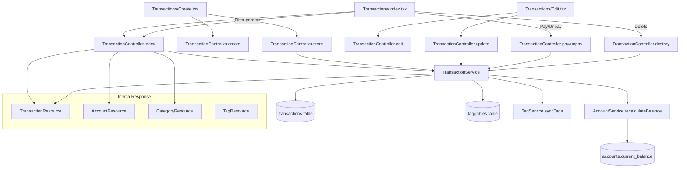

# Despesas em Débito — Design

**Spec:** `.specs/features/despesas-debito/spec.md`
**Status:** Draft

---

## Architecture Overview



**Key interactions:**
1. TransactionService handles all business logic (create, update, pay/unpay, delete, tag syncing)
2. TransactionService calls AccountService::recalculateBalance() whenever a paid transaction changes
3. All controller responses go through Resources (TransactionResource, AccountResource, CategoryResource, TagResource)
4. Index page receives accounts + categories for filter dropdowns, plus paginated transactions
5. Pay/Unpay are separate controller actions (not part of update) for explicit intention

---

## Code Reuse Analysis

### Existing Components to Leverage

| Component | Location | How to Use |
|-----------|----------|------------|
| AccountService::recalculateBalance() | `app/Services/AccountService.php:45` | Upgrade from stub: sum `initial_balance + paid_income - paid_expenses` per account |
| TransactionType enum | `app/Enums/TransactionType.php` | Reuse for `transactions.type` column discriminator |
| taggables migration | `database/migrations/*_create_taggables_table.php` | Schema ready; Transaction model uses `morphToMany(Tag::class, 'taggable')` |
| formatCurrency() | `resources/js/lib/format-currency.ts` | BRL formatting for all value displays |
| AuthenticatedLayout | `resources/js/Layouts/AuthenticatedLayout.tsx` | Page wrapper (all 3 pages) |
| Card, CardContent, CardHeader, CardTitle | `@/components/ui/card` | Form containers (Create, Edit) |
| Button | `@/components/ui/button` | All actions |
| Input | `@/components/ui/input` | Text/number inputs in forms |
| Label | `@/components/ui/label` | Form field labels |
| Select, SelectContent, SelectItem, SelectTrigger, SelectValue | `@/components/ui/select` | Dropdowns (account, category, status filter) |
| Badge | `@/components/ui/badge` | Tag chips, category color indicators, status indicators |
| DynamicIcon | `resources/js/Components/DynamicIcon.tsx` | Category icon rendering |

### Integration Points

| System | Integration Method |
|--------|-------------------|
| Accounts table | FK `account_id` on transactions; AccountService::recalculateBalance() called on pay/unpay/update/delete |
| Categories | FK `category_id`; validate category type is Expense or Both |
| Tags | MorphToMany via `taggables` pivot; TransactionService::syncTags() syncs on create/update |
| Workspace middleware | Transaction model scoped via `workspace_id` FK + route model binding check |
| Inertia shared props | workspace.uuid used in all route() calls; no new shared data needed |

---

## Data Model

### Transaction

**Table:** `transactions`
**Migration:** new migration (timestamped)

```php
Schema::create('transactions', function (Blueprint $table) {
    $table->id();
    $table->uuid('uuid')->unique();
    $table->foreignId('workspace_id')->constrained('workspaces')->cascadeOnDelete();
    $table->foreignId('account_id')->nullable()->constrained('accounts');
    $table->foreignId('category_id')->constrained('categories');
    $table->string('type')->default('expense');
    $table->string('description');
    $table->decimal('value', 15, 2);
    $table->date('date');
    $table->timestamp('paid_at')->nullable();
    $table->foreignId('created_by')->constrained('users');
    $table->timestamps();
    $table->softDeletes();
});
```

**Model:** `App\Models\Transaction`

```php
class Transaction extends Model
{
    use HasFactory, SoftDeletes;

    protected $fillable = [
        'uuid', 'workspace_id', 'account_id', 'category_id',
        'type', 'description', 'value', 'date', 'paid_at', 'created_by',
    ];

    protected function casts(): array
    {
        return [
            'type' => TransactionType::class,
            'value' => 'decimal:2',
            'date' => 'date',
            'paid_at' => 'datetime',
        ];
    }

    public function getRouteKeyName(): string { return 'uuid'; }

    public function workspace(): BelongsTo;
    public function account(): BelongsTo;
    public function category(): BelongsTo;
    public function creator(): BelongsTo { return $this->belongsTo(User::class, 'created_by'); }
    public function tags(): MorphToMany { return $this->morphToMany(Tag::class, 'taggable'); }
}
```

**Relationships:**
- `workspace_id` → `workspaces.id` (CASCADE delete)
- `account_id` → `accounts.id` (nullable — reserved for future credit card expenses; validated as required for type=expense)
- `category_id` → `categories.id`
- `created_by` → `users.id`
- Tags via `taggables` polymorphic pivot (morph name: `taggable`)

**Tag model addition:** Add `morphedByMany(Transaction::class, 'taggable')` to `App\Models\Tag`.

### AccountService::recalculateBalance — Upgrade

**Current stub:**
```php
public function recalculateBalance(Account $account): void
{
    $account->current_balance = $account->initial_balance;
    $account->save();
}
```

**New implementation:**
```php
public function recalculateBalance(Account $account): void
{
    $paidIncome = $account->transactions()
        ->where('type', 'income')
        ->whereNotNull('paid_at')
        ->sum('value');

    $paidExpenses = $account->transactions()
        ->where('type', 'expense')
        ->whereNotNull('paid_at')
        ->sum('value');

    $account->current_balance = $account->initial_balance + $paidIncome - $paidExpenses;
    $account->save();
}
```

**Account model addition:** Add `hasMany(Transaction::class)` relationship.

---

## Components

### TransactionController

- **Purpose:** Resource controller for transactions — index, create, store, edit, update, destroy + pay/unpay actions
- **Location:** `app/Http/Controllers/TransactionController.php`
- **Dependencies:** TransactionService, AccountService (for pay/unpay)
- **Reuses:** AccountController pattern (authorize → service call → Resource → redirect)

**Actions:**

| Method | Auth | Service Call | Response |
|--------|------|-------------|----------|
| `index` | viewAny | — | Inertia: transactions + accounts + categories |
| `create` | create | — | Inertia: accounts + categories (expense/both) + tags |
| `store` | create | create() | Redirect → index |
| `edit` | update | — | Inertia: transaction + accounts + categories + tags |
| `update` | update | update() | Redirect → index |
| `destroy` | delete | archive() | Redirect → index |
| `pay` | update | pay() | Redirect back |
| `unpay` | update | unpay() | Redirect back |

**Index method — filtering + pagination:**
```php
public function index(Request $request, Workspace $workspace): Response
{
    $this->authorize('viewAny', [Transaction::class, $workspace]);

    $query = $workspace->transactions()
        ->with(['account', 'category', 'tags'])
        ->latest('date');

    if ($request->filled('search')) {
        $query->where('description', 'like', '%' . $request->input('search') . '%');
    }
    if ($request->filled('category')) {
        $query->where('category_id', $request->input('category'));
    }
    if ($request->filled('account')) {
        $query->where('account_id', $request->input('account'));
    }
    if ($request->filled('from_date')) {
        $query->whereDate('date', '>=', $request->input('from_date'));
    }
    if ($request->filled('to_date')) {
        $query->whereDate('date', '<=', $request->input('to_date'));
    }
    if ($request->filled('status')) {
        match ($request->input('status')) {
            'paid' => $query->whereNotNull('paid_at'),
            'unpaid' => $query->whereNull('paid_at'),
            default => null,
        };
    }

    $transactions = $query->paginate(25)->withQueryString();

    return inertia('Transactions/Index', [
        'transactions' => TransactionResource::collection($transactions),
        'accounts' => AccountResource::collection($workspace->accounts),
        'categories' => CategoryResource::collection($workspace->categories),
    ]);
}
```

### TransactionService

- **Purpose:** Business logic for transaction CRUD, payment state management, tag syncing, balance recalculation
- **Location:** `app/Services/TransactionService.php`
- **Dependencies:** AccountService (for balance), DB facade (for transactions wrapping mutations)

**Methods:**

| Method | Signature | Behavior |
|--------|-----------|----------|
| `create` | `(Workspace, User, array): Transaction` | Create transaction, sync tags, no balance change (always unpaid) |
| `update` | `(Transaction, array): Transaction` | Update fields, sync tags, recalc balance if paid & value/account changed |
| `pay` | `(Transaction): void` | Set paid_at=now(), call AccountService::recalculateBalance() |
| `unpay` | `(Transaction): void` | Set paid_at=null, call AccountService::recalculateBalance() |
| `archive` | `(Transaction): void` | If paid, recalc balance first; then soft delete |
| `syncTags` | `(Transaction, array): void` | Sync taggable polymorphic relationship |

**DB transactions:** `pay`, `unpay`, `update` (when paid), and `archive` (when paid) are wrapped in `DB::transaction()` for atomicity.

**Balance recalculation trigger logic in `update()`:**
```
IF paid_at was null AND remains null → no recalc
IF paid_at was null AND becomes set → recalculate (new payment)
IF paid_at was set AND becomes null → recalculate (unpay)
IF paid_at was set AND value changed → recalculate (value diff)
IF paid_at was set AND account_id changed → recalculate OLD account + NEW account
```

### TransactionPolicy

- **Purpose:** Authorization rules for transaction operations
- **Location:** `app/Policies/TransactionPolicy.php`
- **Reuses:** AccountPolicy pattern (viewAny, create, update, delete)

```php
public function viewAny(User $user, Workspace $workspace): bool;
public function create(User $user, Workspace $workspace): bool;    // admin, editor
public function update(User $user, Transaction $transaction, Workspace $workspace): bool; // admin, editor
public function delete(User $user, Transaction $transaction, Workspace $workspace): bool;  // admin only
```

### FormRequests

#### StoreTransactionRequest
**Location:** `app/Http/Requests/StoreTransactionRequest.php`
**Reuses:** StoreAccountRequest pattern

```php
public function rules(): array
{
    return [
        'description' => ['required', 'string', 'max:255'],
        'value' => ['required', 'numeric', 'gt:0', 'max:999999999.99'],
        'date' => ['required', 'date'],
        'account_id' => ['required', 'exists:accounts,id'],
        'category_id' => ['required', 'exists:categories,id'],
        'tags' => ['sometimes', 'array'],
        'tags.*' => ['string', 'exists:tags,uuid'],  // validate tags belong to workspace (done in service)
    ];
}
```

**Additional workspace validation** (in service or FormRequest `after` hook):
- `account_id` must belong to `$workspace->id`
- `category_id` must belong to `$workspace->id`
- Category `type` must be `Expense` or `Both`

#### UpdateTransactionRequest
**Location:** `app/Http/Requests/UpdateTransactionRequest.php`
Same rules as StoreTransactionRequest, but all fields `sometimes` (partial updates). Includes `paid_at` field (nullable, date).

### Resources

#### TransactionResource
**Location:** `app/Http/Resources/TransactionResource.php`
**Reuses:** AccountResource pattern

```php
public function toArray(Request $request): array
{
    return [
        'uuid' => $this->uuid,
        'description' => $this->description,
        'value' => (float) $this->value,
        'type' => $this->type,
        'date' => $this->date->format('Y-m-d'),
        'paid_at' => $this->paid_at?->toISOString(),
        'account' => new AccountResource($this->whenLoaded('account')),
        'category' => new CategoryResource($this->whenLoaded('category')),
        'tags' => TagResource::collection($this->whenLoaded('tags')),
        'created_by' => new UserResource($this->whenLoaded('creator')),
        'created_at' => $this->created_at?->toISOString(),
    ];
}
```

### Routes

```php
// Inside Route::prefix("w/{workspace}")->group()
Route::resource('transactions', TransactionController::class);
Route::post('transactions/{transaction}/pay', [TransactionController::class, 'pay'])
    ->name('transactions.pay');
Route::post('transactions/{transaction}/unpay', [TransactionController::class, 'unpay'])
    ->name('transactions.unpay');
```

Resource name: `transactions` (English, consistent with `accounts`, `categories`, `tags`).

---

## Frontend Components

### Pages/Transactions/Index.tsx

- **Purpose:** Transaction list with filters, pagination, and inline pay/unpay/delete actions
- **Location:** `resources/js/Pages/Transactions/Index.tsx`
- **Reuses:** Accounts/Index page pattern (AuthenticatedLayout, header, empty state, grid)
- **Props:** `transactions`, `accounts`, `categories`

**TypeScript interfaces:**

```typescript
interface Transaction {
    uuid: string;
    description: string;
    value: number;
    date: string;
    paid_at: string | null;
    account: { uuid: string; name: string; type: string; current_balance: number } | null;
    category: { uuid: string; name: string; type: string; color: string; icon: string | null } | null;
    tags: { uuid: string; name: string; color: string }[];
}
```

**Layout structure:**

```
AuthenticatedLayout
  Header: "Despesas" + count + "Nova Despesa" button (Link to create)

  Card (filter bar):
    Search Input (debounced 300ms)
    Category Select
    Account Select
    Date Range (from Input[type=date] + to Input[type=date])
    Status Select (all | paid | unpaid)

  Card list (one Card per transaction):
    TransactionCard:
      Row 1 (main):
        [Paid ✓ / Unpaid ○ icon]  Description (bold)         Value (right-aligned, BRL, semibold)
      Row 2 (meta):
        Date · Account name                                    [tag chip] [tag chip]
        Category (with color dot)

      Row 3 (actions):
        IF unpaid: [Pagar] button
        IF paid:   [Desmarcar] button (outline variant)
        [Editar] Link button (outline)
        [Excluir] button (destructive)

  Pagination (if pages > 1):
    Page number navigation (server-rendered by Laravel paginator)

  Empty state (if no transactions):
    Dashed Card with "Nenhuma despesa" + CTA "Registrar primeira despesa"
```

**Filter state management:** Use URL query string params. On filter change, navigate to same route with updated params (via Inertia `router.get()`). Debounce search input (300ms).

**Pay/Unpay:** `useForm().post()` to `route('transactions.pay', {workspace, transaction})` / `route('transactions.unpay', ...)` → onSuccess: `router.reload()`.

**Delete:** `useForm().delete()` to `route('transactions.destroy', ...)` → onSuccess: `router.reload()`.

**Visual distinction paid vs unpaid:**
- Unpaid: full opacity, white Card background
- Paid: `opacity-75`, slightly muted appearance, checkmark icon green

### Pages/Transactions/Create.tsx

- **Purpose:** Create a new debit expense
- **Location:** `resources/js/Pages/Transactions/Create.tsx`
- **Reuses:** Accounts/Create.tsx pattern
- **Props:** `accounts`, `categories` (filtered to expense/both), `tags`

**Form fields:**
1. Description (text Input, required)
2. Value (number Input, step=0.01, required, min=0.01)
3. Date (date Input, default today, required)
4. Account (Select, required — list of workspace accounts)
5. Category (Select, required — filtered to type=Expense or Both)
6. Tags (multi-select or checkbox list — optional)

**Submit:** `useForm().post(route('transactions.store', {workspace}))` → redirect to index.

### Pages/Transactions/Edit.tsx

- **Purpose:** Edit an existing expense
- **Location:** `resources/js/Pages/Transactions/Edit.tsx`
- **Reuses:** Accounts/Edit.tsx pattern
- **Props:** `transaction`, `accounts`, `categories`, `tags`

**Same form as Create.** Pre-filled with transaction data. For paid transactions, additional warning text: "Esta despesa já foi paga. Alterar o valor ou conta recalculará o saldo."

**Submit:** `useForm().put(route('transactions.update', {workspace, transaction}))` → redirect to index.

### Additional Model Changes

#### Account model
Add relationship:
```php
public function transactions(): HasMany
{
    return $this->hasMany(Transaction::class);
}
```

#### Tag model
Add morph relationship:
```php
public function transactions(): MorphToMany
{
    return $this->morphedByMany(Transaction::class, 'taggable');
}
```

---

## UI Layout Details

### Transaction Row Card (Index page)

Following fin-design-system, each transaction is rendered as a Card with tight internal padding:

```
┌──────────────────────────────────────────────────────────────────┐
│ Card (border, full opacity if unpaid, opacity-75 if paid)        │
│ ┌──────────────────────────────────────────────────────────────┐ │
│ │ ○ Compra Supermercado                       R$ 156,90       │ │
│ │   13/07/2026 · Nubank                                        │ │
│ │   ● Alimentação              [urgente] [compras]            │ │
│ │                                                              │ │
│ │   [Pagar]  [Editar]  [Excluir]                              │ │
│ └──────────────────────────────────────────────────────────────┘ │
└──────────────────────────────────────────────────────────────────┘
```

### Paid transaction:
```
┌──────────────────────────────────────────────────────────────────┐
│ ✓ Conta de Luz                              R$ 89,50            │ ← muted
│   10/07/2026 · Itaú     Pago em 10/07/2026                      │
│   ● Moradia                                  [---]              │
│                                                                  │
│   [Desmarcar]  [Editar]  [Excluir]                             │
└──────────────────────────────────────────────────────────────────┘
```

### Colors:
- Paid checkmark: `text-emerald-600`
- Unpaid circle: `text-amber-600`
- Category dot: inline color from category.color
- Tag chips: Badge with background tinted from tag.color + '20'
- Value: `font-semibold`, right-aligned

---

## Error Handling Strategy

| Error Scenario | Handling | User Impact |
|---------------|----------|-------------|
| Invalid form data | FormRequest validation errors → Inertia `form.errors` → field error messages | Red error text below each field |
| Account doesn't belong to workspace | Validation error or 404 in controller (`abort_if`) | "Conta inválida" error message |
| Category doesn't belong to workspace | Same as account | "Categoria inválida" error message |
| Category type is Income-only | Validation error | "Esta categoria não aceita despesas" |
| Tag UUID doesn't exist | Validation error | "Tag inválida" |
| recalculateBalance fails (DB error) | DB::transaction() rollback → 500 | "Erro ao processar pagamento. Tente novamente." |
| Unauthorized action (viewer) | Policy → 403 | Standard Forbidden page |
| Cross-workspace access | `abort_if` 404 check → 404 | Standard Not Found page |
| Empty list | Conditional rendering → empty state card | CTA "Registrar primeira despesa" |
| Soft-deleted transaction accessed directly | Laravel implicit model binding skips soft-deleted → 404 | Not Found |

---

---

## PHPUnit Feature Tests

**Base:** `Tests\Feature\Transactions\` namespace, extend `Tests\TestCase` (which uses `RefreshDatabase`).
**Pattern:** One file per action domain. Each test method = one acceptance criterion or edge case.
**Setup:** Each test creates User + Workspace, attaches user as Admin/Editor/Viewer via `members()->attach()`.

### File: TransactionCreationTest.php

Maps to: DEBT-01 AC1, AC5, Edge Cases

| Test Method | Covers | Assertions |
|-------------|--------|------------|
| `test_user_can_create_transaction` | AC1: Create expense | `assertRedirect()` to index, `assertDatabaseHas('transactions', [...])` with `paid_at = null` |
| `test_validation_errors_on_create` | Edge: empty fields | `assertSessionHasErrors(['description', 'value', 'date', 'account_id', 'category_id'])` |
| `test_transaction_with_zero_value_is_rejected` | Edge: value ≤ 0 | `assertSessionHasErrors(['value'])` |
| `test_transaction_with_negative_value_is_rejected` | Edge: negative value | `assertSessionHasErrors(['value'])` |
| `test_transaction_with_excessive_value_is_rejected` | Edge: value > 999999999.99 | `assertSessionHasErrors(['value'])` |
| `test_transaction_with_future_date_is_accepted` | Edge: future date OK | `assertRedirect()`, `assertDatabaseHas(...)` |
| `test_transaction_with_income_only_category_is_rejected` | Edge: category.type = Income | `assertSessionHasErrors(['category_id'])` |
| `test_transaction_account_must_belong_to_same_workspace` | Edge: cross-workspace account | `assertSessionHasErrors(['account_id'])` |
| `test_transaction_category_must_belong_to_same_workspace` | Edge: cross-workspace category | `assertSessionHasErrors(['category_id'])` |
| `test_transaction_with_invalid_tags_is_rejected` | Edge: non-existent tag UUID | `assertSessionHasErrors(['tags.*'])` |
| `test_transaction_list_shows_correct_data` | AC2: View list with data | `assertInertia(fn($page) => $page->component('Transactions/Index')->has('transactions', N))` |
| `test_empty_transaction_list` | AC5: Empty state | `assertInertia(..., ->has('transactions', 0))` |
| `test_transaction_stores_tags_correctly` | AC1: Tags synced | Create transaction with tags, verify `taggables` table has correct records |
| `test_new_transaction_is_always_unpaid` | AC1: paid_at=null | `assertDatabaseHas('transactions', ['paid_at' => null])` |

### File: TransactionUpdateTest.php

Maps to: DEBT-01 AC3, Edge Cases

| Test Method | Covers | Assertions |
|-------------|--------|------------|
| `test_user_can_update_transaction` | AC3: Edit unpaid expense | `assertRedirect()`, `assertDatabaseHas(...)` with updated fields |
| `test_updating_transaction_syncs_tags` | AC3: Tags synced on update | Verify `taggables` records replaced correctly |
| `test_cannot_update_transaction_with_invalid_data` | Edge: validation | `assertSessionHasErrors(...)` |
| `test_updating_paid_transaction_value_recalculates_balance` | DEBT-02 AC3 | Update value on paid transaction → `current_balance` reflects difference |
| `test_moving_paid_transaction_recalculates_both_accounts` | DEBT-02 AC4 | Change `account_id` on paid → old account restored, new account deducted |

### File: TransactionDeletionTest.php

Maps to: DEBT-01 AC4, DEBT-02 AC5

| Test Method | Covers | Assertions |
|-------------|--------|------------|
| `test_user_can_soft_delete_transaction` | AC4: Delete unpaid | `assertSoftDeleted($transaction)`, DB still has record |
| `test_deleting_paid_transaction_restores_balance` | DEBT-02 AC5 | Paid transaction deleted → `current_balance` restored to pre-payment value |
| `test_soft_deleted_transaction_not_in_list` | AC4: Hidden from list | `assertInertia(..., ->has('transactions', 0))` after soft delete |

### File: TransactionPaymentTest.php

Maps to: DEBT-02 AC1, AC2, AC7

| Test Method | Covers | Assertions |
|-------------|--------|------------|
| `test_user_can_pay_transaction` | AC1: Mark paid | `assertDatabaseHas('transactions', ['paid_at' => notNull])`, account `current_balance` decreased by value |
| `test_user_can_unpay_transaction` | AC2: Mark unpaid | `assertDatabaseHas('transactions', ['paid_at' => null])`, account `current_balance` restored |
| `test_paying_already_paid_transaction_is_idempotent` | Edge: double pay | No error, balance unchanged after second pay |
| `test_unpaying_unpaid_transaction_is_idempotent` | Edge: double unpay | No error, balance unchanged |
| `test_payment_changes_only_target_account` | AC1: Correct account | Other accounts' balances unchanged |
| `test_pay_and_unpay_toggles_correctly` | AC1+AC2: Full toggle cycle | Pay → balance down → unpay → balance back to original |
| `test_editor_can_pay_and_unpay` | Auth: editor role | 200 OK (not 403) |
| `test_viewer_cannot_pay_transaction` | Auth: viewer role | `assertForbidden()` |
| `test_viewer_cannot_unpay_transaction` | Auth: viewer role | `assertForbidden()` |

### File: TransactionAuthorizationTest.php

Maps to: DEBT-01 AC6, AC7

| Test Method | Covers | Assertions |
|-------------|--------|------------|
| `test_viewer_cannot_create_transaction` | AC6: 403 on create | `assertForbidden()` |
| `test_viewer_cannot_update_transaction` | AC6: 403 on update | `assertForbidden()` |
| `test_viewer_cannot_delete_transaction` | AC6: 403 on delete | `assertForbidden()` |
| `test_editor_can_create_transaction` | AC6: editor OK | `assertRedirect()` |
| `test_editor_can_update_transaction` | AC6: editor OK | `assertRedirect()` |
| `test_editor_cannot_delete_transaction` | AC6: editor delete = 403 | `assertForbidden()` (delete is admin-only, same as accounts) |
| `test_cannot_access_transaction_from_other_workspace` | AC7: 404 cross-workspace | `assertNotFound()` when accessing via wrong workspace URL |

### File: TransactionFilteringTest.php

Maps to: DEBT-03 AC1-AC6, DEBT-04 AC1-AC2

| Test Method | Covers | Assertions |
|-------------|--------|------------|
| `test_can_search_transactions_by_description` | AC1: Search | Query with `?search=mercado` → only matching descriptions returned |
| `test_search_is_case_insensitive` | AC1: Case insensitive | `?search=MERCADO` matches "mercado" |
| `test_can_filter_transactions_by_category` | AC2: Category filter | `?category=X` → only transactions with that category |
| `test_can_filter_transactions_by_account` | AC3: Account filter | `?account=X` → only transactions with that account |
| `test_can_filter_transactions_by_date_range` | AC4: Date range | `?from_date=X&to_date=Y` → only transactions in range |
| `test_can_filter_by_paid_status` | AC5: Status filter | `?status=paid` → only paid; `?status=unpaid` → only unpaid |
| `test_filters_combine_with_and_logic` | AC6: Combined | `?search=X&category=Y&status=paid` → intersection of all |
| `test_transaction_list_paginates_at_25` | DEBT-04 AC1 | Seed 30 → page 1 has 25, response has pagination metadata |
| `test_pagination_preserves_filters` | DEBT-04 AC2 | Apply filter → navigate to page 2 → filtered results maintained |

### File: AccountBalanceRecalculationTest.php

Maps to: DEBT-02 AC3 (balance integrity)

| Test Method | Covers | Assertions |
|-------------|--------|------------|
| `test_recalculate_balance_sums_paid_transactions` | core logic | Create account R$1000 initial, pay expense R$200 → `current_balance` = R$800 |
| `test_recalculate_balance_still_stub_for_accounts_without_transactions` | existing behavior | Account with no transactions → `current_balance` = `initial_balance` |
| `test_multiple_transactions_aggregate_correctly` | multi-expense | Pay 3 expenses (100+200+50) → balance = initial - 350 |
| `test_recalculate_on_different_accounts_is_independent` | isolation | Pay expense on account A → only account A's balance changes |
| `test_balance_matches_formula` | formula verification | `current_balance = initial_balance + sum(paid_income) - sum(paid_expenses)` |

---

## Cypress E2E Tests

**File:** `cypress/e2e/transactions/crud.cy.js`
**Pattern:** Follows existing `cypress/e2e/accounts/crud.cy.js` and `categories/crud.cy.js`.

**Setup:** `before()` hook creates a workspace via `cy.loginViaSession()`. `beforeEach()` restores session.

### Spec: Transaction CRUD

| Test | User Journey | Assertions |
|------|-------------|------------|
| `shows transactions index page` | Navigate to `/w/{uuid}/transactions` | Page renders, title "Despesas" visible, empty state displayed |
| `creates a transaction` | Click "Nova Despesa" → fill form → submit | Redirected to index, transaction appears in list with correct description, value, account |
| `shows validation errors on create` | Submit empty form | Error messages visible: "A descrição é obrigatória", "O valor deve ser maior que zero" |
| `edits a transaction` | Click "Editar" → modify description → save | Updated transaction visible in list |
| `pays a transaction` | Click "Pagar" on unpaid transaction | Transaction moves to paid style (muted), paid_at indicator visible |
| `unpays a transaction` | Click "Desmarcar" on paid transaction | Transaction returns to unpaid style |
| `deletes a transaction` | Create one → delete it | Transaction removed from list |
| `filters transactions by search` | Type in search field | List filters to matching descriptions |
| `filters transactions by status` | Select "Pago" / "Pendente" / "Todos" | List shows only matching status |
| `creates transaction with tags` | Select tags in multi-select → submit | Tag chips visible on transaction card |

### Key Cypress selectors (consistent with existing patterns):
- Form fields: `#description`, `#value`, `#date`, `#account_id`, `#category_id`
- Buttons: "Nova Despesa", "Pagar", "Desmarcar", "Editar", "Excluir"
- Containers: `[data-slot="card"]` for transaction cards (following existing pattern)
- Assertion: `cy.contains('description text').should('be.visible')`

### Gate Commands

| Layer | Command | Expected |
|-------|---------|----------|
| PHPUnit (all feature tests) | `php artisan test --filter=Transaction` | All tests pass |
| PHPUnit (single file) | `php artisan test --filter=TransactionCreationTest` | Single file pass |
| Cypress (all E2E) | `npx cypress run --spec "cypress/e2e/transactions/**"` | All specs pass |
| Cypress (single spec) | `npx cypress run --spec "cypress/e2e/transactions/crud.cy.js"` | Single spec pass |

---

## Tech Decisions (non-obvious)

| Decision | Choice | Rationale |
|----------|--------|-----------|
| Pay/Unpay as separate routes | `POST transactions/{id}/pay` and `/unpay` | Explicit intention vs. embedding in update; easier to reason about, separate auth check, clearer audit trail |
| account_id nullable on schema | Nullable with validation enforcing NOT NULL for expense type | Schema is forward-compatible with CCXP-01 (credit card expenses don't have account); avoids migration rewrite |
| Filter state via URL query params | `?search=X&category=Y&status=paid` | Inertia-friendly; no local state management; shareable URLs; preserved on navigation |
| Index method loads accounts + categories | Always in props alongside transactions | Filter dropdowns need this data; single Inertia request; no additional API calls |
| Tag sync in service (not observer) | `TransactionService::syncTags()` called explicitly | Explicit > implicit; avoids unexpected side effects; testable in isolation |
| DB::transaction wrapper on mutations | Only wrap pay/unpay/paid-update/paid-delete | Prevents partial state: balance deducted but paid_at not set, or vice versa |
| Pagination 25/page | Standard Laravel `->paginate(25)` | Matches spec DEBT-04; user expectation from other list-based UIs |
