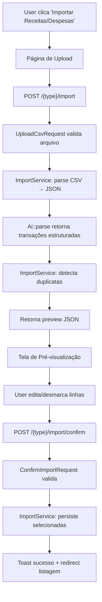

# Importação CSV com IA — Design

**Spec**: `.specs/features/workspace-financeiro/spec.md` (P2: Importação de Extratos via IA, linhas 231–251)
**Issue**: [Feature] Importação de Receitas e Despesas via CSV com IA
**Status**: Draft

---

## Architecture Overview

Fluxo de importação em 3 etapas: Upload → Pré-visualização → Confirmação.



**Fluxo de dados:**
1. Botão na listagem → rota de upload (tipo fixo: expense/income)
2. Upload CSV → controller → `ImportService` → `Ai::parse()` → preview JSON
3. Frontend renderiza tabela interativa (edição, checkbox, alertas duplicata)
4. Confirmação → controller → `ImportService::confirm()` → persiste via `TransactionService`

---

## Code Reuse Analysis

### Existing Components to Leverage

| Component | Location | How to Use |
|-----------|----------|------------|
| `TransactionService` | `app/Services/TransactionService.php` | Persistência de transações (`create()`) |
| `TransactionType` | `app/Enums/TransactionType.php` | Tipo fixo por rota (Expense/Income) |
| `TransactionPolicy` | `app/Policies/TransactionPolicy.php` | Autorização (viewAny/create) |
| `TransactionResource` | `app/Http/Resources/TransactionResource.php` | Formato de resposta |
| `Toast` | `app/Support/Toast.php` | Feedback de sucesso/erro |
| `AuthenticatedLayout` | `resources/js/Layouts/AuthenticatedLayout.tsx` | Wrapper de página |
| shadcn `Table` | `resources/js/Components/ui/table.tsx` | Tabela de preview |
| shadcn `Checkbox` | `resources/js/Components/ui/checkbox.tsx` | Seleção por linha |
| shadcn `Button` | `resources/js/Components/ui/button.tsx` | Ações |
| shadcn `Input` | `resources/js/Components/ui/input.tsx` | Edição inline |
| shadcn `Select` | `resources/js/Components/ui/select.tsx` | Seleção de categoria |
| shadcn `Alert` | `resources/js/Components/ui/alert.tsx` | Alertas de duplicata |
| shadcn `sonner` (toast) | `resources/js/Components/ui/sonner.tsx` | Notificações |
| `useWorkspace` | `resources/js/hooks/useWorkspace.tsx` | Contexto do workspace |
| `formatCurrency` | `resources/js/lib/format-currency.ts` | Formatação de valores |
| `useForm` | `@inertiajs/react` | Mutações (upload, confirmação) |

### Integration Points

| System | Integration Method |
|--------|-------------------|
| `Transaction` | Criação via `TransactionService::create()` |
| `Category` | Match por nome (IA sugere → busca no workspace) |
| `Account` | Seleção de conta destino no upload |
| DeepSeek API | Via `Ai::parse()` (Facade → `AiService` → HTTP) |

---

## Key Decisions

### D-66: Facade AI provider-agnostic
Criar `Ai` Facade + `AiService` que encapsula a chamada ao LLM. O `AiService` usa HTTP direto para DeepSeek API (SDK `laravel/ai` não instalado). A Facade permite trocar o provedor sem impactar controllers/services.

**Justificativa**: Requisito #2 da issue ("garantindo desacoplamento e agnosticism"). D-22 aprovado mas nunca implementado.

### D-67: Processamento síncrono (v1)
O processamento do CSV (parse + IA) será síncrono no endpoint de upload. Sem filas/background jobs.

**Justificativa**: Simplicidade v1. CSVs de extratos bancários são tipicamente pequenos (<100 linhas). Timeout do PHP suficiente. Se necessário, migrar para jobs assíncronos no futuro.

### D-68: "Sem Categoria" como categoria padrão
Criar categoria sistema "Sem Categoria" (is_system=true) auto-criada por workspace. Usada quando IA não retorna categoria ou categoria não existe no workspace.

**Justificativa**: `category_id` é NOT NULL na tabela transactions. Consistente com D-31 ("Pagamento de Cartão" auto-criada).

### D-69: Detecção de duplicatas por valor + data ±1 dia + descrição similar
Comparar cada transação parseada com existentes no workspace:
- Mesmo `value` absoluto
- `date` igual ou ±1 dia
- `description` com similaridade ≥80% (similar_text do PHP)

**Justificativa**: Balanceamento entre precisão e simplicidade. Evita falsos positivos de apenas um campo.

---

## Components

### Ai Facade + AiService

- **Purpose**: Encapsular chamada ao LLM para parsing de extratos
- **Location**: `app/Facades/Ai.php`, `app/Services/AiService.php`
- **Interfaces**:
  - `Ai::parse(string $csvContent, string $type): array` — Retorna lista de transações parseadas
- **Dependencies**: HTTP client (Guzzle, já incluso no Laravel), `config('ai')`

**Assinatura do AiService:**
```php
class AiService
{
    public function __construct(
        private readonly string $apiKey,
        private readonly string $baseUrl = 'https://api.deepseek.com',
        private readonly string 'model' = 'deepseek-chat',
    ) {}

    public function parse(string $csvContent, string $type): array
    {
        // 1. Monta prompt estruturado com instruções de output JSON
        // 2. Envia para API DeepSeek via HTTP
        // 3. Parseia resposta JSON
        // 4. Retorna array de transações normalizadas
    }
}
```

**Prompt structure:**
- Instruções: "Você é um extrator de transações financeiras. Retorne JSON array com objetos {description, value, date (Y-m-d), type (debit/credit), category_name}."
- Input: conteúdo CSV + tipo esperado (expense/income)
- Output: JSON estruturado

**Facade registration:**
```php
// app/Providers/AppServiceProvider.php boot()
$this->app->singleton('ai', fn () => new AiService(
    apiKey: config('ai.deepseek_key'),
    model: config('ai.model'),
));
```

**Config (`config/ai.php`):**
```php
return [
    'deepseek_key' => env('DEEPSEEK_API_KEY'),
    'model' => env('AI_MODEL', 'deepseek-chat'),
    'base_url' => env('AI_BASE_URL', 'https://api.deepseek.com'),
    'timeout' => env('AI_TIMEOUT', 60),
];
```

### ImportService

- **Purpose**: Orquestrar fluxo de importação (parse, duplicatas, persistência)
- **Location**: `app/Services/ImportService.php`
- **Interfaces**:
  - `parseCsv(UploadedFile $file, string $type, Workspace $workspace): ImportPreviewDTO` — Parse CSV → AI → detecta duplicatas
  - `confirm(Workspace $workspace, User $creator, string $type, array $transactions): ImportResultDTO` — Persiste transações selecionadas
- **Dependencies**: `AiService`, `TransactionService`, `Category` model

**Lógica de `parseCsv`:**
1. Lê conteúdo do CSV (UTF-8 encoding)
2. Chama `Ai::parse($content, $type)` → retorna transações estruturadas
3. Para cada transação:
   - Busca categoria por nome no workspace (match exato ou parcial)
   - Se não encontra, usa "Sem Categoria"
   - Detecta duplicata contra base do workspace
4. Retorna `ImportPreviewDTO` com: transações, total, contagem duplicatas

**Lógica de `confirm`:**
1. Valida que todas transações têm campos obrigatórios
2. Para cada transação selecionada:
   - Chama `TransactionService::create($workspace, $creator, $data)`
3. Retorna `ImportResultDTO` com: quantidade criada, erros (se houver)

**Detecção de duplicatas:**
```php
public function findDuplicates(Workspace $workspace, array $parsed): array
{
    $existing = $workspace->transactions()
        ->whereIn('date', $dateRange)
        ->get();

    return collect($parsed)->map(function ($row) use ($existing) {
        $duplicate = $existing->first(fn ($t) =>
            abs($t->value - $row['value']) < 0.01
            && abs($t->date->diffInDays($row['date'])) <= 1
            && similar_text($t->description, $row['description']) / max(strlen($t->description), strlen($row['description'])) >= 0.8
        );
        return [...$row, 'is_duplicate' => $duplicate !== null, 'duplicate_uuid' => $duplicate?->uuid];
    })->toArray();
}
```

### ImportController

- **Purpose**: Expor endpoints do fluxo de importação
- **Location**: `app/Http/Controllers/ImportController.php`
- **Interfaces**:
  - `create(Workspace $workspace): Response` — Página de upload (Inertia)
  - `store(UploadCsvRequest $request, Workspace $workspace): JsonResponse` — Processa CSV, retorna preview
  - `confirm(ConfirmImportRequest $request, Workspace $workspace): RedirectResponse` — Persiste transações
- **Dependencies**: `ImportService`, `TransactionService`
- **Reuses**: Padrão `IncomeController` (authorize, inertia, props, Toast)

**Props do `create`:**
- `type`: 'expense' | 'income' (fixo por rota)
- `accounts`: AccountResource collection
- `categories`: CategoryResource collection (filtradas por tipo)

**Resposta do `store`:**
```json
{
  "type": "expense",
  "transactions": [
    {
      "id": "temp-uuid",
      "description": "Supermercado XYZ",
      "value": 150.00,
      "date": "2026-09-01",
      "type": "debit",
      "category_name": "Alimentação",
      "category_uuid": "cat-uuid-1",
      "is_duplicate": false,
      "duplicate_uuid": null,
      "is_checked": true
    }
  ],
  "summary": {
    "total": 20,
    "total_value": 3500.00,
    "duplicates": 2,
    "checked": 18
  }
}
```

### FormRequests

**UploadCsvRequest** (`app/Http/Requests/UploadCsvRequest.php`):
- `file`: required, file, mimes:csv,txt, max:10240 (10MB)
- `account_id`: required, exists:accounts,uuid (pertence ao workspace)
- Validação de workspace em `withValidator`

**ConfirmImportRequest** (`app/Http/Requests/ConfirmImportRequest.php`):
- `type`: required, in:expense,income
- `transactions`: required, array
- `transactions.*.description`: required, string, max:255
- `transactions.*.value`: required, numeric, gt:0
- `transactions.*.date`: required, date
- `transactions.*.category_id`: required, exists:categories,uuid
- `transactions.*.is_checked`: required, boolean
- Validação de pertencimento ao workspace

### Frontend Pages

**Import page** (`resources/js/Pages/Imports/Index.tsx`):
- Props: `type`, `accounts`, `categories`
- Estado: `stage` ('upload' | 'preview')
- Upload: formulário com file input + select de conta → POST para store
- Preview: tabela interativa com `ImportPreviewTable`
- Confirmação: botão "Importar" → POST para confirm

**ImportPreviewTable** (`resources/js/Components/Import/ImportPreviewTable.tsx`):
- Props: `transactions`, `categories`, `onTransactionChange`, `onToggle`
- Tabela com colunas: checkbox, descrição (editável), valor (editável), data (editável), categoria (select), alerta duplicata
- Linhas duplicata: highlight vermelho + pré-desmarcada + badge "Possível duplicata"
- Summary footer: total, valor total, duplicatas, selecionadas

### TypeScript Types

```typescript
// resources/js/types/import.ts
export type ImportType = 'expense' | 'income';

export interface ImportTransaction {
  id: string;
  description: string;
  value: number;
  date: string;
  type: 'debit' | 'credit';
  category_name: string | null;
  category_uuid: string | null;
  is_duplicate: boolean;
  duplicate_uuid: string | null;
  is_checked: boolean;
}

export interface ImportSummary {
  total: number;
  total_value: number;
  duplicates: number;
  checked: number;
}

export interface ImportPreviewResponse {
  type: ImportType;
  transactions: ImportTransaction[];
  summary: ImportSummary;
}
```

---

## Routes

```php
// routes/web.php — dentro do grupo w/{workspace}
Route::get('transactions/import', [ImportController::class, 'create'])
    ->name('transactions.import.create');
Route::post('transactions/import', [ImportController::class, 'store'])
    ->name('transactions.import.store');
Route::post('transactions/import/confirm', [ImportController::class, 'confirm'])
    ->name('transactions.import.confirm');

Route::get('incomes/import', [ImportController::class, 'create'])
    ->name('incomes.import.create');
Route::post('incomes/import', [ImportController::class, 'store'])
    ->name('incomes.import.store');
Route::post('incomes/import/confirm', [ImportController::class, 'confirm'])
    ->name('incomes.import.confirm');
```

---

## File Inventory

### New Files (18)

| File | Layer | Purpose |
|------|-------|---------|
| `app/Facades/Ai.php` | Backend | Facade para AI service |
| `app/Services/AiService.php` | Backend | Integração com DeepSeek API |
| `app/Services/ImportService.php` | Backend | Orquestração do fluxo de importação |
| `app/Http/Controllers/ImportController.php` | Backend | Endpoints do fluxo |
| `app/Http/Requests/UploadCsvRequest.php` | Backend | Validação de upload |
| `app/Http/Requests/ConfirmImportRequest.php` | Backend | Validação de confirmação |
| `app/Http/Resources/ImportPreviewResource.php` | Backend | Resource do preview |
| `config/ai.php` | Backend | Configuração AI |
| `resources/js/Pages/Imports/Index.tsx` | Frontend | Página de importação |
| `resources/js/Components/Import/ImportPreviewTable.tsx` | Frontend | Tabela interativa de preview |
| `resources/js/Components/Import/CsvUploadForm.tsx` | Frontend | Formulário de upload |
| `resources/js/types/import.ts` | Frontend | Tipos TypeScript |
| `tests/Feature/Import/AiServiceTest.php` | Test | Testes do AiService |
| `tests/Feature/Import/ImportServiceTest.php` | Test | Testes do ImportService |
| `tests/Feature/Import/ImportControllerTest.php` | Testes | Testes de controller |
| `tests/Feature/Import/ImportSmokeTest.php` | Test | Smoke tests |
| `cypress/e2e/import.cy.ts` | Test | E2E do fluxo completo |
| `database/migrations/2026_09_10_000001_create_sem_categoria_category.php*` | Migration | Auto-criar "Sem Categoria" |

*Migration alternativa: usar seeder ou boot do WorkspaceObserver para auto-criar categoria.

### Modified Files (4)

| File | Change |
|------|--------|
| `app/Providers/AppServiceProvider.php` | Registrar singleton 'ai' |
| `routes/web.php` | Adicionar rotas de importação |
| `resources/js/Pages/Transactions/Index.tsx` | Adicionar botão "Importar Despesas" |
| `resources/js/Pages/Incomes/Index.tsx` | Adicionar botão "Importar Receitas" |

---

## Requirement Traceability

| Req | Description | Component(s) |
|-----|-------------|--------------|
| AC-1 | Isolamento de tipos (rota importa estritamente um tipo) | Routes + Controller (type fixo por rota) |
| AC-2 | Agnosticismo de LLM via Facade | `Ai` Facade + `AiService` |
| AC-3 | Detecção de duplicatas | `ImportService::findDuplicates()` + `ImportPreviewTable` |
| AC-4 | UX: editar, desmarcar, confirmar + toasts | `ImportPreviewTable` + `Toast` + sonner |
| AC-5 | Contexto de workspace | Policies + validação de pertencimento |

---

## Testing Strategy

### PHPUnit Feature Tests (TDD-first)

**AiServiceTest** (mock HTTP):
- Test: parse CSV content → returns structured transactions
- Test: AI returns invalid JSON → throws exception
- Test: AI API error → throws exception with message
- Test: empty CSV → returns empty array

**ImportServiceTest**:
- Test: parseCsv returns preview with correct structure
- Test: duplicate detection flags matching transactions
- Test: category matching finds existing category by name
- Test: category fallback to "Sem Categoria" when not found
- Test: confirm persists only checked transactions
- Test: confirm recalculates account balance
- Test: confirm with empty selection → no-op

**ImportControllerTest** (TDD red → green):
- Test: create returns Inertia page with accounts + categories
- Test: store accepts valid CSV → returns preview JSON
- Test: store rejects invalid file → 422
- Test: store rejects non-workspace account → 422
- Test: confirm persists transactions → redirect + toast
- Test: confirm rejects invalid category → 422
- Test: authorization: non-member → 403
- Test: type isolation: expense route only imports expenses

**ImportSmokeTest**:
- Test: GET /transactions/import → 200 + Inertia
- Test: GET /incomes/import → 200 + Inertia

### Cypress E2E

- Test: Full journey — upload CSV → preview → edit → confirm → redirect + toast
- Test: Duplicate detection — upload with duplicates → see flagged rows
- Test: Cancel — upload → cancel → no transactions created
- Test: Error — upload invalid file → see error toast

---

## Edge Cases

| Edge Case | Handling |
|-----------|----------|
| CSV vazio | Retorna preview vazio com mensagem |
| CSV malformado | AI retorna erro → controller retorna 422 com mensagem |
| AI timeout | Try/catch → retorna 500 com mensagem amigável |
| Categoria não encontrada | Fallback para "Sem Categoria" |
| Todas linhas desmarcadas | Botão "Importar" desabilitado |
| Arquivo > 10MB | Validação FormRequest rejeita com mensagem |
| Encoding não-UTF-8 | Tentar converter via `mb_convert_encoding` |
| Transação sem categoria no confirm | Validação retorna 422 |
