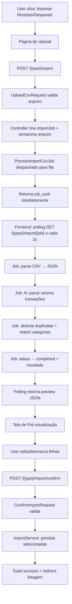

# Importação CSV com IA — Design

**Spec**: `.specs/features/workspace-financeiro/spec.md` (P2: Importação de Extratos via IA, linhas 231–251)
**Issue**: [Feature] Importação de Receitas e Despesas via CSV com IA
**Status**: Draft

---

## Architecture Overview

Fluxo de importação em 4 etapas: Upload → Processamento Assíncrono (polling) → Pré-visualização → Confirmação.



**Fluxo de dados:**
1. Botão na listagem → rota de upload (tipo fixo: expense/income)
2. Upload CSV → controller cria `ImportJob` (status=pending) → despacha `ProcessImportCsvJob` → retorna `{job_uuid}` imediatamente
3. Frontend pooling `GET /{type}/import/{job}` a cada 2s até status=completed/failed
4. Job processa: CSV → IA → duplicatas → categorias → salva resultado no `ImportJob`
5. Ao completar, frontend renderiza tabela interativa (edição, checkbox, alertas duplicata)
6. Confirmação → controller → `ImportService::confirm()` → persiste via `TransactionService`

---

## Code Reuse Analysis

### Existing Components to Leverage

| Component | Location | How to Use |
|-----------|----------|------------|
| `TransactionService` | `app/Services/TransactionService.php` | Persistência de transações (`create()`) |
| `TransactionType` | `app/Enums/TransactionType.php` | Tipo fixo por rota (Expense/Income) |
| `TransactionPolicy` | `app/Policies/TransactionPolicy.php` | Autorização (viewAny/create) |
| `TransactionResource` | `app/Http/Resources/TransactionResource.php` | Formato de resposta |
| `Toast` | `app/Support/Toast.php` | Feedback de sucesso/erro |
| `ProcessRecurrencesJob` | `app/Jobs/ProcessRecurrencesJob.php` | Padrão de referência para Jobs |
| `AuthenticatedLayout` | `resources/js/Layouts/AuthenticatedLayout.tsx` | Wrapper de página |
| shadcn `Table` | `resources/js/Components/ui/table.tsx` | Tabela de preview |
| shadcn `Checkbox` | `resources/js/Components/ui/checkbox.tsx` | Seleção por linha |
| shadcn `Button` | `resources/js/Components/ui/button.tsx` | Ações |
| shadcn `Input` | `resources/js/Components/ui/input.tsx` | Edição inline |
| shadcn `Select` | `resources/js/Components/ui/select.tsx` | Seleção de categoria |
| shadcn `Alert` | `resources/js/Components/ui/alert.tsx` | Alertas de duplicata |
| shadcn `Progress` | `resources/js/Components/ui/progress.tsx` | Indicador de progresso |
| shadcn `sonner` (toast) | `resources/js/Components/ui/sonner.tsx` | Notificações |
| `useWorkspace` | `resources/js/hooks/useWorkspace.tsx` | Contexto do workspace |
| `formatCurrency` | `resources/js/lib/format-currency.ts` | Formatação de valores |
| `useForm` | `@inertiajs/react` | Mutações (upload, confirmação) |
| `axios` | (datatable pattern) | Polling do status do job |

### Integration Points

| System | Integration Method |
|--------|-------------------|
| `Transaction` | Criação via `TransactionService::create()` |
| `Category` | Match por nome (IA sugere → busca no workspace) |
| `Account` | Seleção de conta destino no upload |
| DeepSeek API | Via `Ai::parse()` (Facade → `AiService` → HTTP) |
| Queue (database) | `ProcessImportCsvJob` despachado via `dispatch()` |

---

## Key Decisions

### D-66: Facade AI provider-agnostic
Criar `Ai` Facade + `AiService` que encapsula a chamada ao LLM. O `AiService` usa HTTP direto para DeepSeek API (SDK `laravel/ai` não instalado). A Facade permite trocar o provedor sem impactar controllers/services.

**Justificativa**: Requisito #2 da issue ("garantindo desacoplamento e agnosticism"). D-22 aprovado mas nunca implementado.

### D-67: Processamento assíncrono via Job + polling no frontend (v1)
O processamento do CSV (parse + IA + duplicatas) acontece em background via `ProcessImportCsvJob`. O endpoint de upload retorna imediatamente com um `job_uuid`. O frontend faz pooling do status a cada 2 segundos até completar. Sem websockets.

**Justificativa**: 
- CSVs de extratos bancários são tipicamente pequenos (<100 linhas) mas a chamada à API da IA pode levar 10-60 segundos
- Processamento síncrono causaria timeout em requisições HTTP (limite típico 30s)
- Pooling é mais simples que websockets para v1 (sem necessidade de Laravel Reverb/Pusher)
- Infraestrutura de jobs já existe no projeto (`ProcessRecurrencesJob`, `ApplyRecurrenceScopeChangeJob`)
- `QUEUE_CONNECTION=database` já configurado, worker em produção via docker-compose

### D-68: "Sem Categoria" como categoria padrão
Criar categoria sistema "Sem Categoria" (is_system=true) auto-criada por workspace. Usada quando IA não retorna categoria ou categoria não existe no workspace.

**Justificativa**: `category_id` é NOT NULL na tabela transactions. Consistente com D-31 ("Pagamento de Cartão" auto-criada).

### D-69: Detecção de duplicatas por valor + data ±1 dia + descrição similar
Comparar cada transação parseada com existentes no workspace:
- Mesmo `value` absoluto
- `date` igual ou ±1 dia
- `description` com similaridade ≥80% (similar_text do PHP)

**Justificativa**: Balanceamento entre precisão e simplicidade. Evita falsos positivos de apenas um campo.

### D-70: ImportJob model para rastreamento de estado
Criar model `ImportJob` com status enum (pending/processing/completed/failed) e JSON column para resultado. Permite polling idempotente e rastreabilidade de imports.

**Justificativa**: 
- Necessário para o padrão async + polling
- Permite ao usuário re-tentar imports falhos
- Armazena resultado processado para re-polling sem re-processar
- Auditoria: histórico de imports por workspace

---

## Components

### Ai Facade + AiService

- **Purpose**: Encapsular chamada ao LLM para parsing de extratos
- **Location**: `app/Facades/Ai.php`, `app/Services/AiService.php`
- **Interfaces**:
  - `Ai::parse(string $csvContent, string $type): array` — Retorna lista de transações parseadas
- **Dependencies**: HTTP client (Guzzle, já incluso no Laravel), `config('ai')`

**Assinatura do AiService:**
```php
class AiService
{
    public function __construct(
        private readonly string $apiKey,
        private readonly string $baseUrl = 'https://api.deepseek.com',
        private readonly string 'model' = 'deepseek-chat',
    ) {}

    public function parse(string $csvContent, string $type): array
    {
        // 1. Monta prompt estruturado com instruções de output JSON
        // 2. Envia para API DeepSeek via HTTP
        // 3. Parseia resposta JSON
        // 4. Retorna array de transações normalizadas
    }
}
```

**Prompt structure:**
- Instruções: "Você é um extrator de transações financeiras. Retorne JSON array com objetos {description, value, date (Y-m-d), type (debit/credit), category_name}."
- Input: conteúdo CSV + tipo esperado (expense/income)
- Output: JSON estruturado

**Facade registration:**
```php
// app/Providers/AppServiceProvider.php boot()
$this->app->singleton('ai', fn () => new AiService(
    apiKey: config('ai.deepseek_key'),
    model: config('ai.model'),
));
```

**Config (`config/ai.php`):**
```php
return [
    'deepseek_key' => env('DEEPSEEK_API_KEY'),
    'model' => env('AI_MODEL', 'deepseek-chat'),
    'base_url' => env('AI_BASE_URL', 'https://api.deepseek.com'),
    'timeout' => env('AI_TIMEOUT', 120),
];
```

### ImportJob Model + Enum

- **Purpose**: Rastrear estado de processamento de imports assíncronos
- **Location**: `app/Models/ImportJob.php`, `app/Enums/ImportJobStatus.php`
- **Table**: `import_jobs`

**Migration:**
```php
// database/migrations/2026_09_10_000002_create_import_jobs_table.php
Schema::create('import_jobs', function (Blueprint $table) {
    $table->uuid('id')->primary();
    $table->foreignUuid('workspace_id')->constrained()->cascadeOnDelete();
    $table->foreignUuid('user_id')->constrained()->cascadeOnDelete();
    $table->string('type'); // expense|income
    $table->string('file_path'); // caminho do CSV armazenado
    $table->string('original_filename');
    $table->string('status')->default('pending'); // pending|processing|completed|failed
    $table->json('result')->nullable(); // preview data quando completed
    $table->text('error_message')->nullable(); // mensagem de erro quando failed
    $table->timestamp('started_at')->nullable();
    $table->timestamp('completed_at')->nullable();
    $table->timestamps();

    $table->index(['workspace_id', 'status']);
});
```

**Enum:**
```php
// app/Enums/ImportJobStatus.php
namespace App\Enums;

enum ImportJobStatus: string
{
    case Pending = 'pending';
    case Processing = 'processing';
    case Completed = 'completed';
    case Failed = 'failed';
}
```

**Model:**
```php
// app/Models/ImportJob.php
namespace App\Models;

use App\Enums\ImportJobStatus;
use Illuminate\Database\Eloquent\Concerns\HasUuids;
use Illuminate\Database\Eloquent\Model;
use Illuminate\Database\Eloquent\Relations\BelongsTo;

class ImportJob extends Model
{
    use HasUuids;

    protected $fillable = [
        'workspace_id', 'user_id', 'type', 'file_path',
        'original_filename', 'status', 'result', 'error_message',
        'started_at', 'completed_at',
    ];

    protected $casts = [
        'status' => ImportJobStatus::class,
        'result' => 'array',
        'started_at' => 'datetime',
        'completed_at' => 'datetime',
    ];

    public function workspace(): BelongsTo
    {
        return $this->belongsTo(Workspace::class);
    }

    public function user(): BelongsTo
    {
        return $this->belongsTo(User::class);
    }

    public function isPending(): bool
    {
        return $this->status === ImportJobStatus::Pending;
    }

    public function isProcessing(): bool
    {
        return $this->status === ImportJobStatus::Processing;
    }

    public function isCompleted(): bool
    {
        return $this->status === ImportJobStatus::Completed;
    }

    public function isFailed(): bool
    {
        return $this->status === ImportJobStatus::Failed;
    }

    public function isFinished(): bool
    {
        return in_array($this->status, [ImportJobStatus::Completed, ImportJobStatus::Failed]);
    }
}
```

### ProcessImportCsvJob

- **Purpose**: Processar CSV em background (parse → IA → duplicatas → categorias)
- **Location**: `app/Jobs/ProcessImportCsvJob.php`
- **Dependencies**: `ImportService`, `AiService`, `Storage`
- **Pattern**: Segue padrão `ProcessRecurrencesJob` (try/catch, Log::error, ShouldQueue)

**Implementação:**
```php
// app/Jobs/ProcessImportCsvJob.php
namespace App\Jobs;

use App\Enums\ImportJobStatus;
use App\Models\ImportJob;
use App\Services\ImportService;
use Illuminate\Contracts\Queue\ShouldQueue;
use Illuminate\Foundation\Queue\Queueable;
use Illuminate\Support\Facades\Log;
use Illuminate\Support\Facades\Storage;
use Throwable;

class ProcessImportCsvJob implements ShouldQueue
{
    use Queueable;

    public int $tries = 3;
    public int $timeout = 300; // 5 minutos (IA pode ser lenta)

    public function __construct(
        private readonly string $importJobUuid,
    ) {}

    public function handle(ImportService $importService): void
    {
        $job = ImportJob::where('uuid', $this->importJobUuid)->firstOrFail();

        $job->update(['status' => ImportJobStatus::Processing, 'started_at' => now()]);

        try {
            $csvContent = Storage::disk('local')->get($job->file_path);
            $result = $importService->parseCsv($csvContent, $job->type, $job->workspace);

            $job->update([
                'status' => ImportJobStatus::Completed,
                'result' => $result,
                'completed_at' => now(),
            ]);
        } catch (Throwable $e) {
            Log::error('Import CSV failed', [
                'import_job_uuid' => $this->importJobUuid,
                'error' => $e->getMessage(),
            ]);

            $job->update([
                'status' => ImportJobStatus::Failed,
                'error_message' => $this->getUserFriendlyError($e),
                'completed_at' => now(),
            ]);

            throw $e; // marca job como falho na fila
        }
    }

    private function getUserFriendlyError(Throwable $e): string
    {
        return match (true) {
            str_contains($e->getMessage(), 'timeout') => 'Timeout ao processar o arquivo. Tente novamente.',
            str_contains($e->getMessage(), 'JSON') => 'Erro ao interpretar resposta da IA. Tente novamente.',
            default => 'Erro ao processar arquivo. Verifique o formato do CSV.',
        };
    }

    public function failed(Throwable $e): void
    {
        // Garante que o job marca como failed mesmo em caso de crash
        ImportJob::where('uuid', $this->importJobUuid)->update([
            'status' => ImportJobStatus::Failed,
            'error_message' => 'Erro interno ao processar importação.',
            'completed_at' => now(),
        ]);
    }
}
```

### ImportService

- **Purpose**: Orquestrar fluxo de importação (parse, duplicatas, persistência)
- **Location**: `app/Services/ImportService.php`
- **Interfaces**:
  - `parseCsv(string $csvContent, string $type, Workspace $workspace): array` — Parse CSV → AI → detecta duplicatas — chamado pelo Job
  - `confirm(Workspace $workspace, User $creator, string $type, array $transactions): int` — Persiste transações selecionadas
- **Dependencies**: `AiService`, `TransactionService`, `Category` model

**Lógica de `parseCsv`:**
1. Recebe conteúdo CSV como string (já lido do storage pelo Job)
2. Chama `Ai::parse($content, $type)` → retorna transações estruturadas
3. Para cada transação:
   - Busca categoria por nome no workspace (match exato ou parcial)
   - Se não encontra, usa "Sem Categoria"
   - Detecta duplicata contra base do workspace
4. Retorna array com: transações + summary

**Lógica de `confirm`:**
1. Valida que todas transações têm campos obrigatórios
2. Para cada transação selecionada:
   - Chama `TransactionService::create($workspace, $creator, $data)`
3. Retorna quantidade criada

**Detecção de duplicatas:**
```php
public function findDuplicates(Workspace $workspace, array $parsed): array
{
    $existing = $workspace->transactions()
        ->whereIn('date', $dateRange)
        ->get();

    return collect($parsed)->map(function ($row) use ($existing) {
        $duplicate = $existing->first(fn ($t) =>
            abs($t->value - $row['value']) < 0.01
            && abs($t->date->diffInDays($row['date'])) <= 1
            && similar_text($t->description, $row['description']) / max(strlen($t->description), strlen($row['description'])) >= 0.8
        );
        return [...$row, 'is_duplicate' => $duplicate !== null, 'duplicate_uuid' => $duplicate?->uuid];
    })->toArray();
}
```

### ImportController

- **Purpose**: Expor endpoints do fluxo de importação
- **Location**: `app/Http/Controllers/ImportController.php`
- **Interfaces**:
  - `create(Workspace $workspace): Response` — Página de upload (Inertia)
  - `store(UploadCsvRequest $request, Workspace $workspace): JsonResponse` — Cria ImportJob, despacha Job, retorna `{job_uuid}`
  - `status(Workspace $workspace, ImportJob $importJob): JsonResponse` — Polling: retorna status + resultado
  - `confirm(ConfirmImportRequest $request, Workspace $workspace): RedirectResponse` — Persiste transações
- **Dependencies**: `ImportService`, `ImportJob` model, `ProcessImportCsvJob`
- **Reuses**: Padrão `IncomeController` (authorize, inertia, props, Toast)

**Lógica do `store`:**
```php
public function store(UploadCsvRequest $request, Workspace $workspace): JsonResponse
{
    $file = $request->file('file');
    $path = $file->store('imports/local', 'local');

    $importJob = ImportJob::create([
        'workspace_id' => $workspace->id,
        'user_id' => $request->user()->id,
        'type' => $this->getTypeFromRoute(),
        'file_path' => $path,
        'original_filename' => $file->getClientOriginalName(),
        'status' => ImportJobStatus::Pending,
    ]);

    ProcessImportCsvJob::dispatch($importJob->uuid);

    return response()->json([
        'job_uuid' => $importJob->uuid,
        'status' => $importJob->status->value,
    ]);
}
```

**Lógica do `status`:**
```php
public function status(Workspace $workspace, ImportJob $importJob): JsonResponse
{
    $this->authorize('view', $workspace);

    // Garantir que o job pertence ao workspace
    abort_if($importJob->workspace_id !== $workspace->id, 404);

    $response = [
        'uuid' => $importJob->uuid,
        'status' => $importJob->status->value,
    ];

    if ($importJob->isCompleted()) {
        $response['result'] = $importJob->result;
    }

    if ($importJob->isFailed()) {
        $response['error_message'] = $importJob->error_message;
    }

    return response()->json($response);
}
```

**Props do `create`:**
- `type`: 'expense' | 'income' (fixo por rota)
- `accounts`: AccountResource collection
- `categories`: CategoryResource collection (filtradas por tipo)

**Resposta do `store`:**
```json
{
  "job_uuid": "uuid-do-job",
  "status": "pending"
}
```

**Resposta do `status` (completed):**
```json
{
  "uuid": "uuid-do-job",
  "status": "completed",
  "result": {
    "type": "expense",
    "transactions": [
      {
        "id": "temp-uuid",
        "description": "Supermercado XYZ",
        "value": 150.00,
        "date": "2026-09-01",
        "type": "debit",
        "category_name": "Alimentação",
        "category_uuid": "cat-uuid-1",
        "is_duplicate": false,
        "duplicate_uuid": null,
        "is_checked": true
      }
    ],
    "summary": {
      "total": 20,
      "total_value": 3500.00,
      "duplicates": 2,
      "checked": 18
    }
  }
}
```

**Resposta do `status` (failed):**
```json
{
  "uuid": "uuid-do-job",
  "status": "failed",
  "error_message": "Erro ao processar arquivo. Verifique o formato do CSV."
}
```

### FormRequests

**UploadCsvRequest** (`app/Http/Requests/UploadCsvRequest.php`):
- `file`: required, file, mimes:csv,txt, max:10240 (10MB)
- `account_id`: required, exists:accounts,uuid (pertence ao workspace)
- Validação de workspace em `withValidator`

**ConfirmImportRequest** (`app/Http/Requests/ConfirmImportRequest.php`):
- `type`: required, in:expense,income
- `transactions`: required, array
- `transactions.*.description`: required, string, max:255
- `transactions.*.value`: required, numeric, gt:0
- `transactions.*.date`: required, date
- `transactions.*.category_id`: required, exists:categories,uuid
- `transactions.*.is_checked`: required, boolean
- Validação de pertencimento ao workspace

### ImportJobResource

```php
// app/Http/Resources/ImportJobResource.php
namespace App\Http\Resources;

use Illuminate\Http\Resources\Json\JsonResource;

class ImportJobResource extends JsonResource
{
    public function toArray($request): array
    {
        return [
            'uuid' => $this->uuid,
            'status' => $this->status->value,
            'result' => $this->when($this->isCompleted(), $this->result),
            'error_message' => $this->when($this->isFailed(), $this->error_message),
            'created_at' => $this->created_at->toISOString(),
        ];
    }
}
```

### Frontend Pages

**Import page** (`resources/js/Pages/Imports/Index.tsx`):
- Props: `type`, `accounts`, `categories`
- Estado: `stage` ('upload' | 'processing' | 'preview'), `previewData`, `jobUuid`, `errorMessage`
- Upload: formulário com file input + select de account → POST para store
- Processing: mostra spinner/progress + mensagem "Processando arquivo..." → polling a cada 2s
- Preview: tabela interativa com `ImportPreviewTable`
- Confirmação: botão "Importar" → POST para confirm
- Error: mostra mensagem de erro + botão "Tentar novamente"

**Polling hook** (`resources/js/hooks/use-import-polling.ts`):
```typescript
// Pseudocódigo — implementação real em T10/T12
export function useImportPolling(jobUuid: string | null) {
  const [status, setStatus] = useState<ImportJobStatus | null>(null);
  const [result, setResult] = useState<ImportPreviewResponse | null>(null);
  const [error, setError] = useState<string | null>(null);

  useEffect(() => {
    if (!jobUuid) return;

    const interval = setInterval(async () => {
      const res = await axios.get(`/w/{workspace}/imports/${jobUuid}/status`);
      setStatus(res.data.status);

      if (res.data.status === 'completed') {
        setResult(res.data.result);
        clearInterval(interval);
      }

      if (res.data.status === 'failed') {
        setError(res.data.error_message);
        clearInterval(interval);
      }
    }, 2000); // pooling a cada 2 segundos

    // Timeout de 5 minutos
    const timeout = setTimeout(() => {
      clearInterval(interval);
      setError('Tempo esgotado. Tente novamente.');
    }, 300_000);

    return () => {
      clearInterval(interval);
      clearTimeout(timeout);
    };
  }, [jobUuid]);

  return { status, result, error };
}
```

**ImportPreviewTable** (`resources/js/Components/Import/ImportPreviewTable.tsx`):
- Props: `transactions`, `categories`, `onTransactionChange`, `onToggle`, `summary`
- Tabela com colunas: checkbox, descrição (editável), valor (editável), data (editável), categoria (select), alerta duplicata
- Linhas duplicata: highlight vermelho + pré-desmarcada + badge "Possível duplicata"
- Summary footer: total, valor total, duplicatas, selecionadas

### TypeScript Types

```typescript
// resources/js/types/import.ts
export type ImportType = 'expense' | 'income';

export type ImportJobStatus = 'pending' | 'processing' | 'completed' | 'failed';

export interface ImportTransaction {
  id: string;
  description: string;
  value: number;
  date: string;
  type: 'debit' | 'credit';
  category_name: string | null;
  category_uuid: string | null;
  is_duplicate: boolean;
  duplicate_uuid: string | null;
  is_checked: boolean;
}

export interface ImportSummary {
  total: number;
  total_value: number;
  duplicates: number;
  checked: number;
}

export interface ImportPreviewResponse {
  type: ImportType;
  transactions: ImportTransaction[];
  summary: ImportSummary;
}

export interface ImportJobStatusResponse {
  uuid: string;
  status: ImportJobStatus;
  result?: ImportPreviewResponse;
  error_message?: string;
}

export interface ImportJobStartResponse {
  job_uuid: string;
  status: ImportJobStatus;
}

export interface CsvUploadFormData {
  file: File | null;
  account_id: string;
}
```

---

## Routes

```php
// routes/web.php — dentro do grupo w/{workspace}
Route::get('transactions/import', [ImportController::class, 'create'])
    ->name('transactions.import.create');
Route::post('transactions/import', [ImportController::class, 'store'])
    ->name('transactions.import.store');
Route::get('transactions/import/{importJob}', [ImportController::class, 'status'])
    ->name('transactions.import.status');
Route::post('transactions/import/confirm', [ImportController::class, 'confirm'])
    ->name('transactions.import.confirm');

Route::get('incomes/import', [ImportController::class, 'create'])
    ->name('incomes.import.create');
Route::post('incomes/import', [ImportController::class, 'store'])
    ->name('incomes.import.store');
Route::get('incomes/import/{importJob}', [ImportController::class, 'status'])
    ->name('incomes.import.status');
Route::post('incomes/import/confirm', [ImportController::class, 'confirm'])
    ->name('incomes.import.confirm');
```

---

## File Inventory

### New Files (22)

| File | Layer | Purpose |
|------|-------|---------|
| `app/Facades/Ai.php` | Backend | Facade para AI service |
| `app/Services/AiService.php` | Backend | Integração com DeepSeek API |
| `app/Services/ImportService.php` | Backend | Orquestração do fluxo de importação |
| `app/Models/ImportJob.php` | Backend | Model para rastreamento de imports |
| `app/Enums/ImportJobStatus.php` | Backend | Enum: pending/processing/completed/failed |
| `app/Jobs/ProcessImportCsvJob.php` | Backend | Job assíncrono de processamento CSV |
| `app/Http/Controllers/ImportController.php` | Backend | Endpoints do fluxo (inclui status) |
| `app/Http/Requests/UploadCsvRequest.php` | Backend | Validação de upload |
| `app/Http/Requests/ConfirmImportRequest.php` | Backend | Validação de confirmação |
| `app/Http/Resources/ImportPreviewResource.php` | Backend | Resource do preview |
| `app/Http/Resources/ImportJobResource.php` | Backend | Resource do status do job |
| `config/ai.php` | Backend | Configuração AI |
| `resources/js/Pages/Imports/Index.tsx` | Frontend | Página de upload + polling + preview |
| `resources/js/Components/Import/ImportPreviewTable.tsx` | Frontend | Tabela interativa de preview |
| `resources/js/Components/Import/CsvUploadForm.tsx` | Frontend | Formulário de upload |
| `resources/js/Components/Import/ImportProcessing.tsx` | Frontend | Indicador de processamento (spinner) |
| `resources/js/hooks/use-import-polling.ts` | Frontend | Hook de polling do status |
| `resources/js/types/import.ts` | Frontend | Tipos TypeScript |
| `tests/Feature/Import/AiServiceTest.php` | Test | Testes do AiService |
| `tests/Feature/Import/ImportServiceTest.php` | Test | Testes do ImportService |
| `tests/Feature/Import/ImportControllerTest.php` | Test | Testes de controller (store + status) |
| `tests/Feature/Import/ImportSmokeTest.php` | Test | Smoke tests |

### New Migration (1)

| File | Purpose |
|------|---------|
| `database/migrations/2026_09_10_000002_create_import_jobs_table.php` | Tabela import_jobs |

### Modified Files (4)

| File | Change |
|------|--------|
| `app/Providers/AppServiceProvider.php` | Registrar singleton 'ai' |
| `routes/web.php` | Rotas de importação (8 rotas, incluindo status) |
| `resources/js/Pages/Transactions/Index.tsx` | Botão "Importar Despesas" |
| `resources/js/Pages/Incomes/Index.tsx` | Botão "Importar Receitas" |

---

## Requirement Traceability

| Req | Description | Component(s) |
|-----|-------------|--------------|
| AC-1 | Isolamento de tipos (rota importa estritamente um tipo) | Routes + Controller (type fixo por rota) |
| AC-2 | Agnosticismo de LLM via Facade | `Ai` Facade + `AiService` |
| AC-3 | Detecção de duplicatas | `ImportService::findDuplicates()` + `ImportPreviewTable` |
| AC-4 | UX: editar, desmarcar, confirmar + toasts | `ImportPreviewTable` + `Toast` + sonner + loading state |
| AC-5 | Contexto de workspace | Policies + validação de pertencimento |

---

## Test Catalog

Catálogo completo de testes organizados por arquivo de teste, com mapeamento de critério de aceite (AC) e task responsável.

---

### PHPUnit Feature Tests (TDD-first)

#### AiServiceTest — `tests/Feature/Import/AiServiceTest.php` (≥5 tests) — T1

| # | Test Method | AC | What It Verifies |
|---|-------------|----|------------------|
| 1 | `test_parse_csv_content_returns_structured_transactions` | AC-2 | CSV válido → array de transações com description, value, date, type, category_name |
| 2 | `test_ai_returns_invalid_json_throws_exception` | AC-2 | IA retorna JSON malformado → lança exceção clara |
| 3 | `test_ai_api_error_throws_exception_with_message` | AC-2 | API DeepSeek retorna erro HTTP → exceção com mensagem |
| 4 | `test_empty_csv_returns_empty_array` | AC-2 | CSV vazio → retorna array sem erros |
| 5 | `test_timeout_throws_exception` | AC-2 | Timeout na chamada HTTP → exceção de timeout |

**Mock:** HTTP client mockado — sem chamadas reais à API.

---

#### ImportServiceTest — `tests/Feature/Import/ImportServiceTest.php` (≥10 tests) — T4

| # | Test Method | AC | What It Verifies |
|---|-------------|----|------------------|
| 1 | `test_parse_csv_returns_preview_with_correct_structure` | AC-3 | Retorno contém `transactions` array + `summary` com total, total_value, duplicates, checked |
| 2 | `test_duplicate_detection_flags_matching_transactions` | AC-3 | Transação com valor ±0.01 + data ±1 dia + descrição ≥80% similar → `is_duplicate=true` |
| 3 | `test_category_matching_finds_existing_by_name` | AC-4 | IA retorna "Alimentação" → match exato case-insensitive com categoria do workspace |
| 4 | `test_category_matching_partial_name_fallback` | AC-4 | IA retorna "Mercado" → match parcial encontra "Alimentação" |
| 5 | `test_category_fallback_to_sem_categoria_when_not_found` | AC-4 | Categoria inexistente → usa "Sem Categoria" (is_system=true) |
| 6 | `test_confirm_persists_only_checked_transactions` | AC-4 | 5 transações, 3 checked → persiste apenas 3 via TransactionService |
| 7 | `test_confirm_recalculates_account_balance` | AC-4 | Após confirm → saldo da conta atualizado corretamente |
| 8 | `test_confirm_with_empty_selection_returns_zero` | AC-4 | Nenhuma transação checked → retorna 0, nada persistido |
| 9 | `test_import_job_model_status_transitions` | AC-6 | Enum transitions: pending → processing → completed/failed |
| 10 | `test_import_job_model_helper_methods` | AC-6 | `isPending()`, `isProcessing()`, `isCompleted()`, `isFailed()`, `isFinished()` |
| 11 | `test_import_job_model_workspace_relationship` | AC-5 | `ImportJob::workspace()` retorna o workspace correto |
| 12 | `test_import_job_model_user_relationship` | AC-5 | `ImportJob::user()` retorna o criador correto |

**Mock:** `Ai::parse()` mockado — sem chamadas reais.

---

#### ProcessImportCsvJobTest — `tests/Feature/Import/ProcessImportCsvJobTest.php` (≥6 tests) — T4b

| # | Test Method | AC | What It Verifies |
|---|-------------|----|------------------|
| 1 | `test_job_updates_status_pending_to_processing_to_completed` | AC-6 | Após dispatch: ImportJob.status segue o fluxo completo |
| 2 | `test_job_stores_preview_result_in_import_job_on_success` | AC-6 | `ImportJob.result` contém o preview JSON após completed |
| 3 | `test_job_updates_status_to_failed_when_ai_throws_exception` | AC-7 | `Ai::parse()` lança exceção → status=failed |
| 4 | `test_job_stores_user_friendly_error_message_on_failure` | AC-7 | `ImportJob.error_message` contém mensagem legível (não stack trace) |
| 5 | `test_job_calls_import_service_parse_csv_with_correct_params` | AC-6 | `ImportService::parseCsv()` recebe (content, type, workspace) corretos |
| 6 | `test_job_reads_file_from_storage_with_correct_path` | AC-6 | `Storage::disk('local')->get()` chamado com `ImportJob->file_path` |
| 7 | `test_job_has_correct_retry_and_timeout_configuration` | AC-7 | `$tries=3`, `$timeout=300` |
| 8 | `test_job_failed_method_marks_import_job_as_failed_on_crash` | AC-7 | Crash total → `failed()` method garante status=failed |

**Nota:** `QUEUE_CONNECTION=sync` nos testes → job roda sincronamente ao ser despachado.

---

#### ImportControllerTest — `tests/Feature/Import/ImportControllerTest.php` (≥15 tests) — T6/T7

**Endpoint: `create` (GET)**

| # | Test Method | AC | What It Verifies |
|---|-------------|----|------------------|
| 1 | `test_create_returns_inertia_page_with_accounts_categories_and_type` | AC-1 | Response 200 + componente 'Imports/Index' + props type, accounts, categories |
| 2 | `test_create_requires_authentication` | AC-5 | Guest → redirect para login |
| 3 | `test_create_rejects_non_workspace_member_with_403` | AC-5 | Usuário sem acesso ao workspace → 403 |

**Endpoint: `store` (POST)**

| # | Test Method | AC | What It Verifies |
|---|-------------|----|------------------|
| 4 | `test_store_accepts_valid_csv_returns_job_uuid_with_201` | AC-6 | Upload CSV válido → 201 + `{job_uuid, status: "pending"}` |
| 5 | `test_store_creates_import_job_record_in_database` | AC-6 | ImportJob criado com workspace_id, user_id, type corretos |
| 6 | `test_store_stores_file_in_storage` | AC-6 | Arquivo salvo em `imports/{uuid}/{filename}` |
| 7 | `test_store_dispatches_process_import_csv_job` | AC-6 | `ProcessImportCsvJob::dispatch()` chamado com job_uuid |
| 8 | `test_store_rejects_invalid_file_type_with_422` | AC-1 | Upload de .pdf → 422 com mensagem de validação |
| 9 | `test_store_rejects_non_workspace_account_with_422` | AC-5 | account_id de outro workspace → 422 |
| 10 | `test_store_rejects_file_greater_than_10mb_with_422` | AC-1 | Arquivo > 10MB → 422 |

**Endpoint: `status` (GET)**

| # | Test Method | AC | What It Verifies |
|---|-------------|----|------------------|
| 11 | `test_status_returns_pending_for_new_job` | AC-6 | Job recém-criado → `{status: "pending"}` |
| 12 | `test_status_returns_processing_while_job_runs` | AC-6 | Job em execução → `{status: "processing"}` |
| 13 | `test_status_returns_completed_with_preview_result` | AC-6 | Job completed → `{status: "completed", result: {...}}` |
| 14 | `test_status_returns_failed_with_error_message` | AC-7 | Job failed → `{status: "failed", error_message: "..."}` |
| 15 | `test_status_rejects_non_workspace_member_with_403` | AC-5 | Membro de outro workspace → 403 |
| 16 | `test_status_rejects_job_from_different_workspace_with_404` | AC-5 | Job UUID de outro workspace → 404 |

**Endpoint: `confirm` (POST)**

| # | Test Method | AC | What It Verifies |
|---|-------------|----|------------------|
| 17 | `test_confirm_persists_checked_transactions_with_redirect_and_toast` | AC-4 | Confirm válido → redirect + toast sucesso + transações no DB |
| 18 | `test_confirm_rejects_invalid_category_with_422` | AC-5 | category_id inexistente → 422 |
| 19 | `test_confirm_with_all_unchecked_creates_no_transactions` | AC-4 | Todas `is_checked=false` → 0 transações no DB |
| 20 | `test_confirm_type_isolation_expense_creates_only_expenses` | AC-1 | Rota expense → transações type=Expense apenas |

---

#### ImportSmokeTest — `tests/Feature/Import/ImportSmokeTest.php` (≥3 tests) — T13

| # | Test Method | AC | What It Verifies |
|---|-------------|----|------------------|
| 1 | `test_get_transactions_import_returns_200_with_inertia_component` | AC-1 | GET /w/{workspace}/transactions/import → 200 + 'Imports/Index' |
| 2 | `test_get_incomes_import_returns_200_with_inertia_component` | AC-1 | GET /w/{workspace}/incomes/import → 200 + 'Imports/Index' |
| 3 | `test_non_member_access_returns_403` | AC-5 | Usuário sem acesso → 403 em ambos endpoints |

---

### Cypress E2E — `cypress/e2e/import.cy.ts` (≥7 scenarios) — T14

| # | Scenario | ACs Covered | What It Verifies |
|---|----------|-------------|------------------|
| 1 | `Full journey: upload → processing → preview → edit → confirm → redirect + toast` | AC-1, AC-3, AC-4, AC-6 | Fluxo completo com fixture CSV real; transações aparecem no DB |
| 2 | `Processing state visible: upload → "Processando..." → preview appears` | AC-4, AC-6 | Indicador de loading aparece e desaparece quando preview carrega |
| 3 | `Duplicate detection: upload with duplicates → flagged rows pre-unchecked` | AC-3 | Linhas duplicata com highlight vermelho + badge + checkbox desmarcada |
| 4 | `Cancel: upload → cancel → no transactions created` | AC-4 | Botão cancelar descarta preview; 0 transações no DB |
| 5 | `Error: upload invalid file → error toast visible` | AC-4 | Arquivo .txt inválido → toast de erro com mensagem amigável |
| 6 | `Type isolation: expense import creates only expenses` | AC-1 | Importar via rota de despesa → todas transações type=Expense |
| 7 | `Polling recovery: slow processing → preview eventually appears` | AC-6 | Simula job lento → polling continua até completed |

---

### Test Summary

| Test File | Layer | Tests | ACs | Task |
|-----------|-------|-------|-----|------|
| `AiServiceTest` | Service | ≥5 | AC-2 | T1 |
| `ImportServiceTest` | Service + Model | ≥12 | AC-3, AC-4, AC-5, AC-6 | T4 |
| `ProcessImportCsvJobTest` | Job | ≥8 | AC-6, AC-7 | T4b |
| `ImportControllerTest` | Controller | ≥20 | AC-1, AC-4, AC-5, AC-6, AC-7 | T6/T7 |
| `ImportSmokeTest` | Smoke | ≥3 | AC-1, AC-5 | T13 |
| **Total PHPUnit** | | **≥48** | **AC-1 a AC-7** | |
| `import.cy.ts` | E2E | ≥7 | AC-1, AC-3, AC-4, AC-6 | T14 |

---

### AC Coverage Matrix

| AC | PHPUnit Tests | E2E | Status |
|----|---------------|-----|--------|
| AC-1: Isolamento de tipos | Controller #1, #8, #10, #20; Smoke #1, #2 | #6 | ✅ Covered |
| AC-2: Agnosticismo de LLM | AiServiceTest #1-5 | — | ✅ Covered |
| AC-3: Detecção de duplicatas | ImportService #2 | #3 | ✅ Covered |
| AC-4: UX (loading, editar, confirmar, toasts) | ImportService #3-#8; Controller #17, #19 | #1, #2, #4, #5 | ✅ Covered |
| AC-5: Contexto de workspace | ImportService #11, #12; Controller #3, #9, #15, #16, #18; Smoke #3 | — | ✅ Covered |
| AC-6: Processamento assíncrono | ImportService #9, #10; Job #1-#7; Controller #4-#7, #11-#14 | #1, #2, #7 | ✅ Covered |
| AC-7: Resiliência (retry + erros) | Job #3, #4, #7, #8; Controller #14 | — | ✅ Covered |

---

## Edge Cases

| Edge Case | Handling |
|-----------|----------|
| CSV vazio | Job retorna preview vazio com mensagem |
| CSV malformado | AI retorna erro → job marca failed + mensagem amigável |
| AI timeout | Job retry (3x) → após falhas, marca failed com mensagem "Timeout ao processar" |
| Categoria não encontrada | Fallback para "Sem Categoria" |
| Todas linhas desmarcadas | Botão "Importar" desabilitado |
| Arquivo > 10MB | Validação FormRequest rejeita com mensagem (antes de criar job) |
| Encoding não-UTF-8 | Tentar converter via `mb_convert_encoding` no job |
| Transação sem categoria no confirm | Validação retorna 422 |
| Usuário fecha página durante processing | Job continua rodando; ao reabrir, pode re-pollar pelo job_uuid |
| Worker de fila cai durante processamento | Job retry automático (3x); se falhar, status=failed |
| Job demora > 5 min | Timeout do job (300s) → marca failed |
| Múltiplos uploads simultâneos | Cada um cria ImportJob independente; processados em paralelo pela fila |
