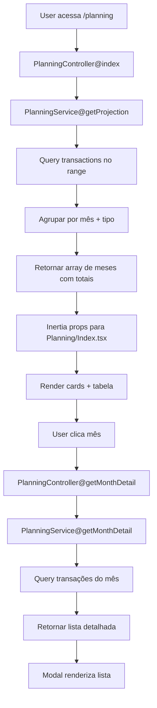

# Planejamento Futuro Design

**Spec**: `.specs/features/planejamento-futuro/spec.md`
**Status**: Draft

---

## Architecture Overview

Feature de leitura/projeção. Sem novas entidades — 100% derivada de transações existentes (avulsas, parcelas, recorrências).



**Fluxo de dados:**
1. Frontend envia `date_start` e `date_end` via query params
2. Backend calcula projeção agrupando transações por mês
3. Frontend renderiza cards + tabela com totais
4. User clica mês → modal abre com lista detalhada

---

## Code Reuse Analysis

### Existing Components to Leverage

| Component            | Location                              | How to Use                                      |
| -------------------- | ------------------------------------- | ----------------------------------------------- |
| AuthenticatedLayout  | `resources/js/Layouts/AuthenticatedLayout.tsx` | Wrapper padrão para páginas autenticadas       |
| Card (shadcn)        | `resources/js/Components/ui/card.tsx` | Cards de totais no topo                         |
| Table (shadcn)       | `resources/js/Components/ui/table.tsx` | Tabela mês-a-mês                                |
| Dialog (shadcn)      | `resources/js/Components/ui/dialog.tsx` | Modal de detalhamento                           |
| Select (shadcn)      | `resources/js/Components/ui/select.tsx` | Dropdown de presets                             |
| DatePicker           | `resources/js/Components/ui/calendar.tsx` | Date range picker                               |
| formatCurrency       | `resources/js/lib/format-currency.ts` | Formatação de valores                           |
| useWorkspace         | `resources/js/hooks/useWorkspace.ts`  | Workspace context                               |

### Integration Points

| System         | Integration Method                                      |
| -------------- | ------------------------------------------------------- |
| Transaction    | Query via `$workspace->transactions()` com scopes       |
| Recurrence     | Gerar transações projetadas para recorrências ativas    |
| CreditCardBill | Parcelas já são transações com `date` = vencimento      |

---

## Components

### PlanningService

- **Purpose**: Calcular projeções de gastos e rendas com base em transações existentes
- **Location**: `app/Services/PlanningService.php`
- **Interfaces**:
  - `getProjection(Workspace $workspace, Carbon $dateStart, Carbon $dateEnd): array` - Retorna array de meses com totais
  - `getMonthDetail(Workspace $workspace, Carbon $month): array` - Retorna lista detalhada de transações do mês
- **Dependencies**: Transaction model, Recurrence model
- **Reuses**: Padrão de query do TransactionService (whereDate, whereBetween)

**Lógica de `getProjection`:**
1. Buscar todas transações type=Expense no range via Eloquent (incluindo parcelas + recorrências já materializadas)
2. Para recorrências ativas com `next_date` no futuro, gerar transações projetadas em memória (sem persistir)
3. Mesclar transações reais + projetadas em Collection
4. Agrupar por mês via Collection `groupBy(fn($t) => $t->date->format('Y-m'))` (sem SQL raw)
5. Somar valores por tipo (Expense/Income) via Collection `sum()`
6. Retornar array estruturado: `[{month: '2026-09', expenses: 1320.00, incomes: 2200.00}, ...]`

**Lógica de `getMonthDetail`:**
1. Buscar todas transações do mês (Expense + Income)
2. Incluir recorrências projetadas se aplicável
3. Retornar lista ordenada por data com: description, value, category, date, type

### PlanningController

- **Purpose**: Expor endpoints de projeção via Inertia
- **Location**: `app/Http/Controllers/PlanningController.php`
- **Interfaces**:
  - `index(Workspace $workspace, Request $request): Response` - Página principal com props
  - `monthDetail(Workspace $workspace, Request $request): JsonResponse` - Detalhamento de mês (AJAX)
- **Dependencies**: PlanningService
- **Reuses**: Padrão de controller do IncomeController (authorize, inertia, props)

**Props do `index`:**
- `projection`: array de meses com totais (calculado via PlanningService)
- `date_start`: data início (default: mês atual)
- `date_end`: data fim (default: 6 meses à frente)
- `totals`: objeto com `expenses`, `incomes`, `balance` (soma do período)

### PlanningResource

- **Purpose**: Formatar dados de projeção para frontend
- **Location**: `app/Http/Resources/PlanningResource.php`
- **Interfaces**:
  - `toArray(Request $request): array` - Estrutura JSON
- **Dependencies**: JsonResource
- **Reuses**: Padrão de TransactionResource (whenLoaded, format)

**Estrutura:**
```php
[
    'month' => '2026-09',
    'month_label' => 'Set/26',
    'expenses' => 1320.00,
    'incomes' => 2200.00,
    'balance' => 880.00,
]
```

### Planning/Index.tsx

- **Purpose**: Página principal de planejamento com cards + tabela + modal
- **Location**: `resources/js/Pages/Planning/Index.tsx`
- **Interfaces**:
  - Props: `projection: MonthProjection[]`, `date_start: string`, `date_end: string`, `totals: Totals`
- **Dependencies**: AuthenticatedLayout, Card, Table, Dialog, Select, DatePicker
- **Reuses**: formatCurrency, useWorkspace, padrões de Incomes/Index.tsx

**Estrutura:**
1. Header com título + seletor de período (presets + custom)
2. Grid de 3 cards (Gastos, Rendas, Saldo)
3. Tabela com colunas: Mês, Gastos, Rendas, Saldo
4. Modal de detalhamento (abre ao clicar em linha)

### Planning/MonthDetailModal.tsx

- **Purpose**: Modal com lista detalhada de transações do mês
- **Location**: `resources/js/Components/Planning/MonthDetailModal.tsx`
- **Interfaces**:
  - Props: `month: string`, `isOpen: boolean`, `onClose: () => void`
- **Dependencies**: Dialog, Table, axios
- **Reuses**: Padrão de modal do Incomes/Index.tsx

**Lógica:**
1. Ao abrir, faz GET `/w/{workspace}/planning/month-detail?month=2026-09`
2. Renderiza lista agrupada por tipo (Gastos / Rendas)
3. Cada linha: descrição, valor, categoria, data

---

## Data Models (if applicable)

### MonthProjection (frontend type)

```typescript
interface MonthProjection {
  month: string // '2026-09'
  month_label: string // 'Set/26'
  expenses: number
  incomes: number
  balance: number
}
```

### Totals (frontend type)

```typescript
interface Totals {
  expenses: number
  incomes: number
  balance: number
}
```

### MonthDetail (frontend type)

```typescript
interface MonthDetail {
  month: string
  expenses: TransactionDetail[]
  incomes: TransactionDetail[]
}

interface TransactionDetail {
  id: string
  description: string
  value: number
  category: string | null
  date: string
  type: 'expense' | 'income'
}
```

---

## Error Handling Strategy

| Error Scenario                          | Handling                          | User Impact                          |
| --------------------------------------- | --------------------------------- | ------------------------------------ |
| Período > 24 meses                      | Validação backend (422)           | Mensagem "Período máximo: 24 meses"  |
| Data fim < data início                  | Validação backend (422)           | Mensagem "Data fim deve ser >= início" |
| Workspace sem transações                | Retornar array vazio              | Tabela vazia com mensagem "Nenhuma transação" |
| Erro ao buscar detalhamento             | Try/catch + toast error           | Toast "Erro ao carregar detalhamento" |

---

## Tech Decisions (only non-obvious ones)

| Decision                              | Choice                            | Rationale                                        |
| ------------------------------------- | --------------------------------- | ------------------------------------------------ |
| Projeção de recorrências              | Gerar transações em memória (sem persistir) | Evita poluir tabela com transações futuras que podem ser editadas/pausadas |
| Agrupamento por mês                   | Eloquent + Collection `groupBy` (sem SQL raw) | Portabilidade entre databases (MariaDB → PostgreSQL etc) |
| Endpoint de detalhamento              | AJAX (JSON) ao invés de Inertia full reload | UX: modal abre sem recarregar página             |
| Presets de período                    | Dropdown com opções fixas         | UX: rápido para casos comuns (3, 6, 12 meses)    |
| Saldo projetado                       | Renda - Gasto (não considera saldo atual) | Escopo: foco em fluxo, não em saldo acumulado    |

---

## Test Strategy

### PHPUnit (Feature Tests)

1. **PlanningServiceTest** (unit-like feature test):
   - Testar `getProjection` com transações avulsas, parcelas, recorrências
   - Testar `getMonthDetail` com lista detalhada
   - Testar edge cases: mês vazio, recorrência pausada, período > 24 meses

2. **PlanningControllerTest** (feature test):
   - Testar `index` retorna 200 + props corretas
   - Testar `monthDetail` retorna JSON com lista
   - Testar autorização (usuário não membro não acessa)
   - Testar validação (data fim < início, período > 24 meses)

### Cypress (E2E)

1. **planning.cy.ts**:
   - Acessar `/planning`, ver cards + tabela
   - Selecionar preset "Próximos 3 meses", ver tabela com 3 linhas
   - Clicar em mês, ver modal abrir com lista
   - Selecionar "Personalizado", ver tabela ajustar

**Gate:** `composer quality`, `npm run quality`, `phpunit --filter=Planning`, `cypress run --spec cypress/e2e/planning.cy.ts`

---

## Files to Create/Modify

### New Files

**Backend:**
- `app/Services/PlanningService.php`
- `app/Http/Controllers/PlanningController.php`
- `app/Http/Resources/PlanningResource.php`
- `tests/Feature/PlanningServiceTest.php`
- `tests/Feature/PlanningControllerTest.php`

**Frontend:**
- `resources/js/Pages/Planning/Index.tsx`
- `resources/js/Components/Planning/MonthDetailModal.tsx`
- `resources/js/types/planning.ts`
- `cypress/e2e/planning.cy.ts`

### Modified Files

- `routes/web.php` — adicionar rotas `planning.index` e `planning.month-detail`
- `resources/js/Components/AppSidebar.tsx` — adicionar link "Planejamento" no menu

---

## Implementation Order

1. **PlanningService** + testes (TDD)
2. **PlanningController** + testes
3. **PlanningResource**
4. Rotas + sidebar
5. **Planning/Index.tsx** (cards + tabela)
6. **MonthDetailModal.tsx**
7. Cypress E2E
8. Quality gates
