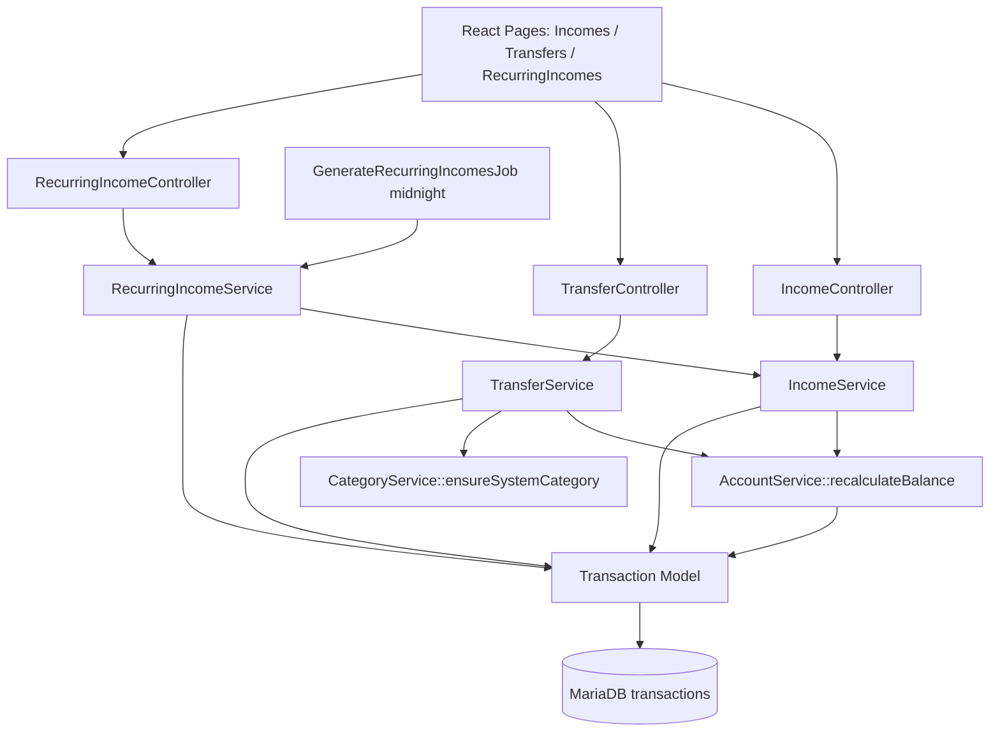

# Receitas — Design

**Spec**: `.specs/features/receitas/spec.md`
**Context**: `.specs/features/receitas/context.md` (locked decisions G-1..G-8)
**Status**: Draft

---

## Architecture Overview

INCM-01 estende o domínio `Transaction` com 3 novos fluxos (receita, parcelamento de receita, recorrência mensal) + 1 fluxo de transferência (par de 2 transactions). Reusa schema, modelo e `recalculateBalance` (já soma income). Visa minimizar duplicação: services novos só onde existe divergência de negócio.



**Layering rule:** `TransferService` chama `IncomeService::create` + marca `transfer_group_id` na Expense leg (usa `TransactionService::create` já existente para Expense leg). `RecurringIncomeService` chama `IncomeService::create` para cada ocorrência. `IncomeService` não depende dos outros dois (lower-level).

---

## Code Reuse Analysis

### Existing Components to Leverage

| Component | Location | How to Use |
|-----------|----------|------------|
| `Transaction` model | `app/Models/Transaction.php` | Add fillable: `is_recurring`, `recurring_parent_uuid`, `recurring_ends_at`, `recurring_year_month`, `transfer_group_id`. Add casts. Add relations: `recurringParent`, `recurringOccurrences`, `transferSibling`. Keep UUID binding. |
| `AccountService::recalculateBalance` | `app/Services/AccountService.php:45` | Já soma `paid_income - paid_expenses`. Reuso direto — zero mudança. |
| `CardExpenseService::createInstallment` | `app/Services/CardExpenseService.php:59` | Pattern: `installment_group_id` UUID + D-33 rounding + monthly dates via `addMonthsNoOverflow`. **Espelhar** lógica em `IncomeService::createInstallment` (sem bill / card). |
| `CloseBillsJob` shape | `app/Jobs/CloseBillsJob.php` | Pattern: queueable job + try/catch + Log::error. Espelhar em `GenerateRecurringIncomesJob`. Scheduler em `routes/console.php` duplica a linha `Schedule::job(...)->dailyAt('00:00')`. |
| `TransactionResource` | `app/Http/Resources/TransactionResource.php` | Extender campos (ver Data Models). |
| `TransactionPolicy` | `app/Policies/TransactionPolicy.php` | Reusar para receitas/transferências (workspace-scoped, mesmas roles). Sem política nova. |
| `TransactionService::syncTags` | `app/Services/TransactionService.php:133` | Refatorar p/ `protected` (ou trait) e usar em `IncomeService`. Evita duplicar 10 linhas. |
| `CategoryResource`, `AccountResource`, `TagResource` | `app/Http/Resources/` | Props em pages, sem mudança. |
| **shadcn primitives** | `resources/js/components/ui/` | Reusar: `dialog`, `radio-group`, `select`, `input`, `badge`, `card`, `button`. NO new primitive proposals — reusar existentes. |
| `DynamicIcon` | `resources/js/Components/DynamicIcon.tsx` | Para exibir ícones de categoria/runtime. |
| `lib/format-currency.ts` | `resources/js/lib/` | BRL formatting reuse. |

### Deprecated / Modified

| Component | Action |
|-----------|--------|
| `TransactionService::create` | Atualmente hardcodes `type='expense'`. INCM-01 NÃO toca aqui (DEBT-01 mantido). Income usa `IncomeService`. Divergência intencional — mirrors `CardExpenseService` pattern. |
| `StoreTransactionRequest` / `UpdateTransactionRequest` | NÃO modificados. New: `StoreIncomeRequest`, `UpdateIncomeRequest` (mirror com `type=Income` validation). |
| `TransactionController` | NÃO modificado para receitas. Novo `IncomeController`. |

### Integration Points

| System | Integration |
|--------|-------------|
| `transactions` table | 3 migrations: (1) add recurring cols + recurring_year_month + UNIQUE index, (2) add `transfer_group_id` nullable UUID, (3) backfill `is_system=false` default — no-op (categories já tem `is_system`). |
| `categories` table | Auto-create categoria sistema "Transferência" `type=Both, is_system=true` lazie on first transfer. Pattern copied from "Pagamento de Cartão" (D-31). |
| Scheduler | `routes/console.php` new `Schedule::job(new GenerateRecurringIncomesJob)->dailyAt('00:00')`. |
| Dashboard futuro (out-of-scope agora) | Aggregation query `WHERE transfer_group_id IS NULL` exclui legs. Não implementado em INCM-01 — só garantia técnica. |

---

## Components

### IncomeService

- **Purpose**: Business logic para receitas avulsas e parceladas. Simétrico a `TransactionService` (DEBT-01) com `type=Income`.
- **Location**: `app/Services/IncomeService.php`
- **Interfaces**:
  - `create(Workspace $w, User $u, array $data): Transaction` — Receita simples. `type='income'`, `paid_at=null`. Mesmo padrão de UUID resolution para account/category. Resolve category `type∈{Income,Both}` (rejeita `Expense` logo aqui também além do FormRequest).
  - `createInstallment(Workspace $w, User $u, array $data): string` — N parcelas. Espelha `CardExpenseService::createInstallment` com `installment_group_id=Str::orderedUuid()->toString()`, D-33 rounding (`round(total/count, 2)` + remainder na última). Não usa `credit_card_id` nem `bill`. Datas via `Carbon::addMonthsNoOverflow($i-1)`. Retorna `group_id`.
  - `update(Transaction $income, array $data): Transaction` — Atualiza row única (G-1: edit só aquela linha). Espelha `TransactionService::update` na lógica de `recalculateAfterUpdate` (calls `recalculateBalance` em old/new account se paid). NÃO propaga a irmãs.
  - `deleteSingle(Transaction $income): void` — Soft delete 1 row + `recalculateBalance` se paid.
  - `deleteGroup(Transaction $income): void` — Soft delete todas rows do `installment_group_id` (G-2: bulk action). Para cada paid row chama recalc.
  - `receive(Transaction $income): void` — DB::transaction: `paid_at=now()` + `recalculateBalance(account)`. Mirror de `TransactionService::pay`.
  - `unreceive(Transaction $income): void` — Mirror `unpay`.
  - `syncTags(Transaction $t, array $uuids): void` — Promote `TransactionService::syncTags` para `protected` e reuse, OU copiar (prefere promote para DRY). Lens de implementação.
- **Dependencies**: `AccountService`, `Account`, `Category`, `Tag`, `Transaction`, `Str`, `DB`, `Carbon`.
- **Reuses**: `CardExpenseService::createInstallment` pattern, `TransactionService::update` pattern, `AccountService::recalculateBalance`.

### RecurringIncomeService

- **Purpose**: Template recorrente mensal + geração lazy/diária de ocorrências. Idempotente via UNIQUE.
- **Location**: `app/Services/RecurringIncomeService.php`
- **Interfaces**:
  - `createTemplate(Workspace $w, User $u, array $data): Transaction` — Cria row `Transaction` com `type='income', is_recurring=true, recurring_parent_uuid=null, recurring_ends_at=$data['recurring_ends_at']?.toBeNull(), paid_at=null, recurring_year_month=null` (template não ocupa bucket). **Geração imediata**: chama `generateOccurrencesUpTo($template, Carbon::now()->startOfMonth())` dentro da DB transaction.
  - `generateOccurrencesUpTo(Transaction $template, Carbon $untilMonth): int` — Itera meses do `start_date` até `min($untilMonth, recurring_ends_at)`. Para cada mês: tenta `IncomeService::create` com `recurring_parent_uuid=template.uuid, recurring_year_month='YYYY-MM'`. Catch `QueryException` (duplicate unique) → skip silently (idempotência). Retorna count de geradas.
  - `updateTemplate(Transaction $template, array $data, bool $propagate): void` — Update fields do template. If `$propagate=true` (G-3): `WHERE recurring_parent_uuid=template.uuid AND paid_at IS NULL`. Propagável: `description, value, category_id, account_id, tags`. **Não**: `date` (bucket fixo), **não**: received occurrences.
  - `cancelTemplate(Transaction $template): void` — Set `recurring_ends_at=today()`. Ocorrências futuras não geradas. Histórico preservado.
  - `deleteTemplate(Transaction $template, bool $orphanOccurrences): void` — G-4. If `$orphanOccurrences=true`: `UPDATE transactions SET recurring_parent_uuid=null, is_recurring=false WHERE recurring_parent_uuid=template.uuid` antes de soft-delete template (ocorrências viram standalone). If `$orphanOccurrences=false`: soft-delete template + soft-delete ocorrências NÃO-recebidas (`paid_at IS NULL`); received occurrences permanecem intactas (saldo real).
- **Dependencies**: `IncomeService`, `Transaction`, `DB`, `Carbon`, `Str`.
- **Reuses**: `IncomeService::create` como factory de ocorrência.

### TransferService

- **Purpose**: Criação/edição/exclusão de par de 2 Transactions (Income no destino + Expense na origem). Saldo total workspace invariante.
- **Location**: `app/Services/TransferService.php`
- **Interfaces**:
  - `create(Workspace $w, User $u, array $data): string` — DB::transaction. `from_account_id`!=`to_account_id` validation. Ambas contas workspace-scoped. Resolve `transfer_group_id=Str::orderedUuid()->toString()`. Resolve `transfer_category_id=CategoryService::ensureSystemCategory($w, 'Transferência', TransactionType::Both)`. Cria 2 rows:
    - Expense leg: `type='expense', account_id=from, value=$V, paid_at=now, transfer_group_id=$G, category_id=$transferCat`.
    - Income leg: `type='income', account_id=to, value=$V, paid_at=now, transfer_group_id=$G, category_id=$transferCat`.
    - Tags: sincronizadas ambas (mesmas).
    - Após criação: `recalculateBalance` em from (decresce) e to (acresce).
    - Retorna `transfer_group_id`.
  - `updateGroup(string $transferGroupId, Workspace $w, array $data): void` — DB::transaction. Edita valor/descrição/data em ambas rows simultaneamente. Recalcs ambas contas (old + new em caso de mudar conta também).
  - `deleteGroup(string $transferGroupId): void` — DB::transaction. Soft-delete ambas + recalc ambas contas. Legs já recebidas/pagas (paid_at=now) por criação → recalc reverte.
- **Dependencies**: `AccountService`, `CategoryService::ensureSystemCategory`, `Transaction`, `DB`, `Str`.
- **Reuses**: `AccountService::recalculateBalance`. Categoria sistema pattern (D-31 mirror).

### CategoryService (extension)

- Extensions:
  - `ensureSystemCategory(Workspace $w, string $name, TransactionType $type): int` — Find-or-create category `is_system=true` no workspace. Idempotent (name + workspace unique). Returns category_id. Used by `TransferService` e (potencialmente) `BillPaymentService` no refactor futuro (D-31 já hard-coded "Pagamento de Cartão" — refactor opcional em INCM-01 se tocarmos esse code, senão deixar p/ cleanup).
- **Reuses**: migration `is_system` já existe.

### IncomeController

- **Location**: `app/Http/Controllers/IncomeController.php`
- Resource controller + `receive`/`unreceive` actions.
- Routes:
  - `/w/{w}/incomes` (resource: index/create/store/show/edit/update/destroy)
  - `/w/{w}/incomes/{income}/receive` (POST)
  - `/w/{w}/incomes/{income}/unreceive` (POST)
  - `/w/{w}/incomes/{income}/group` (DELETE, scope=group — bulk delete de parceladas)
- Index: filter `WHERE type='income' AND transfer_group_id IS NULL` (não mostra legs de transferência).
- Categories on form: `whereIn('type', [Income, Both])`.

### TransferController

- **Location**: `app/Http/Controllers/TransferController.php`
- Limited resource: only `create`, `store`, `edit`, `update`, `destroy`.
- Route: `/w/{w}/transfers`.
- Show action: redirect to edit (transfer não tem página show própria, aparece em Income list and Expense list flagged).
- Update/Destroy recebem `transfer_group_id` como identificador roteado: `Route::resource('transfers', ...)->parameter('transfers', 'transfer_group')` custom key? ou usar `{transferGroup}` sintético. Preferido: rota nomeada explicit:
  ```php
  Route::get('transfers/create', [TransferController::class, 'create'])->name('transfers.create');
  Route::post('transfers', [TransferController::class, 'store'])->name('transfers.store');
  Route::get('transfers/{transferGroup}/edit', ...)->name('transfers.edit');
  Route::put('transfers/{transferGroup}', ...)->name('transfers.update');
  Route::delete('transfers/{transferGroup}', ...)->name('transfers.destroy');
  ```
  Where `{transferGroup}` is UUID string resolved in controller by query.

### RecurringIncomeController

- **Location**: `app/Http/Controllers/RecurringIncomeController.php`
- Routes:
  - `/w/{w}/recurring-incomes` (index — lista templates `WHERE is_recurring=true AND recurring_parent_uuid IS NULL`)
  - `/w/{w}/recurring-incomes/{template}/edit` (edit template)
  - `/w/{w}/recurring-incomes/{template}` (PUT update — body inclui `propagate` boolean)
  - `/w/{w}/recurring-incomes/{template}/cancel` (POST — set recurring_ends_at)
  - `/w/{w}/recurring-incomes/{template}` (DELETE — body `orphan_occurrences` boolean)
- No `create` standalone — template criado a partir do form de Income checkbox "Recorrente".

### GenerateRecurringIncomesJob

- **Location**: `app/Jobs/GenerateRecurringIncomesJob.php`
- Shape mirror `CloseBillsJob`: ShouldQueue + try/catch + Log::error.
- `handle(RecurringIncomeService $service)`: query templates `is_recurring=true AND recurring_parent_uuid IS NULL AND (recurring_ends_at IS NULL OR recurring_ends_at >= today)`. Para cada: `$service->generateOccurrencesUpTo($template, Carbon::now()->startOfMonth())`.

### FormRequests

- `app/Http/Requests/StoreIncomeRequest.php` — Mirror `StoreTransactionRequest`. valida `description, value, date, account_id, category_id, tags`. Custom: category `type∈{Income,Both}` (rejeita `Expense`). Opcional `installments_total` (int 1..60) e `is_recurring` (bool) + `recurring_ends_at` (date, nullable, must be ≥ date if is_recurring=true). Mutually exclusive validation: `is_recurring` AND `installments_total>1` rejeitar.
- `app/Http/Requests/UpdateIncomeRequest.php` — Mirror `UpdateTransactionRequest`.
- `app/Http/Requests/StoreTransferRequest.php` — `from_account_id, to_account_id, value, date, description, tags`. Custom rule `from != to`. Ambas contas mesma workspace.
- `app/Http/Requests/UpdateTransferRequest.php` — Permite update value/description/date + account changes.
- `app/Http/Requests/UpdateRecurringIncomeRequest.php` — `description, value, category_id, account_id, tags, propagate (bool)`.
- `app/Http/Requests/CancelRecurringIncomeRequest.php` — vazio (sem body).

### TransactionResource (extension)

- Add fields: `is_recurring` (bool), `recurring_parent_uuid` (?string), `recurring_ends_at` (?ISO date), `is_transfer` (computed = `$this->transfer_group_id !== null`), `transfer_group_id` (?string), `is_template` (computed = `$this->is_recurring && $this->recurring_parent_uuid === null`).
- `installment_label` já existe — reusar.
- `category.is_system` field em `CategoryResource` se ainda não exposto (verificar existente).

### React Pages

- `resources/js/Pages/Incomes/Index.tsx` — Lista de receitas (not transfer legs). Filtros por categoria/conta/period/status/recurring/parcelada. Pagination 25. Mirror de `Pages/Transactions/Index.tsx`.
- `resources/js/Pages/Incomes/Create.tsx` — Form com checkbox "Recorrente" (mostras `recurring_ends_at` optional), radio "Avulsa | Parcelada" (se parcelada mostra `installments_total` input), date/description/value/account/category/tags. Reusa `RadioGroup` primitive já instalado.
- `resources/js/Pages/Incomes/Edit.tsx` — Edita receita única (não edita grupo nem template aqui; se for parcela do grupo, aviso visual "Edita apenas esta parcela").
- `resources/js/Pages/RecurringIncomes/Index.tsx` — Lista templates ativos→cancelados com count de ocorrências e botões Edit/Cancel/Delete.
- `resources/js/Pages/RecurringIncomes/Edit.tsx` — Edit template com checkbox "Aplicar a ocorrências futuras não recebidas".
- `resources/js/Pages/Transfers/Create.tsx` — Form simples: from_account/to_account (Select), value, date, description, tags. Dialog component (modal) preferível vs full page — Design leave open as modal-in-page see design.md tips: chose full page para simplicidade.
- `resources/js/Pages/Transfers/Edit.tsx` — Edita transfer group.

### React Components (domain)

- `resources/js/Components/Incomes/IncomeForm.tsx` — form base + conditional fields (recorrente, parcelada).
- `resources/js/Components/Incomes/IncomeRow.tsx` — row na listagem com badges (Recebida/A receber, Recorrente, Parcelada).
- `resources/js/Components/Transfers/TransferForm.tsx` — form simples.
- `resources/js/Components/RecurringIncomes/RecurringTemplateCard.tsx` — card do template.

Domain folder `Components/Incomes/`, `Components/Transfers/`, `Components/RecurringIncomes/`.

---

## Data Models

### Migration 1: `transactions` add recurring + transfer cols

```
Schema::table('transactions', function (Blueprint $t) {
    $t->boolean('is_recurring')->default(false)->after('installment_group_id');
    $t->uuid('recurring_parent_uuid')->nullable()->after('is_recurring');
    $t->date('recurring_ends_at')->nullable()->after('recurring_parent_uuid');
    $t->char('recurring_year_month', 7)->nullable()->after('recurring_ends_at');
    $t->uuid('transfer_group_id')->nullable()->after('recurring_year_month');

    // Partial unique: only non-null recurring rows collide
    // MariaDB: NULLs excluded from unique by default → 
    // safely add full unique on (recurring_parent_uuid, recurring_year_month)
    $t->unique(['recurring_parent_uuid', 'recurring_year_month'], 'uniq_recurring_occurrence');

    $t->index('transfer_group_id');
});
```

Nota: index `uniq_recurring_occurrence` em `(recurring_parent_uuid, recurring_year_month)`. Para rows template (`recurring_parent_uuid=null`) e rows avulsas, ambos NULL → MariaDB permite múltiplas linhas NULL (default SQL behavior). Ocorrências tem `recurring_parent_uuid=template.uuid` e `recurring_year_month='YYYY-MM'` → collision protegida.

### Transaction Model Additions

```php
protected $fillable = [
    // ... existing
    'is_recurring',
    'recurring_parent_uuid',
    'recurring_ends_at',
    'recurring_year_month',
    'transfer_group_id',
];

protected function casts(): array
{
    return [
        // ... existing
        'is_recurring' => 'boolean',
        'recurring_ends_at' => 'date',
    ];
}

public function recurringParent(): BelongsTo
{
    return $this->belongsTo(Transaction::class, 'recurring_parent_uuid', 'uuid');
}

public function recurringOccurrences(): HasMany
{
    return $this->hasMany(Transaction::class, 'recurring_parent_uuid', 'uuid');
}

public function transferSiblings(): HasMany
{
    return $this->hasMany(Transaction::class, 'transfer_group_id', 'transfer_group_id')
        ->whereKeyNot($this->id);
}

public function isTransfer(): bool
{
    return $this->transfer_group_id !== null;
}

public function isRecurringTemplate(): bool
{
    return $this->is_recurring && $this->recurring_parent_uuid === null;
}

public function isRecurringOccurrence(): bool
{
    return $this->recurring_parent_uuid !== null;
}
```

### TransactionResource Extension

```php
return [
    // existing fields
    'is_recurring' => $this->is_recurring,
    'is_recurring_template' => $this->isRecurringTemplate(),
    'recurring_parent_uuid' => $this->recurring_parent_uuid,
    'recurring_ends_at' => $this->recurring_ends_at?->format('Y-m-d'),
    'is_transfer' => $this->isTransfer(),
    'transfer_group_id' => $this->transfer_group_id,
];
```

### TypeScript Types (`resources/js/types/income.ts` new, or extend `resources/js/types/transaction.ts` if exists)

```typescript
export interface Income {
  uuid: string;
  description: string;
  value: number;
  date: string;        // 'YYYY-MM-DD'
  paid_at: string | null;
  account: Account;
  category: Category;
  tags: Tag[];
  is_recurring: boolean;
  is_recurring_template: boolean;
  recurring_parent_uuid: string | null;
  recurring_ends_at: string | null;
  installment_number: number | null;
  installments_total: number | null;
  installment_label: string | null;
  is_transfer: boolean;
  transfer_group_id: string | null;
  created_at: string;
}
```

(Confirmar exact files convention em design handoff — projeto atual usa `App.Data.*` typagens via Inertia? `ziggy` route helper.) — verificação em Execução.

---

## Error Handling Strategy

| Error Scenario | Handling | User Impact |
|----------------|----------|-------------|
| Duplicate recurring occurrence (race job + fallback) | MariaDB throws unique violation → catch `QueryException` silently | Silent — não duplica; próxima geração continua |
| Account archived (soft-deleted) | Receita ainda references; Resource mostra `name + "(Arquivada)"` | Listagem mostra a conta arquivada; create de nova receita em archived account é bloqueado por validation (`exists` rule + workspace scope) |
| Category `type=Expense` em receita | `StoreIncomeRequest` custom validator rejeita | "Categoria de despesa não pode ser usada em receita" |
| `recurring_ends_at < start_date` | `StoreIncomeRequest` custom rule | "Data de fim anterior à data de início" |
| `is_recurring=true` AND `installments_total>1` | Validation mutually exclusive | "Não pode ser recorrente e parcelada ao mesmo tempo" |
| Transfer `from == to` | `StoreTransferRequest` custom rule | "Conta de origem e destino devem ser diferentes" |
| Recalc fails mid-tx | `DB::transaction` rollback | Error flash "Operação falhou": saldo não alterado |
| `recalculateBalance` throws in job | `CloseBillsJob` pattern: try/catch + Log::error | Silent log; próxima execução tenta novamente (idempotência) |
| Soft-deleted receita (received) | `archive()` recalcs antes de delete | Saldo restaurado |
| Delete paid parcelada individual | Permite (recalc reverte); mensagem confirm | Saldo restaurado, parcelas irmãs intactas |

---

## Tech Decisions (non-obvious)

| Decision | Choice | Rationale |
|----------|--------|-----------|
| Separar `IncomeService` vs extender `TransactionService` | Separar | Mirrors `CardExpenseService` pattern; divergência já aceita no domain. Permite DEBT-01 untouched. |
| Separar `TransferService` vs método em IncomeService | Separar | Duplo row em DB::transaction; cria categoria sistema; swap de sentido (origem+destino). Não cabe em Income. |
| Separar `RecurringIncomeService` vs merge no IncomeService | Separar | Job integration, idempotência, propagation — complexidade isolada. Mantém `IncomeService` focado em 1 row. |
| Categoria "Transferência" lazy on first transfer vs na criação workspace | Lazy on first transfer | Deferred creation — não polui workspaces sem uso. Idempotência via `firstOrCreate` por nome. |
| `recurring_year_month` `char(7)` nova coluna vs derivar via virtual column | Nova coluna | User confirmou G-6; MariaDB virtual cols são boost técnico; preferida explicit por simplicidade e compatibilidade. |
| `transfer_group_id` UUID único vs FK para tabela `transfers` | UUID único no `transactions` | Sem nova tabela; legs identificadas por group_id; query simples `WHERE transfer_group_id=X`. |
| Index partial só em rows preenchidas | MariaDB trata NULL como non-colliding em unique | Standard SQL behavior; validado se Mariadb 10.x+ respeita. ⚠️ Confirmar versão subjacente em MarBTBD acquire conhecimento. |
| Transfer list appears on both income & expense index | Não (index de Income só não-transfer; Expense lista global depois separa) | User requested em spec success criteria: transferências marcadas visualmente mas NÃO poluem ficha de "renda real". Filter SQLmente `WHERE transfer_group_id IS NULL`. |
| React page Transfer full-page vs Dialog modal | Full page (`Pages/Transfers/Create.tsx`) | Simplicidade; route direto; evita estado complexo no Income Create. Modal em consideração futura. |
| Scheduler: Artisan command + Schedule::command vs Schedule::job | `Schedule::job(new GenerateRecurringIncomesJob)->dailyAt('00:00')` | Igual a `CloseBillsJob` — consistência. Sem wrapper Artisan adicional. |

---

## CONCERNS / Risks (sem `.specs/codebase/CONCERNS.md` existindo)

| Concern | Mitigation |
|---------|------------|
| `TransactionService::create` hardcoded `type='expense'` é duplicado por `IncomeService::create` | DRY via `syncTags` promote p/ `protected` ou trait `HasTagSync`. Valor extra: futura refactor alinha `CardExpenseService`. Não fazer agora (escopo). |
| MariaDB version `NULL behavior` em UNIQUE | Validação em migrate: index não deve rejeitar templates (ambos NULL). Test: criar 2 templates + 5 avulso receitas sem erro unique. |
| Task schedulers 2 jobs em mídware (CloseBills + Recurring) | Container Laravel único scheduler; jobs independentes. Memória: silently coexist. Verify queue driver default `sync` em dev/test. |
| Race: user cria transferência com `paid_at=now` em ambas legs (conta origem não tem saldo suficiente) | Out-of-scope: projeto não enforce saldos (PROJECT.md: saldos calculados, sem bloqueio). Negative balance permitido — documento. |
| Edit template propagar tags | Tags mantidas em sync; "Occurrence already received" never touched — `WHERE paid_at IS NULL` guard. |
| Percy: delete de group de receita parcelada afeta transfers? | Não: domains separados; `installment_group_id` ≠ `transfer_group_id`. |

---

## Files: New vs Modified

### New (estimated ~25)

**Migrations:** 1 (`add_recurring_and_transfer_columns_to_transactions`)

**Backend:**
- `app/Services/IncomeService.php`
- `app/Services/RecurringIncomeService.php`
- `app/Services/TransferService.php`
- `app/Jobs/GenerateRecurringIncomesJob.php`
- `app/Http/Controllers/IncomeController.php`
- `app/Http/Controllers/TransferController.php`
- `app/Http/Controllers/RecurringIncomeController.php`
- `app/Http/Requests/StoreIncomeRequest.php`
- `app/Http/Requests/UpdateIncomeRequest.php`
- `app/Http/Requests/StoreTransferRequest.php`
- `app/Http/Requests/UpdateTransferRequest.php`
- `app/Http/Requests/UpdateRecurringIncomeRequest.php`

**Backend tests (PHPUnit feature tests):**
- `tests/Feature/Income/IncomeCrudTest.php`
- `tests/Feature/Income/IncomeReceiveTest.php`
- `tests/Feature/Income/IncomeInstallmentTest.php`
- `tests/Feature/Income/RecurringIncomeTest.php`
- `tests/Feature/Income/TransferTest.php`
- `tests/Feature/Income/RecurringJobTest.php`

**Frontend:**
- `resources/js/Pages/Incomes/Index.tsx`
- `resources/js/Pages/Incomes/Create.tsx`
- `resources/js/Pages/Incomes/Edit.tsx`
- `resources/js/Pages/RecurringIncomes/Index.tsx`
- `resources/js/Pages/RecurringIncomes/Edit.tsx`
- `resources/js/Pages/Transfers/Create.tsx`
- `resources/js/Pages/Transfers/Edit.tsx`
- `resources/js/Components/Incomes/IncomeForm.tsx`
- `resources/js/Components/Incomes/IncomeRow.tsx`
- `resources/js/Components/Incomes/IncomeFilters.tsx`
- `resources/js/Components/Transfers/TransferForm.tsx`
- `resources/js/Components/RecurringIncomes/RecurringTemplateCard.tsx`

**Cypress E2E:**
- `cypress/e2e/income_crud.cy.ts`
- `cypress/e2e/income_receive.cy.ts`
- `cypress/e2e/income_installment.cy.ts`
- `cypress/e2e/income_recurring.cy.ts`
- `cypress/e2e/transfer.cy.ts`

### Modified (~8)

- `app/Models/Transaction.php` — fillable, casts, relations, helpers
- `app/Services/TransactionService.php` — promote `syncTags` to `protected` (DRY with IncomeService/CardExpenseService)
- `app/Services/CategoryService.php` — add `ensureSystemCategory`
- `app/Http/Resources/TransactionResource.php` — add recurring + transfer fields
- `app/Http/Resources/CategoryResource.php` — expose `is_system` (if not already)
- `routes/web.php` — add routes for incomes/transfers/recurring-incomes
- `routes/console.php` — add `Schedule::job(new GenerateRecurringIncomesJob)->dailyAt('00:00')`
- `resources/js/Components/AppSidebar.tsx` — add nav items: "Receitas", "Transferências", "Receitas Recorrentes"

---

## Testing Strategy (TDD-First)

| Layer | Tests | Where used |
|-------|-------|------------|
| PHPUnit feature | Income CRUD, receive/unreceive, installment group create/edit/delete (G-2 scope), recurring creation+generation+idempotência+propagation (G-3)+delete (G-4), transfer create/update/delete + invariant saldo, scheduler job dispatch | 6 test files, ~70 tests |
| Cypress E2E | User cadastra receita, marca recebida, vê saldo subir; cria parcelada 3x; cria recorrente salário; faz transferência A→B; filtra lista | 5 e2e files |

**Gate commands:**
- Backend: `php artisan test --filter=Income` (+ `TransferTest`, `RecurringJobTest`)
- Frontend build: `npm run build`
- Cypress: `npx cypress run --spec cypress/e2e/income_*.cy.ts`

---

## Open Design Questions (deferred to Tasks confirmation)

- Convention atual Inertia typed props: 是否 existe `resources/js/types/` folder? Verificar antes de ficheiro types. Se inexiste, derivar types inline nos Pages.
- `CategoryResource` — 是否 já expõe `is_system`? Ver read atual.
- Route binding para `transfer_group_id` — string parameter vs parse manual dentro do controller. Simples: string parameter.
- Cypress support for time-travel (test job midnight) — usar `Carbon::setTestNow` no backend + Laravel `Queue::fake` para job tests; para Cypress, criar receita recorrente com start_date no passado → geração eager já cria ocorrências iniciais.